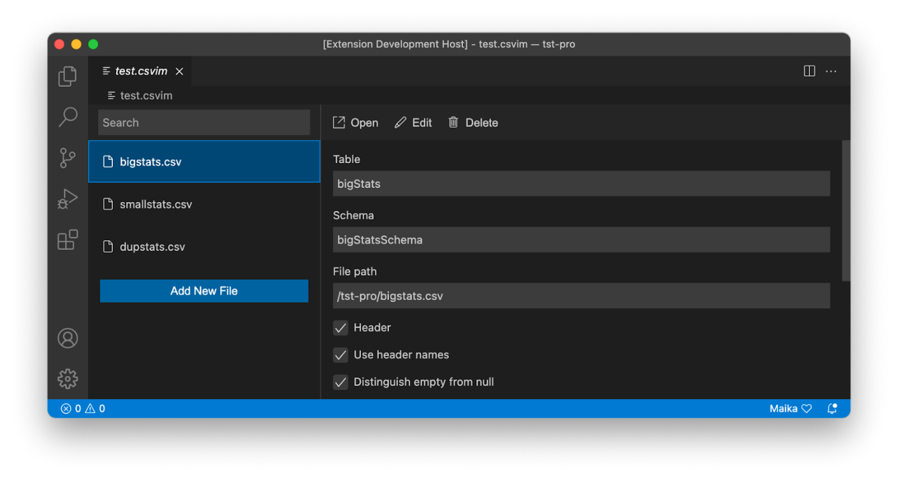

Recently, I was tasked with porting an extension from Eclipse Dirigible to VS Code and Eclipse Theia. During that process, I found some interesting things about how those products work and their design choices, which inspired this short blog post. I will try to explain the main differences between them from the point of view of an extension developer. This will not be a tutorial on how to make extensions, instead it will be more focused on overall design differences between the IDEs (Integrated Development Environment). 

## What are they?

First, let me give you a brief introduction to what each of those products are and what they are best suited for. 

### Eclipse Dirigible 

This is a cloud development environment, featuring a low-code platform for rapid development of business applications, while also providing a runtime. It is best suited for people who need a cloud IDE (Integrated Development Environment), which focuses on JavaScript development with the ability to connect to databases such as SAP HANA and PostgreSQL. 

### Visual Studio Code (VS Code) 

This one is quite popular and does not need much of an introduction. It is a desktop-focused code editor, which can also run in the cloud. It is best suited for people who need a general-purpose IDE with a clean and simple UI (User Interface). 

### Eclipse Theia 

Eclipse Theia is a cloud and desktop IDE framework. Its primary aim is to be a modular, vendor-agnostic version of VS Code. It is not a fork or a one-to-one copy of VS Code but it is API (Application Programming Interface) compatible with it and shares a lot of its components. While it can be used as an IDE, it is an IDE framework which means that it is used as a base for creating other IDEs. It is best suited for people who need to develop their own custom IDE, without reinventing the wheel. 

 

## One extension to rule them all 

“Extension” is the official name used by VS Code. In Dirigible, the same thing is referred to as a “module”. The equivalent in Theia is called “plug-in”. 
 
All three platforms are built using web technologies such as HTML, CSS and JavaScript, so my initial reaction was that I could take the Dirigible module and make it run in the other two by making some minor changes. 

I tested that hypothesis, and while it can be achieved by making some sacrifices, I would not recommend it. 
 
Here is a screenshot of my attempt at running an unmodified Dirigible module inside a VS Code extension serving as a container:

**It does run** but the first and most obvious problem is that the **user interface does not react** to the theme selected in VS Code.

This makes the extension feel very out of place.

Another problem I encountered is that input fields created by Dirigible’s UI framework disable the save action in VS Code, when focused. This is probably caused by the input field model in AngularJS, but I did not spend too much time trying to figure it out.

After seeing those problems, I decided that the best way to go about this is to have two separate extensions. One for Dirigible and one for the other two.

Theia and other editors based on Theia are, as I said, API compatible with VS Code, so from an extension point of view they are the same. This reduces the maintenance burden significantly.

Something to note here is that Theia has something called “extensions”, but they are not the same thing as the extensions found in VS Code and I will not be talking about them as they serve a different use case. As mentioned earlier, in Theia, VS Code extensions are referred to as “plug-ins”.

## Dirigible view modules and theming

Every view module in Dirigible has a few basic components.

Each view is contained in its own iframe window.

For the view itself, Dirigible provides its own version of Bootstrap as a CSS framework combined with AngularJS as a front-end framework.

This means that **Dirigible provides ready-to-use widgets and a developer can quickly create a view** module. Those components, however, are not mandatory.

If developers want to, they can use their own framework and make the UI however they like.

**Everything is permitted** as long as it is contained inside the iframe of the view.

Theming in Dirigible is done by having each theme implement its own colors, fonts and widget sizes, in its own CSS file, packaged inside a theme module. The only rule is that **CSS classes and IDs must have the same names as the default theme**. When a view requests the IDE stylesheet, the back end responds with the CSS file of the currently selected theme. This means that **a view is never aware of what theme is being used**. Currently, this is being reworked as we move away from Bootstrap and adopt the “fundamental-styles” open-source project initiated by SAP.

**Modules can communicate with other modules** by making use of something called MessageHub. It is an abstraction layer for the ‘postMessage’ publisher-subscriber system found in every major browser.

When **communicating with the back end**, modules use the Dirigible RESTful API.

**View modules are stateful**, meaning that if they are created and active, they will not lose their state even if the user moves their focus to a different view in another tab and they will not have to be redrawn when focus is returned to them.

## Developing an extension in Dirigible

In Dirigible, modules are dynamically loaded.

You just create a normal project, then create a project.json file which points to the folder containing the module and Dirigible will detect and load it based on its content.

No special development host is needed. When you make a change, all you must do is refresh the view. This allows for rapid development but depending on what view you are working on, it could also mean that it can stop Dirigible from rendering its UI when there is a significant problem with the view.

If you want to see examples of Dirigible views and more detailed information, you can take a look at the following GitHub repository: [https://github.com/dirigiblelabs/sample-ide-perspective](https://github.com/dirigiblelabs/sample-ide-perspective).

## Custom editors in Dirigible

When you create a custom editor in Dirigible, **your communication with the back end must be kept to a minimum**. After all, Dirigible is a cloud IDE and frequent requests can lead to a bad user experience.

When a user opens a file, the editor receives the contents of the file from the back end and all editing and unsaved changes are done and saved on the client machine. When editing is done and the user saves the file, its contents are sent to the back end, where the old file will be replaced.

Dirigible does not provide a universal API to create a custom editor. At least not yet. This means that functionalities such as undo and redo have to be implemented by the custom editor itself.

## Theia/VS Code extensions and theming

In VS Code, and therefore Theia, **extensions are done in a very different way**. In fact, it’s almost the exact opposite of Dirigible.

Most extensions do not create their own UI. Instead, they use the VS Code API which creates the UI for them, which limits where the extension can be shown and what the UI can do.

Most extensions are small add-ons to the status, activity, or side bar. If your extension is more advanced, like a custom file editor, or you need more visual space and a custom UI, **your only option is to use something called WebViews**.

This splits the extension into two parts. Front end and back end.

Like in Dirigible, WebViews are iframes but have some strict content policies applied to them. At the time of writing, there is no UI framework provided by VS Code that you can use, so it is only plain HTML and CSS. The only thing you will have as a helping hand are the default VS Code colors in the form of CSS variables, which will be injected into your WebView. 

Technically speaking, you can use Angular or React but as I said, **WebViews have some strict content policies, so they do not fully work out-of-the-box**. This makes WebView extensions inconsistent and hard to implement, especially if you want your extensions to look at home inside the IDE. There has been some recent work on developing an official UI Toolkit but at the time of writing, it is just a public preview.

The back-end part of the extension communicates with the front end using the WebView API which looks and feels very similar to MessageHub.

**WebViews are also stateless**. This means that once a user focuses on another editor and the WebView is no longer visible, its UI is destroyed. When a user focuses back, the UI is created again. This happens even if there are unsaved changes.

To not lose those changes, you can use the WebView state API which stores a JavaScript object describing the last known state of the WebView. There is an option which you can enable, that will make your WebView stateful like in Dirigible, but it is not recommended as there are some performance penalties and should be used only if there is no other option.

Finally, WebViews are aware of themes. **The colors from the current theme are injected into the WebView** and your body element will have a special CSS class assigned to it, which will tell you if the theme is dark or light. Most of the time, your UI will work without problems regardless of themes, but in some small edge cases, you may need to implement special rules based on the theme selected.

## Developing an extension in Theia/VS Code

**Extensions in VS Code and Theia are not loaded dynamically**, at least not in the same way they are in Dirigible. When developing an extension, before you could test it, you must compile it first, then start something called an “Extension Development Host”.

It is a special instance of the IDE that runs your extension. **Every time you make a change, you must recompile and restart the development host**. It does not take a lot of time, but it is something that slows you down. On the plus side, if there is something very wrong with your extension, it will not affect the non-development host.

## Custom editors in Theia/VS Code

In the case of a custom editor, when a user opens a file, the back end sends the file contents to the front end and every change, no matter small or big, must be send back. Once the file is saved, it is again sent to the front end, which is redrawn. This means that unlike Dirigible, **actual editing and all unsaved changes take place in the back end back-end front end just displays its current state**. VS Code also provides a custom editor API, simplifying the process. Functionalities such as save, undo, and redo are handled by the IDE. That being said, the developer (or developers) can create their own editor API from scratch if they need to.

## Summary

To summarize everything, VS Code and Theia have a different design from Dirigible.

VS Code can be a bit more intimidating in the beginning and has a steep learning curve but once you get the hang of it, it is quite easy to develop extensions for it.
The biggest problem it has is that it does not have a proper UI framework.

Dirigible is easier to start with, loads modules dynamically and has a proper UI framework, but lacks more advanced APIs and you may end up having to write your own functionality for certain things.

As I said in the beginning of this post, you can make Dirigible modules run inside VS Code and Theia, but you will be making some sacrifices. The maintenance burden will be bigger, and you may encounter some unexpected bugs.

If you need to make an extension which supports all three, make one for Dirigible and one for the other two. It will take more time when starting out, but it will prove to be the better choice in the long run.

The main question, of course, is do you really need to support all three? In fact, VS Code and Theia target efficient coding experience, while Dirigible is focused on RAD/LCNC tooling, so depending on your scenario you can choose one of these **complementary frameworks** as a basis for your tooling.
