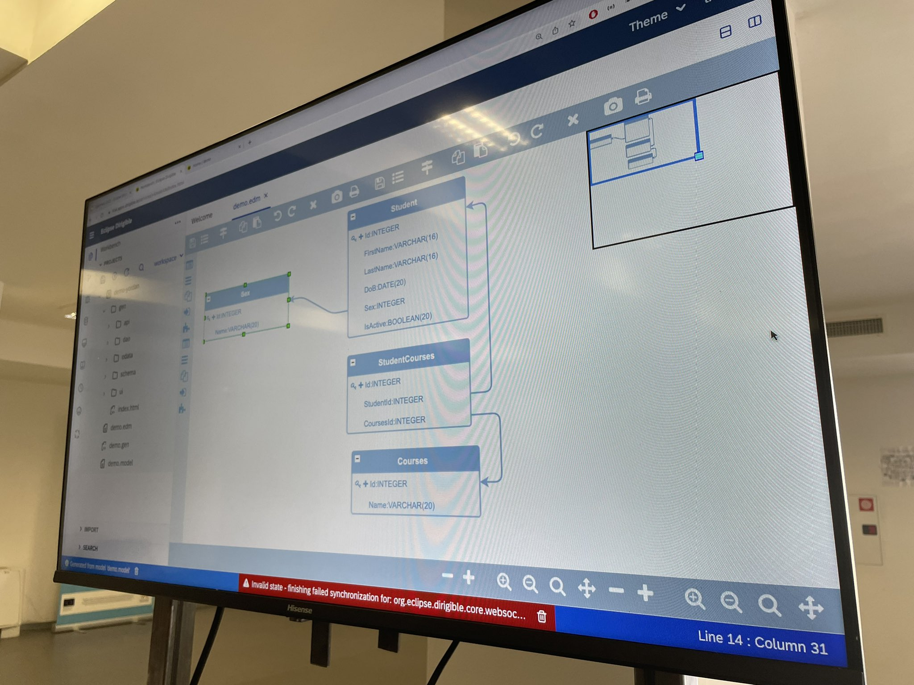

Last week at OpenFest Bulgaria [codbex](https://www.codbex.com)' and [Quanterall](https://www.quanterall.com)'s developers came together to demo the Low-Code power of Eclipse Dirigible.
The technics were demonstrated also with the real products such as [AVERATO](https://www.averato.com/) and [GenHub](https://www.quanterall.com/projects/genhub) products.

{: .img-responsive }

{: .img-responsive }

{: .img-responsive }

### Congrats
