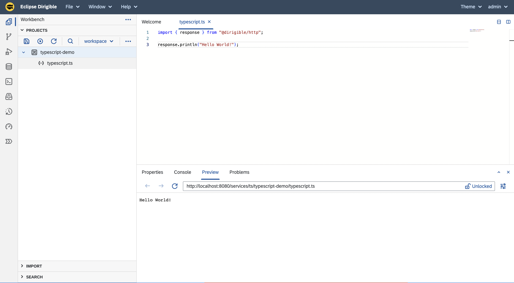

In the ever-evolving world of web development, staying on top of the latest technologies is crucial for success. Eclipse Dirigible, the open-source cloud development platform, has always been at the forefront of enabling developers to build innovative applications effortlessly. Now, we are thrilled to announce a major enhancement that will revolutionize your development experience: support for TypeScript!

## TypeScript in Eclipse Dirigible
TypeScript is a statically typed superset of JavaScript that offers better tooling, enhanced code quality, and improved developer productivity. Its adoption has skyrocketed, making it a staple in modern web development. Eclipse Dirigible recognized the need for TypeScript support and has seamlessly integrated it into the platform.

### Lightning-Fast Compilation with esbuild
Efficiency in the development cycle is essential, and at Eclipse Dirigible, we've seamlessly integrated `esbuild`, an ultra-fast JavaScript bundler and minifier, while preserving our in-system development model. This approach allows us to compile TypeScript code in a fraction of the time compared to other tools, ensuring that you can iterate quickly and see the results of your changes instantly. By preserving the in-system development model, we've not only enhanced the efficiency of the development process but also maintained the familiar workflow that our users value - just "Save" and see your code running.

### Execution with GraalJS
Compiled TypeScript code is executed by GraalJS, a high-performance JavaScript runtime. This combination ensures that your applications run smoothly and efficiently, providing excellent runtime performance and a responsive user experience.

### No Configuration Hassles
One of the most significant advantages of using TypeScript in Eclipse Dirigible is that you don't need to worry about configuring your project. There's no need to create custom tsconfig.json files or mess around with complex project configurations. You can jump right into writing your TypeScript code and focus on what matters most: building great applications.

### Effortless TypeScript Debugging
Debugging TypeScript in Eclipse Dirigible is just as intuitive and efficient as debugging JavaScript. Our integrated development environment (IDE) provides a seamless debugging experience. Set breakpoints, inspect variables, and step through your TypeScript code effortlessly. Whether you're an experienced developer or new to TypeScript, our debugging capabilities simplify issue identification and resolution, ensuring you can create high-quality applications with confidence.


## Getting Started with TypeScript in Eclipse Dirigible
To start writing TypeScript in Eclipse Dirigible, follow these simple steps:

1. **Create a New Project**: If you don't already have a project, create a new one in Eclipse Dirigible.

2. **Create a TypeScript Service**: Inside your project, create a new `TypeScript Service` using our predefined template. You should now have a file with the following content:
```TypeScript
import { response } from "@dirigible/http";

response.println("Hello World!");
```

3. **Save**: On Save, Eclipse Dirigible will automatically detect the TypeScript code and use `esbuild` to compile it into JavaScript. With the compiled JavaScript code ready, you can see your application running in the Preview component:




## Benefits of Using TypeScript in Eclipse Dirigible
- **Improved Code Quality**: TypeScript's static typing helps catch errors at compile-time, reducing runtime errors and enhancing code quality.

- **Enhanced Tooling**: Eclipse Dirigible's TypeScript support includes robust tooling, making development more efficient and less error-prone.

- **Faster Development**: The combination of esbuild and GraalJS means faster compilation and execution, enabling quicker development cycles.

- **Simplified Setup**: Say goodbye to complex configurations and focus on writing code.

## In Conclusion
Eclipse Dirigible's support for TypeScript, powered by esbuild and GraalJS, is a game-changer for web developers. Whether you're building web applications, APIs, or microservices, you can now harness the benefits of TypeScript without the usual configuration hassles. Elevate your development experience and build high-quality applications with ease using Eclipse Dirigible.

Ready to get started? Head over to the Eclipse Dirigible website and explore the possibilities of TypeScript development in this powerful cloud development platform. Happy coding!