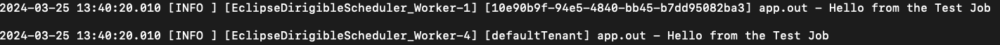
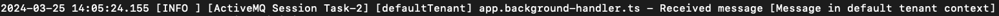
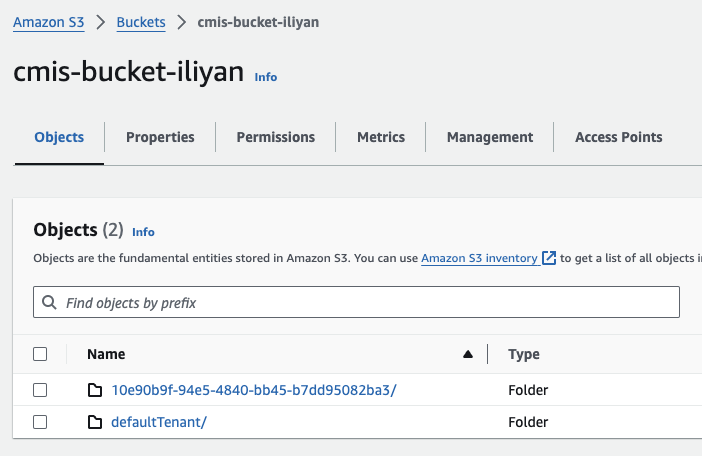
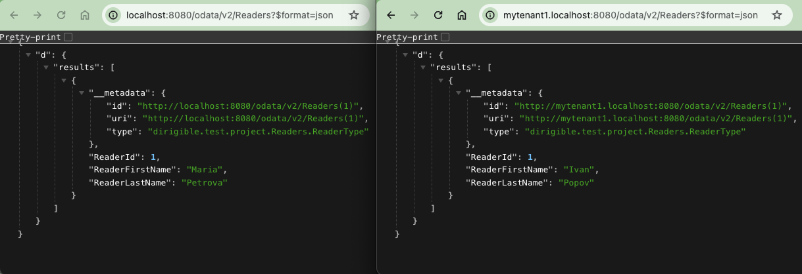

## Multitenancy in Eclipse Dirigible
Multitenancy is becoming increasingly essential in cloud-based applications, enabling multiple users or organizations (tenants) to securely share the same resources while maintaining isolation. Usually, it takes a lot of time and effort to achieve multitenancy in your application. You must be really careful when you design and implement your application to ensure proper isolation between the tenants.  
Recently, we added multitenancy support in Eclipse Dirigible which helps you to achieve secure and reliable multitenancy with **zero effort** from your side.

Since version **10.1.4**, Eclipse Dirigible is **multitenant by default**. 

We made all the essential application resources multitenant. 
This includes the following resources:
- tables (`*.table`)
- views (`*.view`)
- schemas (`*.schema`)
- CSVIMs (`*.csvim`)
- datasources (`*.datasource`)
- jobs (`*.job`)
- [Messaging API](https://www.dirigible.io/api/messaging/consumer/)
- listeners (`*.listener`)
- [Documents API (CMS)](https://www.dirigible.io/api/cms/cmis/)
- OData (`*.odata`)

If your existing applications use the above resources, they are **already multitenant**.<br>
All other resources are not multitenant and must be carefully used in multitenant scenarios. If you need some other resource type to become a multitenant, please create [a new feature request](https://github.com/eclipse/dirigible/issues/new?assignees=&labels=&projects=&template=feature_request.md&title=) in Eclipse Dirigible project.

### Current tenant determination
Eclipse Dirigible determines the current tenant based on the used subdomain. For example, if your application's host is `my-application.com` and you open it via `mytenant1.my-application.com`, the current tenant which is resolved is the one which is registered for subdomain `mytenant1`. If the tenant subdomain cannot be determined, the request is considered to be executed in the context of the default tenant. By default, the regex which is used to get the subdomain is `^([^\.]+)\..+$`. If you have more complex host, you can configure the regex using the dedicated configuration `DIRIGIBLE_TENANT_SUBDOMAIN_REGEX`.

### Tenant provisioning
Registered tenants are stored in the Dirigible's system database. To register a new tenant, you simply have to insert a new entry in the corresponding table. An automated provisioning job will execute all the necessary work to provision the newly added tenant. You may need to wait a few minutes until the job is executed since it is executed regularly. Currently, it is configured to execute with initial delay of `30 seconds` after start of the application and after that, it will execute at `15 minutes` intervals.<Br>
As part of the automated provisioning process, a dedicated default database random user, schema and datasource will be created for each tenant.<br>
<br>
To register a new tenant, follow the steps bellow:

- Add a new tenant
  ```
  INSERT INTO DIRIGIBLE_TENANTS (TENANT_ID, TENANT_NAME, TENANT_STATUS, TENANT_SUBDOMAIN)
  VALUES ('10e90b9f-94e5-4840-bb45-b7dd95082ba3', 'My Tenant 1', 'INITIAL', 'mytenant1' );
  ```

- Add tenant users<br>
  To be able to access the tenant using the registered subdomain, you have to register a user for your tenant.
  ```
  INSERT INTO DIRIGIBLE_USERS (USER_ID, USER_PASSWORD, USER_USERNAME, USER_TENANT_ID)
  VALUES ('93d2f6b5-3f6e-4d20-a1fa-1c9788761139', '$2a$10$R35KSyhNwEph..nS3RDJReXqcpGmE.oQtyCo5jZ.I3z1sb8X7dTYO', 'myuser1', '10e90b9f-94e5-4840-bb45-b7dd95082ba3');
  ```
  __Note:__ use BCrypt to encode the user's password.

To automate the above steps, you can define these entries in `*.csv` files and register the files in a `*.csvim` file.

### Multitenant resources

#### Tables, views and schemas
Using these resources, you can describe the structures of your application's database.
Once the resources are published, they are automatically created in the default tenant databases.

#### CSVIMs
CSVIMs are used to import predefined data into tables. Each csvim is imported in each tenant, once published.

#### Datasources
These resources are used to define datasources which later could be used by your application. For the default database, a dedicated datasource is created for each tenant as part of the provisioning tenant as described in [tenant provisioning section](#tenant-provisioning). When you use the default datasource with name `DefaultDB` in your code, you actually use the dedicated tenant datasource. For all other datasource, you have to provide a separate `*.datasource` resource for each tenant with tenant id prefix in its name. For example, if you have a datasource with name `MyDB` and you use it from the context of a tenant with id `10e90b9f-94e5-4840-bb45-b7dd95082ba3`, a datasource with name `10e90b9f-94e5-4840-bb45-b7dd95082ba3_MyDB` will be used.<br>
For backwards compatibility, the default tenant uses datasources without prefix.

#### Jobs
Jobs are used to schedule a background execution of a logic which is triggered based on the defined cron expression. For each job, a dedicated job is triggered for each tenant.
<br>
Job execution log UI was enhanced to collect data for each tenant.
<br>

#### Messaging API
Using Eclipse Dirigible [messaging API](https://www.dirigible.io/api/messaging/consumer/) you can send/receive messages to/from queues and topics in synchronous manner. Depending on the current tenant context, messages are sent/received to/from dedicated tenant queues and topics. A tenant specific prefix is used for the destination names. For example, if you send a message to a topic with name `mytopic` and the current tenant is with id `10e90b9f-94e5-4840-bb45-b7dd95082ba3`, it will be sent to topic with name `10e90b9f-94e5-4840-bb45-b7dd95082ba3###mytopic`.<br>
For backwards compatibility, such a prefix is not added for the default tenant.

#### Listeners
Listener resources are used to configure asynchronous code logic which will be executed when a new message is sent to queue or topic. The execution is executed in the context of the tenant for which the message is sent.
<br>
<br>

#### Documents API (CMS)
[Documents API](https://www.dirigible.io/api/cms/cmis/) is used to manage documents.<br>In the internal Eclipse Dirigible implementation, the file system is used. `DIRIGIBLE_CMS_INTERNAL_ROOT_FOLDER` configuration property could be provided to set the internal folder path. Tenant documents are isolated using a dedicated folder for each tenant.<br>
<br>
In the Amazon S3 scenario, a separate folder for each tenant is created in the configured bucket to achieve tenant isolation. The documents API will automatically use the corresponding tenant's folder.<br>
<br>

#### OData
OData resources are used to expose your data using the OData protocol. All requests to the OData service are routed to the corresponding DefaultDB datasource for the current tenant. This way the OData works in tenant isolation.  
<br>

If you prefer the REST protocol, you can implement it using our API which is described [here](https://www.dirigible.io/api/http/rs/). In the implementation, you can use our [databse APIs](https://www.dirigible.io/api/database/dao/).

### Traceability
To improve the logs traceability, current tenant id was added to the logs pattern.
<br>
If a code is executed in non-tenant context, `background` is used in the logs for tenant id.


### Conclusion
Using Eclipse Dirigible, you can achieve multitenancy **without any additional effort** from your side. It costs **zero effort** from your side.

**Enjoy low-code development using Eclipse Dirigible like never before!**

### Resources
- [Dirigible API documentation](https://www.dirigible.io/api/)
- [Dirigible repository](https://github.com/eclipse/dirigible)
- [Multitenancy wikipedia](https://en.wikipedia.org/wiki/Multitenancy)
