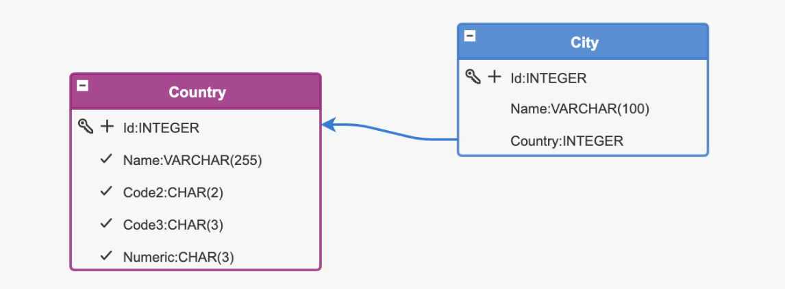
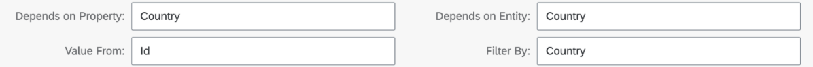
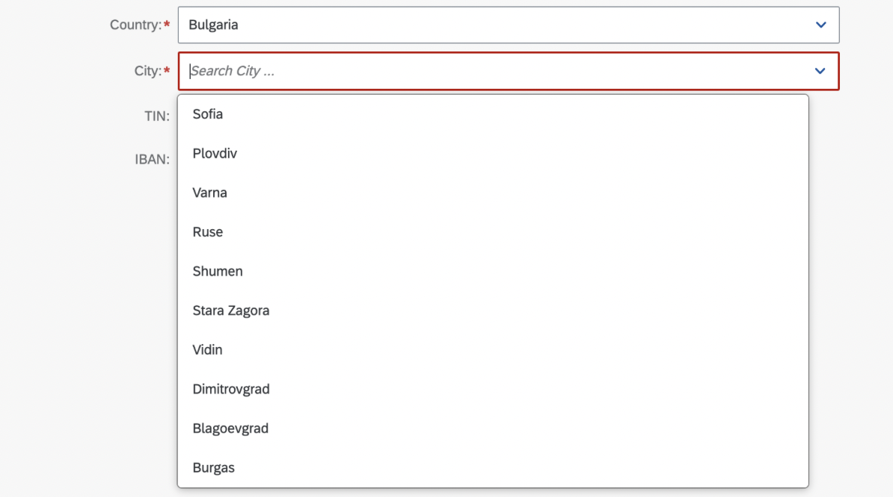
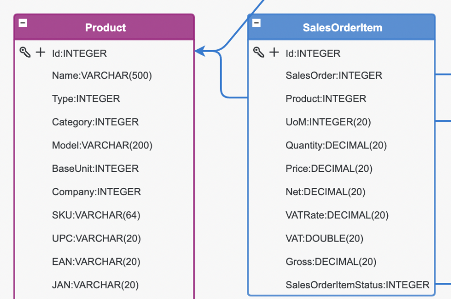
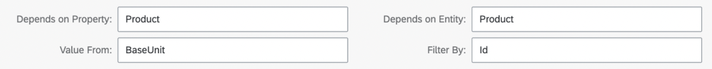
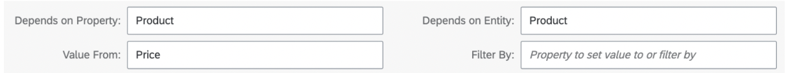
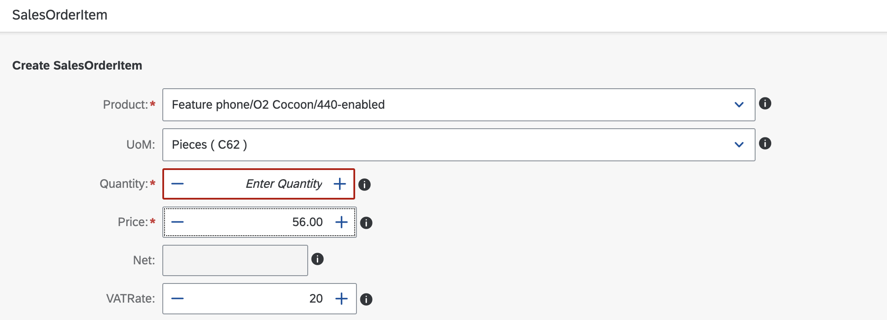

# The 'Depens on' feature in Eclipse Dirigible
In this blog post, we introduce a new feature for building models in Dirigible: the "Depends on" functionality. Previously, Dirigible allowed for visualising dropdowns based on key-value pairs, often displaying data by ID and showing the corresponding name or number. However, as we encountered more complex use cases, we realised the need for more advanced connections and filtering of options based on a specific indicator. One such use case was filtering a list of cities by the selected country.

## Sections:

 * First case: Filtering Cities by Country
 * Second case: Automatically Setting the Unit of Measurement (UoM)
 * Third case: Expanding the "Depends on" Feature to work with different types of fields

 1. ## First case: Filtering Cities by Country

To explore this in more detail, consider the following model structure:

 

Each city has a reference to the country it belongs to, typically stored as an ID. 

The solution we implemented was to filter the list of cities based on the selected country ID. This is where the "Depends on" section was introduced in the user interface properties of the modeller, allowing us to filter the list of cities based on the selected country. This solved the issue for simple relationships where the filter value was a direct part of the filtered entity.

 

What this feature does is simply filter the cities list by the value of "Country" in the current entity. The dropdown for cities now functions with the following logic: "Take the value from the Country property in the current entity, link it to the Country entity, retrieve the ID of the selected country, and filter the list of cities where City.Country matches Country.Id."

**Example: Filtering Cities by Country**

To illustrate this, consider the following example. Suppose we have two countries in the application: Bulgaria (ID 1) and Greece (ID 2). The city Sofia references Bulgaria, so its Country property is set to 1. On the other hand, Athens references Greece, so its Country value is set to 2. When Bulgaria is selected from the countries dropdown, the cities list is filtered by this choice. Dirigible uses the value from the Country property (1), finds the corresponding Country entity with ID 1, and filters the cities list where City.Country = Country.Id.

 

 

2. ## Second case: Automatically Setting the Unit of Measurement (UoM)

The next step is to define the purpose of your reports. The issue arose when we wanted to automatically set the unit of measurement (UoM) for a product when it was chosen in a sales order. The Product entity has a BaseUnit property, which is a reference to the primary unit of measurement for the product. However, when adding items to a sales order, we couldn't link the BaseUnit to the expected UoM because the "Depends on" feature could only filter entities by a field they contained (e.g., City by Country), not the other way around (e.g., UoM by Product).

 

The solution was to define the property of the current entity whose value was needed, then identify the entity and property we aimed to reach. In this case, the logic was as follows: "Take the value from the SalesOrderItem's Product, find the corresponding product entity, retrieve the value from the BaseUnit property, and filter the current UoM list where the ID matches the selected BaseUnit."

 

3. ## Third case: Expanding the "Depends on" Feature to work with different types of field
The next step was to expand the functionality of the "Depends on" feature, not only for dropdowns but also for other fields like text boxes, numbers, and more. By applying the same logic, we can now transfer product details such as price and VAT directly into the order items. These values can also be edited if necessary. The "Filter by" option is primarily used for lists, where the value from the selected property is not directly used but rather employed to filter the available options.

 

 

**Conclusion**
The introduction of the "Depends on" feature in Dirigible significantly enhances the flexibility and usability of the platform, enabling more complex data relationships and dynamic filtering. Whether filtering cities by country, setting UoM for products, or transferring product details directly into order items, this feature provides a streamlined and efficient approach for handling interrelated entities. By expanding this functionality beyond dropdowns to other field types, D

-------------------------
