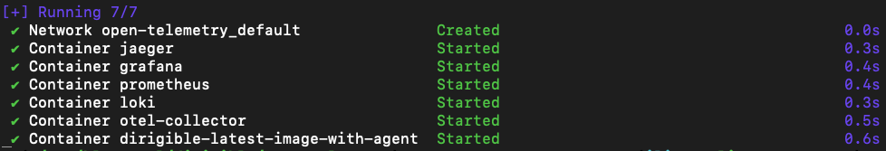
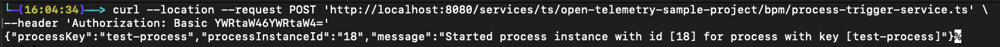

## Overview
In today’s fast-paced software development landscape, [observability](https://en.wikipedia.org/wiki/Observability_(software)) has become a cornerstone of resilient and high-performing systems. Observability is more than just [logs](https://opentelemetry.io/docs/concepts/signals/logs/), [metrics](https://opentelemetry.io/docs/concepts/signals/metrics/), and [traces](https://opentelemetry.io/docs/concepts/signals/traces/) — it’s about gaining actionable insights into how your software behaves in production.<br> 

That’s where [OpenTelemetry](https://opentelemetry.io/docs/what-is-opentelemetry/) comes in, a powerful, vendor-neutral framework that simplifies collecting telemetry data and integrates seamlessly with major providers like Google Cloud Platform, AWS, and Azure.<br>

In our [Eclipse Dirigible](https://www.dirigible.io/) project, we embraced OpenTelemetry to enhance our observability practices. By instrumenting components such as Quartz jobs, Flowable BPM processes, Apache Camel routes, and TypeScript/JavaScript script executions, we achieved a comprehensive view of our system’s behavior. Additionally, we exposed [Spring Boot Actuator Metrics](https://docs.spring.io/spring-boot/reference/actuator/metrics.html) to provide even deeper insights into application health and performance.

In this blog, we showcase the architecture of our local setup, provide step-by-step instructions to run it locally, and share examples of traces, metrics, and logs generated from a sample Dirigible project.

## Local OpenTelemetry stack
As part of our observability implementation, we prepared a local OpenTelemetry stack implemented with [Docker Compose](https://docs.docker.com/compose/), featuring [OpenTelemetry Collector](https://opentelemetry.io/docs/collector/), [Jaeger](https://www.jaegertracing.io/), [Prometheus](https://prometheus.io/), [Loki](https://grafana.com/oss/loki/), and [Grafana](https://grafana.com/). While this setup enables powerful local monitoring, OpenTelemetry is versatile and can be integrated with any OpenTelemetry-compliant stack that supports it. 


### Architecture
To better understand how the components interact within our local setup, let's take a look at the architecture. The following diagram illustrates the flow of telemetry data through the system, showcasing how OpenTelemetry Collector integrates with Jaeger, Prometheus, Loki, and Grafana for comprehensive monitoring.
<a href="../../../../images/open-telemetry/architecture.png" target="_blank">
  
</a>

### Run steps
There are different Docker Compose profiles which helps you to run the local OpenTelemetry stack depending on your scenario.
In this blog we will run the profile which starts OpenTelemetry Collector, Jaeger, Prometheus, Loki, Grafana and latest Eclipse Dirigible image with configured [OpenTelemetry Agent](https://opentelemetry.io/docs/zero-code/java/agent/).
More details about the different profiles could be found in [this README](https://github.com/eclipse/dirigible/blob/68e916832b99805d8979f0d1b0537fc8dc7adc5e/open-telemetry/README.md).

```shell
git clone --branch 10.6.34 https://github.com/eclipse/dirigible.git dirigible
cd dirigible/open-telemetry

docker compose --profile dirigible-latest-image-with-agent up --detach --build
```


Once started, all containers could be accessed using the following URLs:

| Container         | URL                                                            | 
|-------------------|----------------------------------------------------------------|
| Eclipse Dirigible | [http://localhost:8080](http://localhost:8080)                 | 
| Prometheus        | [http://localhost:16686](http://localhost:16686)               | 
| Jaeger            | [http://localhost:9090](http://localhost:9090)                 | 
| Loki              | [http://localhost:3100](http://localhost:3100)                 | 
| Grafana           | [http://localhost:3000/grafana](http://localhost:3000/grafana) | 

## Sample Eclipse Dirigible project
We will use a sample Eclipse Dirigible project to demonstrate the observability functionalities.
The project is located in [this GitHub repository](https://github.com/dirigiblelabs/sample-open-telemetry).
It contains some common functionalities used in Eclipse Dirigible projects - REST endpoint, BPM (Flowable) process, asynchronous job (Quartz) and Camel routes.

To run the application, follow the steps:<br>

- Open Eclipse Dirigible UI at [http://localhost:8080](http://localhost:8080) and login using the default credentials `admin / admin`<br>
- Go to `Git` perspective<br>
   
- Click on `Clone` button<br>
   
- Set `https://github.com/dirigiblelabs/sample-open-telemetry.git` for URL and click on `Clone` button<br>
  
- Go back to the `Workbench` perspective<br>
  
- Click on `Publish All` button<br>
  

The sample application is now published and ready to be explored.


## Out-of-the-Box telemetry data
OpenTelemetry’s agent instrumentation makes it remarkably easy to capture telemetry data with minimal effort. It provides built-in support for monitoring and collecting telemetry from many popular libraries and frameworks out of the box. It supports frameworks like Apache HttpClient, Quartz, Camel, Spring Web MVC, Java JDBC and so on. For a complete and up-to-date list of frameworks and libraries supported by the OpenTelemetry agent, visit the [OpenTelemetry Java Instrumentation GitHub repository](https://github.com/open-telemetry/opentelemetry-java-instrumentation/blob/c73f1ddea352082c57a0309ee72b9cd2f62ffef2/docs/supported-libraries.md#libraries--frameworks).

The following JSON examples showcase the generated traces and metrics, captured for our sample Eclipse Dirigible application, by our observability setup.

- Traces<br>
    The traces were exported using [the Jaeger API endpoint](http://localhost:16686/api/operations?service=eclipse-dirigible-agent). For a more detailed exploration, visit [the Grafana dashboard](http://localhost:3000/grafana/explore?left=%7B%22datasource%22:%22Jaeger%22,%22context%22:%22explore%22%7D) or view them through [the Jaeger UI](http://localhost:16686/search?service=eclipse-dirigible-agent).

    <details>
      <summary>Click to expand the traces in JSON</summary>
    
      ```json
      {
          "data": [
              {
                  "name": "CREATE TABLE ./target/dirigible/h2/systemdb.QRTZ_LOCKS",
                  "spanKind": "client"
              },
              {
                  "name": "INSERT ./target/dirigible/h2/systemdb.ACT_GE_BYTEARRAY",
                  "spanKind": "client"
              },
              {
                  "name": "MarkdownRepository.findAll",
                  "spanKind": "internal"
              },
              {
                  "name": "Session.persist org.eclipse.dirigible.components.engine.camel.domain.Camel",
                  "spanKind": "internal"
              },
              {
                  "name": "synchronizer_BpmnSynchronizer_parse_execution",
                  "spanKind": "internal"
              },
              {
                  "name": "synchronizer_CamelSynchronizer_complete_execution",
                  "spanKind": "internal"
              },
              {
                  "name": "UPDATE ./target/dirigible/h2/systemdb.DIRIGIBLE_JOBS",
                  "spanKind": "client"
              },
              {
                  "name": "SELECT ./target/dirigible/h2/systemdb.DIRIGIBLE_EXTENSION_POINTS",
                  "spanKind": "client"
              },
              {
                  "name": "SELECT ./target/dirigible/h2/systemdb.DIRIGIBLE_SECURITY_ROLES",
                  "spanKind": "client"
              },
              {
                  "name": "SELECT ./target/dirigible/h2/systemdb.DIRIGIBLE_JOB_EMAILS",
                  "spanKind": "client"
              },
              {
                  "name": "GET /**",
                  "spanKind": "server"
              },
              {
                  "name": "GET /services/js/{projectName}/{*projectFilePath}",
                  "spanKind": "server"
              },
              {
                  "name": "SELECT ./target/dirigible/h2/systemdb.DIRIGIBLE_PROBLEMS",
                  "spanKind": "client"
              },
              {
                  "name": "GET /services/data/sources",
                  "spanKind": "server"
              },
              {
                  "name": "Session.persist org.eclipse.dirigible.components.jobs.domain.Job",
                  "spanKind": "internal"
              },
              {
                  "name": "SELECT org.eclipse.dirigible.components.tenants.domain.Tenant",
                  "spanKind": "internal"
              },
              {
                  "name": "SELECT org.eclipse.dirigible.components.data.store.domain.Entity",
                  "spanKind": "internal"
              },
              {
                  "name": "SELECT ./target/dirigible/h2/systemdb.DIRIGIBLE_DATA_VIEWS",
                  "spanKind": "client"
              },
              {
                  "name": "SELECT ./target/dirigible/h2/systemdb.DIRIGIBLE_ODATA",
                  "spanKind": "client"
              },
              {
                  "name": "TypeScriptEndpoint.get",
                  "spanKind": "internal"
              },
              {
                  "name": "SELECT ./target/dirigible/h2/systemdb.ACTIVEMQ_MSGS",
                  "spanKind": "client"
              },
              {
                  "name": "SELECT ./target/dirigible/h2/systemdb.DIRIGIBLE_CSVIM",
                  "spanKind": "client"
              },
              {
                  "name": "Session.merge org.eclipse.dirigible.components.data.store.domain.Entity",
                  "spanKind": "internal"
              },
              {
                  "name": "SELECT ./target/dirigible/h2/systemdb.DIRIGIBLE_DATA_SCHEMAS",
                  "spanKind": "client"
              },
              {
                  "name": "CREATE TABLE ./target/dirigible/h2/systemdb.QRTZ_TRIGGERS",
                  "spanKind": "client"
              },
              {
                  "name": "INSERT ./target/dirigible/h2/systemdb.QRTZ_CRON_TRIGGERS",
                  "spanKind": "client"
              },
              {
                  "name": "EntityRepository.findAll",
                  "spanKind": "internal"
              },
              {
                  "name": "JavascriptEndpoint.get",
                  "spanKind": "internal"
              },
              {
                  "name": "UPDATE ./target/dirigible/h2/systemdb.DIRIGIBLE_OPENAPI",
                  "spanKind": "client"
              },
              {
                  "name": "ODataRepository.findAll",
                  "spanKind": "internal"
              },
              {
                  "name": "Session.merge org.eclipse.dirigible.components.openapi.domain.OpenAPI",
                  "spanKind": "internal"
              },
              {
                  "name": "INSERT ./target/dirigible/h2/systemdb.QRTZ_FIRED_TRIGGERS",
                  "spanKind": "client"
              },
              {
                  "name": "Session.merge org.eclipse.dirigible.components.engine.camel.domain.Camel",
                  "spanKind": "internal"
              },
              {
                  "name": "ALTER TABLE ./target/dirigible/h2/systemdb.QRTZ_PAUSED_TRIGGER_GRPS",
                  "spanKind": "client"
              },
              {
                  "name": "ALTER TABLE ./target/dirigible/h2/systemdb.QRTZ_CALENDARS",
                  "spanKind": "client"
              },
              {
                  "name": "SELECT ./target/dirigible/h2/systemdb.DIRIGIBLE_TENANTS",
                  "spanKind": "client"
              },
              {
                  "name": "WebsocketRepository.saveAndFlush",
                  "spanKind": "internal"
              },
              {
                  "name": "UserRoleAssignmentRepository.findByUser",
                  "spanKind": "internal"
              },
              {
                  "name": "SELECT",
                  "spanKind": "internal"
              },
              {
                  "name": "INSERT ./target/dirigible/h2/systemdb.DIRIGIBLE_CAMEL",
                  "spanKind": "client"
              },
              {
                  "name": "INSERT ./target/dirigible/h2/systemdb.DIRIGIBLE_JOB_LOGS",
                  "spanKind": "client"
              },
              {
                  "name": "./target/dirigible/h2/systemdb",
                  "spanKind": "client"
              },
              {
                  "name": "CREATE INDEX ./target/dirigible/h2/systemdb",
                  "spanKind": "client"
              },
              {
                  "name": "defined.synchronize",
                  "spanKind": "internal"
              },
              {
                  "name": "GET /services/ide/problems/search",
                  "spanKind": "server"
              },
              {
                  "name": "SELECT ./target/dirigible/h2/systemdb.DIRIGIBLE_DEFINITIONS",
                  "spanKind": "client"
              },
              {
                  "name": "Session.persist org.eclipse.dirigible.components.engine.bpm.flowable.domain.Bpmn",
                  "spanKind": "internal"
              },
              {
                  "name": "JobRepository.findByName",
                  "spanKind": "internal"
              },
              {
                  "name": "SELECT org.eclipse.dirigible.components.data.sources.domain.DataSource",
                  "spanKind": "internal"
              },
              {
                  "name": "UPDATE ./target/dirigible/h2/systemdb.QRTZ_TRIGGERS",
                  "spanKind": "client"
              },
              {
                  "name": "synchronizer_WebsocketsSynchronizer_complete_execution",
                  "spanKind": "internal"
              },
              {
                  "name": "GET",
                  "spanKind": "client"
              },
              {
                  "name": "CamelRepository.findByKey",
                  "spanKind": "internal"
              },
              {
                  "name": "cron",
                  "spanKind": "server"
              },
              {
                  "name": "synchronizer_BpmnSynchronizer_complete_execution",
                  "spanKind": "internal"
              },
              {
                  "name": "CREATE TABLE ./target/dirigible/h2/systemdb.QRTZ_JOB_DETAILS",
                  "spanKind": "client"
              },
              {
                  "name": "SELECT ./target/dirigible/h2/systemdb.DIRIGIBLE_CONFLUENCE",
                  "spanKind": "client"
              },
              {
                  "name": "synchronizer_OpenAPISynchronizer_complete_execution",
                  "spanKind": "internal"
              },
              {
                  "name": "HttpServletResponseWrapper.sendError",
                  "spanKind": "internal"
              },
              {
                  "name": "DELETE ./target/dirigible/h2/systemdb.QRTZ_FIRED_TRIGGERS",
                  "spanKind": "client"
              },
              {
                  "name": "GET /services/data/definition/{datasource}",
                  "spanKind": "server"
              },
              {
                  "name": "ExtensionRepository.saveAndFlush",
                  "spanKind": "internal"
              },
              {
                  "name": "SchemaRepository.findAll",
                  "spanKind": "internal"
              },
              {
                  "name": "DataSourceRepository.saveAndFlush",
                  "spanKind": "internal"
              },
              {
                  "name": "SELECT ./target/dirigible/h2/systemdb.DIRIGIBLE_LISTENERS",
                  "spanKind": "client"
              },
              {
                  "name": "synchronizer_JobSynchronizer_complete_execution",
                  "spanKind": "internal"
              },
              {
                  "name": "OpenAPIRepository.findAll",
                  "spanKind": "internal"
              },
              {
                  "name": "ProblemRepository.count",
                  "spanKind": "internal"
              },
              {
                  "name": "TopologicalDepleter.deplete",
                  "spanKind": "internal"
              },
              {
                  "name": "SELECT org.eclipse.dirigible.components.extensions.domain.Extension",
                  "spanKind": "internal"
              },
              {
                  "name": "GET /services/data/metadata/{datasource}",
                  "spanKind": "server"
              },
              {
                  "name": "SELECT org.eclipse.dirigible.components.initializers.definition.Definition",
                  "spanKind": "internal"
              },
              {
                  "name": "ListenerRepository.findAll",
                  "spanKind": "internal"
              },
              {
                  "name": "INSERT ./target/dirigible/h2/systemdb.QRTZ_SIMPLE_TRIGGERS",
                  "spanKind": "client"
              },
              {
                  "name": "synchronizer_DataSourcesSynchronizer_complete_execution",
                  "spanKind": "internal"
              },
              {
                  "name": "OnCommittedResponseWrapper.sendRedirect",
                  "spanKind": "internal"
              },
              {
                  "name": "SELECT org.eclipse.dirigible.components.engine.wiki.domain.Markdown",
                  "spanKind": "internal"
              },
              {
                  "name": "CREATE ./target/dirigible/h2/defaultdb",
                  "spanKind": "client"
              },
              {
                  "name": "SELECT ./target/dirigible/h2/systemdb.ACT_HI_TASKINST",
                  "spanKind": "client"
              },
              {
                  "name": "ALTER TABLE ./target/dirigible/h2/systemdb.QRTZ_SIMPROP_TRIGGERS",
                  "spanKind": "client"
              },
              {
                  "name": "JobLogRepository.saveAndFlush",
                  "spanKind": "internal"
              },
              {
                  "name": "TableRepository.findAll",
                  "spanKind": "internal"
              },
              {
                  "name": "SELECT org.eclipse.dirigible.components.engine.camel.domain.Camel",
                  "spanKind": "internal"
              },
              {
                  "name": "SELECT ./target/dirigible/h2/systemdb.DIRIGIBLE_BPMN",
                  "spanKind": "client"
              },
              {
                  "name": "UPDATE ./target/dirigible/h2/systemdb.ACTIVEMQ_LOCK",
                  "spanKind": "client"
              },
              {
                  "name": "POST /*",
                  "spanKind": "server"
              },
              {
                  "name": "INSERT ./target/dirigible/h2/systemdb.DIRIGIBLE_DEFINITIONS",
                  "spanKind": "client"
              },
              {
                  "name": "ALTER table ./target/dirigible/h2/systemdb",
                  "spanKind": "client"
              },
              {
                  "name": "synchronizer_ExtensionsSynchronizer_complete_execution",
                  "spanKind": "internal"
              },
              {
                  "name": "UPDATE ./target/dirigible/h2/systemdb.QRTZ_SIMPLE_TRIGGERS",
                  "spanKind": "client"
              },
              {
                  "name": "UPDATE ./target/dirigible/h2/systemdb.DIRIGIBLE_SECURITY_ACCESS",
                  "spanKind": "client"
              },
              {
                  "name": "ViewRepository.findAll",
                  "spanKind": "internal"
              },
              {
                  "name": "UPDATE ./target/dirigible/h2/systemdb.DIRIGIBLE_ENTITIES",
                  "spanKind": "client"
              },
              {
                  "name": "BpmnRepository.saveAndFlush",
                  "spanKind": "internal"
              },
              {
                  "name": "SELECT org.eclipse.dirigible.components.data.structures.domain.Table",
                  "spanKind": "internal"
              },
              {
                  "name": "SELECT org.eclipse.dirigible.components.odata.domain.OData",
                  "spanKind": "internal"
              },
              {
                  "name": "Session.merge org.eclipse.dirigible.components.data.sources.domain.DataSource",
                  "spanKind": "internal"
              },
              {
                  "name": "synchronizer_ExtensionPointsSynchronizer_complete_execution",
                  "spanKind": "internal"
              },
              {
                  "name": "Transaction.commit",
                  "spanKind": "internal"
              },
              {
                  "name": "SELECT org.eclipse.dirigible.components.extensions.domain.ExtensionPoint",
                  "spanKind": "internal"
              },
              {
                  "name": "UPDATE ./target/dirigible/h2/systemdb.DIRIGIBLE_CAMEL",
                  "spanKind": "client"
              },
              {
                  "name": "UPDATE ./target/dirigible/h2/systemdb.DIRIGIBLE_EXTENSIONS",
                  "spanKind": "client"
              },
              {
                  "name": "SELECT ./target/dirigible/h2/systemdb.DIRIGIBLE_WEBSOCKETS",
                  "spanKind": "client"
              },
              {
                  "name": "Session.merge org.eclipse.dirigible.components.engine.bpm.flowable.domain.Bpmn",
                  "spanKind": "internal"
              },
              {
                  "name": "EntityRepository.saveAndFlush",
                  "spanKind": "internal"
              },
              {
                  "name": "SELECT ./target/dirigible/h2/systemdb.ACT_RU_TASK",
                  "spanKind": "client"
              },
              {
                  "name": "GET /services/data/metadata/",
                  "spanKind": "server"
              },
              {
                  "name": "defined.test-job",
                  "spanKind": "internal"
              },
              {
                  "name": "SELECT ./target/dirigible/h2/systemdb.DIRIGIBLE_DATA_TABLES",
                  "spanKind": "client"
              },
              {
                  "name": "GET /services/js/all-dts",
                  "spanKind": "server"
              },
              {
                  "name": "SELECT org.eclipse.dirigible.components.data.csvim.domain.Csvim",
                  "spanKind": "internal"
              },
              {
                  "name": "ProblemRepository.findProblemsByConditionAndLimit",
                  "spanKind": "internal"
              },
              {
                  "name": "INSERT ./target/dirigible/h2/systemdb.DIRIGIBLE_JOBS",
                  "spanKind": "client"
              },
              {
                  "name": "INSERT ./target/dirigible/h2/systemdb.DIRIGIBLE_BPMN",
                  "spanKind": "client"
              },
              {
                  "name": "WebsocketRepository.findAll",
                  "spanKind": "internal"
              },
              {
                  "name": "GET /public/js/{projectName}/{*projectFilePath}",
                  "spanKind": "server"
              },
              {
                  "name": "SELECT DIRIGIBLE_PROBLEMS",
                  "spanKind": "internal"
              },
              {
                  "name": "CREATE TABLE ./target/dirigible/h2/systemdb.QRTZ_SIMPLE_TRIGGERS",
                  "spanKind": "client"
              },
              {
                  "name": "SELECT org.eclipse.dirigible.components.jobs.domain.Job",
                  "spanKind": "internal"
              },
              {
                  "name": "CsvimRepository.findAll",
                  "spanKind": "internal"
              },
              {
                  "name": "SELECT ./target/dirigible/h2/systemdb.ACT_RU_JOB",
                  "spanKind": "client"
              },
              {
                  "name": "SELECT ./target/dirigible/h2/systemdb.ACT_RE_PROCDEF",
                  "spanKind": "client"
              },
              {
                  "name": "POST",
                  "spanKind": "client"
              },
              {
                  "name": "SELECT ./target/dirigible/h2/systemdb.ACT_GE_PROPERTY",
                  "spanKind": "client"
              },
              {
                  "name": "SELECT org.eclipse.dirigible.components.listeners.domain.Listener",
                  "spanKind": "internal"
              },
              {
                  "name": "SELECT ./target/dirigible/h2/systemdb.DIRIGIBLE_OPENAPI",
                  "spanKind": "client"
              },
              {
                  "name": "CREATE table ./target/dirigible/h2/defaultdb",
                  "spanKind": "client"
              },
              {
                  "name": "JobEmailRepository.findAll",
                  "spanKind": "internal"
              },
              {
                  "name": "ALTER TABLE ./target/dirigible/h2/systemdb.QRTZ_FIRED_TRIGGERS",
                  "spanKind": "client"
              },
              {
                  "name": "CREATE TABLE ./target/dirigible/h2/systemdb.QRTZ_CALENDARS",
                  "spanKind": "client"
              },
              {
                  "name": "SELECT org.eclipse.dirigible.components.openapi.domain.OpenAPI",
                  "spanKind": "internal"
              },
              {
                  "name": "UPDATE ./target/dirigible/h2/systemdb.DIRIGIBLE_DEFINITIONS",
                  "spanKind": "client"
              },
              {
                  "name": "CREATE TABLE ./target/dirigible/h2/systemdb.QRTZ_BLOB_TRIGGERS",
                  "spanKind": "client"
              },
              {
                  "name": "SELECT ./target/dirigible/h2/systemdb.DIRIGIBLE_SECURITY_ACCESS",
                  "spanKind": "client"
              },
              {
                  "name": "SELECT org.eclipse.dirigible.components.data.structures.domain.View",
                  "spanKind": "internal"
              },
              {
                  "name": "DataSourceRepository.findAll",
                  "spanKind": "internal"
              },
              {
                  "name": "ALTER TABLE ./target/dirigible/h2/systemdb.ACTIVEMQ_ACKS",
                  "spanKind": "client"
              },
              {
                  "name": "INSERT ./target/dirigible/h2/systemdb.QRTZ_TRIGGERS",
                  "spanKind": "client"
              },
              {
                  "name": "system.TenantsProvisioningJob",
                  "spanKind": "internal"
              },
              {
                  "name": "AccessRepository.findAll",
                  "spanKind": "internal"
              },
              {
                  "name": "SELECT ./target/dirigible/h2/systemdb.ACTIVEMQ_ACKS",
                  "spanKind": "client"
              },
              {
                  "name": "RoleRepository.findAll",
                  "spanKind": "internal"
              },
              {
                  "name": "SELECT ./target/dirigible/h2/systemdb.QRTZ_LOCKS",
                  "spanKind": "client"
              },
              {
                  "name": "SELECT ./target/dirigible/h2/systemdb.DIRIGIBLE_JOB_PARAMETERS",
                  "spanKind": "client"
              },
              {
                  "name": "SELECT org.eclipse.dirigible.components.security.domain.Access",
                  "spanKind": "internal"
              },
              {
                  "name": "SELECT ./target/dirigible/h2/systemdb.ACT_PROCDEF_INFO",
                  "spanKind": "client"
              },
              {
                  "name": "INSERT ./target/dirigible/h2/systemdb.QRTZ_LOCKS",
                  "spanKind": "client"
              },
              {
                  "name": "UPDATE ./target/dirigible/h2/systemdb.DIRIGIBLE_WEBSOCKETS",
                  "spanKind": "client"
              },
              {
                  "name": "UPDATE ./target/dirigible/h2/systemdb.QRTZ_SCHEDULER_STATE",
                  "spanKind": "client"
              },
              {
                  "name": "ConfluenceRepository.findAll",
                  "spanKind": "internal"
              },
              {
                  "name": "SELECT ./target/dirigible/h2/systemdb.DIRIGIBLE_DATA_SOURCE_PROPERTIES",
                  "spanKind": "client"
              },
              {
                  "name": "SELECT ./target/dirigible/h2/systemdb.ACT_HI_ACTINST",
                  "spanKind": "client"
              },
              {
                  "name": "CREATE TABLE ./target/dirigible/h2/systemdb.ACTIVEMQ_ACKS",
                  "spanKind": "client"
              },
              {
                  "name": "OpenAPIRepository.saveAndFlush",
                  "spanKind": "internal"
              },
              {
                  "name": "synchronizer_RolesSynchronizer_cleanup_execution",
                  "spanKind": "internal"
              },
              {
                  "name": "DefinitionRepository.saveAndFlush",
                  "spanKind": "internal"
              },
              {
                  "name": "OnCommittedResponseWrapper.sendError",
                  "spanKind": "internal"
              },
              {
                  "name": "ALTER TABLE ./target/dirigible/h2/systemdb.QRTZ_JOB_DETAILS",
                  "spanKind": "client"
              },
              {
                  "name": "SELECT org.eclipse.dirigible.components.websockets.domain.Websocket",
                  "spanKind": "internal"
              },
              {
                  "name": "GET /services/web/{*path}",
                  "spanKind": "server"
              },
              {
                  "name": "SELECT ./target/dirigible/h2/systemdb.DIRIGIBLE_USERS",
                  "spanKind": "client"
              },
              {
                  "name": "CamelRepository.findAll",
                  "spanKind": "internal"
              },
              {
                  "name": "synchronizer_EntitySynchronizer_complete_execution",
                  "spanKind": "internal"
              },
              {
                  "name": "SELECT INFORMATION_SCHEMA.SEQUENCES",
                  "spanKind": "client"
              },
              {
                  "name": "SELECT ./target/dirigible/h2/systemdb",
                  "spanKind": "client"
              },
              {
                  "name": "TenantRepository.findByStatus",
                  "spanKind": "internal"
              },
              {
                  "name": "WebSocketMessageBrokerStats$$Lambda.run",
                  "spanKind": "internal"
              },
              {
                  "name": "CREATE TABLE ./target/dirigible/h2/systemdb.ACTIVEMQ_MSGS",
                  "spanKind": "client"
              },
              {
                  "name": "JobRepository.findAll",
                  "spanKind": "internal"
              },
              {
                  "name": "SELECT org.eclipse.dirigible.components.jobs.domain.JobEmail",
                  "spanKind": "internal"
              },
              {
                  "name": "GET /services/ide/workspaces",
                  "spanKind": "server"
              },
              {
                  "name": "SELECT org.eclipse.dirigible.components.ide.problems.domain.Problem",
                  "spanKind": "internal"
              },
              {
                  "name": "AccessRepository.saveAndFlush",
                  "spanKind": "internal"
              },
              {
                  "name": "SpringCronConsumer.run",
                  "spanKind": "internal"
              },
              {
                  "name": "GET /services/data/",
                  "spanKind": "server"
              },
              {
                  "name": "GET /services/data/definition/",
                  "spanKind": "server"
              },
              {
                  "name": "ALTER TABLE ./target/dirigible/h2/systemdb.QRTZ_SCHEDULER_STATE",
                  "spanKind": "client"
              },
              {
                  "name": "ExtensionPointRepository.findAll",
                  "spanKind": "internal"
              },
              {
                  "name": "Session.merge org.eclipse.dirigible.components.jobs.domain.Job",
                  "spanKind": "internal"
              },
              {
                  "name": "GET /webjars/**",
                  "spanKind": "server"
              },
              {
                  "name": "Session.persist org.eclipse.dirigible.components.initializers.definition.Definition",
                  "spanKind": "internal"
              },
              {
                  "name": "DefinitionRepository.findAll",
                  "spanKind": "internal"
              },
              {
                  "name": "JobRepository.saveAndFlush",
                  "spanKind": "internal"
              },
              {
                  "name": "SELECT ./target/dirigible/h2/systemdb.DIRIGIBLE_DATA_SOURCES",
                  "spanKind": "client"
              },
              {
                  "name": "UPDATE ./target/dirigible/h2/systemdb.QRTZ_FIRED_TRIGGERS",
                  "spanKind": "client"
              },
              {
                  "name": "UserRepository.findUserByUsernameAndTenantId",
                  "spanKind": "internal"
              },
              {
                  "name": "ALTER TABLE ./target/dirigible/h2/systemdb.QRTZ_LOCKS",
                  "spanKind": "client"
              },
              {
                  "name": "CREATE TABLE ./target/dirigible/h2/systemdb.QRTZ_FIRED_TRIGGERS",
                  "spanKind": "client"
              },
              {
                  "name": "SELECT org.eclipse.dirigible.components.data.structures.domain.Schema",
                  "spanKind": "internal"
              },
              {
                  "name": "SELECT ./target/dirigible/h2/systemdb.QRTZ_SCHEDULER_STATE",
                  "spanKind": "client"
              },
              {
                  "name": "CREATE TABLE ./target/dirigible/h2/systemdb.QRTZ_SIMPROP_TRIGGERS",
                  "spanKind": "client"
              },
              {
                  "name": "ALTER TABLE ./target/dirigible/h2/systemdb.QRTZ_CRON_TRIGGERS",
                  "spanKind": "client"
              },
              {
                  "name": "SELECT ./target/dirigible/h2/systemdb.QRTZ_JOB_DETAILS",
                  "spanKind": "client"
              },
              {
                  "name": "GET /websockets/ide/console",
                  "spanKind": "server"
              },
              {
                  "name": "SELECT ./target/dirigible/h2/systemdb.QRTZ_PAUSED_TRIGGER_GRPS",
                  "spanKind": "client"
              },
              {
                  "name": "SELECT ./target/dirigible/h2/systemdb.DIRIGIBLE_JOBS",
                  "spanKind": "client"
              },
              {
                  "name": "SELECT ./target/dirigible/h2/systemdb.DIRIGIBLE_ENTITIES",
                  "spanKind": "client"
              },
              {
                  "name": "SELECT org.eclipse.dirigible.components.security.domain.Role",
                  "spanKind": "internal"
              },
              {
                  "name": "ALTER TABLE ./target/dirigible/h2/systemdb.QRTZ_TRIGGERS",
                  "spanKind": "client"
              },
              {
                  "name": "ALTER TABLE ./target/dirigible/h2/systemdb.ACTIVEMQ_MSGS",
                  "spanKind": "client"
              },
              {
                  "name": "CREATE TABLE ./target/dirigible/h2/systemdb.ACTIVEMQ_LOCK",
                  "spanKind": "client"
              },
              {
                  "name": "Session.merge org.eclipse.dirigible.components.extensions.domain.Extension",
                  "spanKind": "internal"
              },
              {
                  "name": "DefinitionRepository.findOne",
                  "spanKind": "internal"
              },
              {
                  "name": "UPDATE ./target/dirigible/h2/systemdb.ACT_GE_PROPERTY",
                  "spanKind": "client"
              },
              {
                  "name": "Session.merge org.eclipse.dirigible.components.initializers.definition.Definition",
                  "spanKind": "internal"
              },
              {
                  "name": "INSERT ./target/dirigible/h2/systemdb.QRTZ_JOB_DETAILS",
                  "spanKind": "client"
              },
              {
                  "name": "UPDATE ./target/dirigible/h2/systemdb.QRTZ_CRON_TRIGGERS",
                  "spanKind": "client"
              },
              {
                  "name": "GET /*",
                  "spanKind": "server"
              },
              {
                  "name": "SELECT information_schema.sequences",
                  "spanKind": "client"
              },
              {
                  "name": "CREATE table ./target/dirigible/h2/systemdb",
                  "spanKind": "client"
              },
              {
                  "name": "POST /services/ide/git/{workspace}/clone",
                  "spanKind": "server"
              },
              {
                  "name": "UPDATE ./target/dirigible/h2/systemdb.DIRIGIBLE_DATA_SOURCES",
                  "spanKind": "client"
              },
              {
                  "name": "script_execution",
                  "spanKind": "internal"
              },
              {
                  "name": "SELECT org.eclipse.dirigible.components.engine.wiki.domain.Confluence",
                  "spanKind": "internal"
              },
              {
                  "name": "SELECT ./target/dirigible/h2/systemdb.ACT_RU_EXTERNAL_JOB",
                  "spanKind": "client"
              },
              {
                  "name": "UPDATE ./target/dirigible/h2/systemdb.DIRIGIBLE_BPMN",
                  "spanKind": "client"
              },
              {
                  "name": "CREATE TABLE ./target/dirigible/h2/systemdb.QRTZ_CRON_TRIGGERS",
                  "spanKind": "client"
              },
              {
                  "name": "system.SynchronizationJob",
                  "spanKind": "internal"
              },
              {
                  "name": "SELECT ./target/dirigible/h2/systemdb.DIRIGIBLE_MARKDOWN",
                  "spanKind": "client"
              },
              {
                  "name": "JobRepository.findByKey",
                  "spanKind": "internal"
              },
              {
                  "name": "CREATE TABLE ./target/dirigible/h2/systemdb.QRTZ_PAUSED_TRIGGER_GRPS",
                  "spanKind": "client"
              },
              {
                  "name": "INSERT ./target/dirigible/h2/systemdb.ACTIVEMQ_LOCK",
                  "spanKind": "client"
              },
              {
                  "name": "POST /services/ide/publisher/{workspace}/{project}/{*path}",
                  "spanKind": "server"
              },
              {
                  "name": "dirigible-java-script",
                  "spanKind": "client"
              },
              {
                  "name": "SELECT ./target/dirigible/h2/systemdb.DIRIGIBLE_EXTENSIONS",
                  "spanKind": "client"
              },
              {
                  "name": "BpmnRepository.findAll",
                  "spanKind": "internal"
              },
              {
                  "name": "SELECT ./target/dirigible/h2/systemdb.QRTZ_SIMPLE_TRIGGERS",
                  "spanKind": "client"
              },
              {
                  "name": "synchronizer_JobSynchronizer_parse_execution",
                  "spanKind": "internal"
              },
              {
                  "name": "SELECT ./target/dirigible/h2/systemdb.DIRIGIBLE_CAMEL",
                  "spanKind": "client"
              },
              {
                  "name": "GET /services/ide/workspaces/{workspace}",
                  "spanKind": "server"
              },
              {
                  "name": "INSERT ./target/dirigible/h2/systemdb.ACT_RE_PROCDEF",
                  "spanKind": "client"
              },
              {
                  "name": "CREATE TABLE ./target/dirigible/h2/systemdb.QRTZ_SCHEDULER_STATE",
                  "spanKind": "client"
              },
              {
                  "name": "SELECT ./target/dirigible/h2/systemdb.ACTIVEMQ_LOCK",
                  "spanKind": "client"
              },
              {
                  "name": "SELECT org.eclipse.dirigible.components.engine.bpm.flowable.domain.Bpmn",
                  "spanKind": "internal"
              },
              {
                  "name": "Session.persist org.eclipse.dirigible.components.jobs.domain.JobLog",
                  "spanKind": "internal"
              },
              {
                  "name": "GET /services/ts/{projectName}/{*projectFilePath}",
                  "spanKind": "server"
              },
              {
                  "name": "DELETE ./target/dirigible/h2/systemdb.ACTIVEMQ_MSGS",
                  "spanKind": "client"
              },
              {
                  "name": "Session.merge org.eclipse.dirigible.components.security.domain.Access",
                  "spanKind": "internal"
              },
              {
                  "name": "GET /services/ide/git/{workspace}/",
                  "spanKind": "server"
              },
              {
                  "name": "BpmnRepository.findByKey",
                  "spanKind": "internal"
              },
              {
                  "name": "synchronizer_AccessSynchronizer_complete_execution",
                  "spanKind": "internal"
              },
              {
                  "name": "SELECT org.eclipse.dirigible.components.tenants.domain.UserRoleAssignment",
                  "spanKind": "internal"
              },
              {
                  "name": "SELECT ./target/dirigible/h2/systemdb.DIRIGIBLE_USER_ROLE_ASSIGNMENTS",
                  "spanKind": "client"
              },
              {
                  "name": "INSERT ./target/dirigible/h2/systemdb.ACT_RE_DEPLOYMENT",
                  "spanKind": "client"
              },
              {
                  "name": "GET /services/ide/git/{workspace}/{repositoryName}/diff",
                  "spanKind": "server"
              },
              {
                  "name": "ALTER TABLE ./target/dirigible/h2/systemdb.QRTZ_SIMPLE_TRIGGERS",
                  "spanKind": "client"
              },
              {
                  "name": "ExtensionRepository.findAll",
                  "spanKind": "internal"
              },
              {
                  "name": "Session.merge org.eclipse.dirigible.components.websockets.domain.Websocket",
                  "spanKind": "internal"
              },
              {
                  "name": "SELECT ./target/dirigible/h2/systemdb.QRTZ_CRON_TRIGGERS",
                  "spanKind": "client"
              },
              {
                  "name": "GET /services/ide/workspaces/{workspace}/{project}/{*path}",
                  "spanKind": "server"
              },
              {
                  "name": "SELECT ./target/dirigible/h2/systemdb.QRTZ_TRIGGERS",
                  "spanKind": "client"
              },
              {
                  "name": "SELECT ./target/dirigible/h2/systemdb.ACT_RU_TIMER_JOB",
                  "spanKind": "client"
              },
              {
                  "name": "CamelRepository.saveAndFlush",
                  "spanKind": "internal"
              },
              {
                  "name": "synchronizer_CamelSynchronizer_parse_execution",
                  "spanKind": "internal"
              }
          ],
          "total": 254,
          "limit": 0,
          "offset": 0,
          "errors": null
      }
      ```
    </details> 
    Grafana trace example:
     <a href="../../../../images/open-telemetry/grafana-jaeger-trace-example.png" target="_blank">
      
     </a>
  
- Metrics<br>
  The metrics were exported using [the Prometheus API endpoint](http://localhost:9090/api/v1/label/__name__/values). For a more detailed exploration, visit [the Grafana metrics dashboard](http://localhost:3000/grafana/explore/metrics/trail) or view them through [the Prometheus UI](http://localhost:9090/graph).

    <details>
      <summary>Click to expand the metrics in JSON</summary>

      ```json
      {
          "status": "success",
          "data": [
              "application_ready_time_seconds",
              "application_started_time_seconds",
              "camel_exchange_event_notifier_max_seconds",
              "camel_exchange_event_notifier_seconds_bucket",
              "camel_exchange_event_notifier_seconds_count",
              "camel_exchange_event_notifier_seconds_sum",
              "camel_exchanges_inflight",
              "camel_exchanges_succeeded_total",
              "camel_exchanges_total",
              "camel_route_policy_max_seconds",
              "camel_route_policy_seconds_bucket",
              "camel_route_policy_seconds_count",
              "camel_route_policy_seconds_sum",
              "camel_routes_added",
              "camel_routes_reloaded",
              "camel_routes_running",
              "db_client_connections_create_time_milliseconds_bucket",
              "db_client_connections_create_time_milliseconds_count",
              "db_client_connections_create_time_milliseconds_sum",
              "db_client_connections_idle_min",
              "db_client_connections_max",
              "db_client_connections_pending_requests",
              "db_client_connections_usage",
              "db_client_connections_use_time_milliseconds_bucket",
              "db_client_connections_use_time_milliseconds_count",
              "db_client_connections_use_time_milliseconds_sum",
              "db_client_connections_wait_time_milliseconds_bucket",
              "db_client_connections_wait_time_milliseconds_count",
              "db_client_connections_wait_time_milliseconds_sum",
              "disk_free_bytes",
              "disk_total_bytes",
              "executor_active_threads",
              "executor_completed_tasks_total",
              "executor_pool_core_threads",
              "executor_pool_max_threads",
              "executor_pool_size_threads",
              "executor_queue_remaining_tasks",
              "executor_queued_tasks",
              "flowable_completedActivities",
              "flowable_completedProcessInstanceCount",
              "flowable_completedTaskCount",
              "flowable_completedTaskCountToday",
              "flowable_openTaskCount",
              "flowable_processDefinitionCount",
              "flowable_runningProcessInstanceCount",
              "hikaricp_connections",
              "hikaricp_connections_acquire_max_seconds",
              "hikaricp_connections_acquire_seconds_bucket",
              "hikaricp_connections_acquire_seconds_count",
              "hikaricp_connections_acquire_seconds_sum",
              "hikaricp_connections_active",
              "hikaricp_connections_creation_max_seconds",
              "hikaricp_connections_idle",
              "hikaricp_connections_max",
              "hikaricp_connections_min",
              "hikaricp_connections_pending",
              "hikaricp_connections_usage_max_seconds",
              "hikaricp_connections_usage_seconds_bucket",
              "hikaricp_connections_usage_seconds_count",
              "hikaricp_connections_usage_seconds_sum",
              "http_client_request_duration_seconds_bucket",
              "http_client_request_duration_seconds_count",
              "http_client_request_duration_seconds_sum",
              "http_server_request_duration_seconds_bucket",
              "http_server_request_duration_seconds_count",
              "http_server_request_duration_seconds_sum",
              "http_server_requests_active_active",
              "http_server_requests_active_duration_seconds",
              "http_server_requests_max_seconds",
              "http_server_requests_seconds_bucket",
              "http_server_requests_seconds_count",
              "http_server_requests_seconds_sum",
              "jvm_buffer_count_buffers",
              "jvm_buffer_memory_used_bytes",
              "jvm_buffer_total_capacity_bytes",
              "jvm_class_count",
              "jvm_class_loaded_total",
              "jvm_class_unloaded_total",
              "jvm_classes_loaded",
              "jvm_classes_unloaded_total",
              "jvm_compilation_time_milliseconds_total",
              "jvm_cpu_count",
              "jvm_cpu_recent_utilization_ratio",
              "jvm_cpu_time_seconds_total",
              "jvm_gc_concurrent_phase_time_max_seconds",
              "jvm_gc_concurrent_phase_time_seconds_bucket",
              "jvm_gc_concurrent_phase_time_seconds_count",
              "jvm_gc_concurrent_phase_time_seconds_sum",
              "jvm_gc_duration_seconds_bucket",
              "jvm_gc_duration_seconds_count",
              "jvm_gc_duration_seconds_sum",
              "jvm_gc_live_data_size_bytes",
              "jvm_gc_max_data_size_bytes",
              "jvm_gc_memory_allocated_bytes_total",
              "jvm_gc_memory_promoted_bytes_total",
              "jvm_gc_overhead",
              "jvm_gc_pause_max_seconds",
              "jvm_gc_pause_seconds_bucket",
              "jvm_gc_pause_seconds_count",
              "jvm_gc_pause_seconds_sum",
              "jvm_info",
              "jvm_memory_committed_bytes",
              "jvm_memory_limit_bytes",
              "jvm_memory_max_bytes",
              "jvm_memory_usage_after_gc",
              "jvm_memory_used_after_last_gc_bytes",
              "jvm_memory_used_bytes",
              "jvm_thread_count",
              "jvm_threads_daemon",
              "jvm_threads_live",
              "jvm_threads_peak",
              "jvm_threads_started_total",
              "jvm_threads_states",
              "logback_events_total",
              "otlp_exporter_exported_total",
              "otlp_exporter_seen_total",
              "process_cpu_time_nanoseconds_total",
              "process_cpu_usage",
              "process_files_max",
              "process_files_open",
              "process_start_time_seconds",
              "process_uptime_seconds",
              "processedLogs_total",
              "processedSpans_total",
              "quartz_job_executed_count_total",
              "quartz_job_execution_time_bucket",
              "quartz_job_execution_time_count",
              "quartz_job_execution_time_sum",
              "quartz_job_failed_count_total",
              "quartz_scheduler_running_jobs",
              "queueSize_ratio",
              "scrape_duration_seconds",
              "scrape_samples_post_metric_relabeling",
              "scrape_samples_scraped",
              "scrape_series_added",
              "spring_data_repository_invocations_max_seconds",
              "spring_data_repository_invocations_seconds_bucket",
              "spring_data_repository_invocations_seconds_count",
              "spring_data_repository_invocations_seconds_sum",
              "spring_security_authentications_active_active",
              "spring_security_authentications_active_duration_seconds",
              "spring_security_authentications_max_seconds",
              "spring_security_authentications_seconds_bucket",
              "spring_security_authentications_seconds_count",
              "spring_security_authentications_seconds_sum",
              "spring_security_authorizations_active_active",
              "spring_security_authorizations_active_duration_seconds",
              "spring_security_authorizations_max_seconds",
              "spring_security_authorizations_seconds_bucket",
              "spring_security_authorizations_seconds_count",
              "spring_security_authorizations_seconds_sum",
              "spring_security_filterchains_DefaultResourcesFilter_after_total",
              "spring_security_filterchains_DefaultResourcesFilter_before_total",
              "spring_security_filterchains_TenantContextInitFilter_after_total",
              "spring_security_filterchains_TenantContextInitFilter_before_total",
              "spring_security_filterchains_access_exceptions_after_total",
              "spring_security_filterchains_access_exceptions_before_total",
              "spring_security_filterchains_active_active",
              "spring_security_filterchains_active_duration_seconds",
              "spring_security_filterchains_authentication_anonymous_after_total",
              "spring_security_filterchains_authentication_anonymous_before_total",
              "spring_security_filterchains_authentication_basic_after_total",
              "spring_security_filterchains_authentication_basic_before_total",
              "spring_security_filterchains_authentication_form_after_total",
              "spring_security_filterchains_authentication_form_before_total",
              "spring_security_filterchains_authorization_after_total",
              "spring_security_filterchains_authorization_before_total",
              "spring_security_filterchains_context_async_after_total",
              "spring_security_filterchains_context_async_before_total",
              "spring_security_filterchains_context_holder_after_total",
              "spring_security_filterchains_context_holder_before_total",
              "spring_security_filterchains_context_servlet_after_total",
              "spring_security_filterchains_context_servlet_before_total",
              "spring_security_filterchains_cors_after_total",
              "spring_security_filterchains_cors_before_total",
              "spring_security_filterchains_header_after_total",
              "spring_security_filterchains_header_before_total",
              "spring_security_filterchains_logout_after_total",
              "spring_security_filterchains_logout_before_total",
              "spring_security_filterchains_max_seconds",
              "spring_security_filterchains_page_login_after_total",
              "spring_security_filterchains_page_login_before_total",
              "spring_security_filterchains_page_logout_after_total",
              "spring_security_filterchains_page_logout_before_total",
              "spring_security_filterchains_requestcache_after_total",
              "spring_security_filterchains_requestcache_before_total",
              "spring_security_filterchains_seconds_bucket",
              "spring_security_filterchains_seconds_count",
              "spring_security_filterchains_seconds_sum",
              "spring_security_filterchains_session_urlencoding_after_total",
              "spring_security_filterchains_session_urlencoding_before_total",
              "spring_security_http_secured_requests_active_active",
              "spring_security_http_secured_requests_active_duration_seconds",
              "spring_security_http_secured_requests_max_seconds",
              "spring_security_http_secured_requests_seconds_bucket",
              "spring_security_http_secured_requests_seconds_count",
              "spring_security_http_secured_requests_seconds_sum",
              "system_cpu_count",
              "system_cpu_usage",
              "system_load_average_1m",
              "target_info",
              "tomcat_sessions_active_current",
              "tomcat_sessions_active_max",
              "tomcat_sessions_alive_max_seconds",
              "tomcat_sessions_created_total",
              "tomcat_sessions_expired_total",
              "tomcat_sessions_rejected_total",
              "up"
          ]
      }
      ```
    </details> 
    Grafana metrics dashboard:
     <a href="../../../../images/open-telemetry/grafana-metrics.png" target="_blank">
      
     </a>

## Custom Telemetry using OpenTelemetry API

In this section, we explore the custom implementations of traces and metrics for different scenarios within our sample Eclipse Dirigible application, utilizing [the OpenTelemetry API](https://opentelemetry.io/docs/languages/java/api/). This way, we are able to monitor and troubleshoot each scenario effectively, ensuring enhanced observability and performance tuning capabilities for the application.

### REST API
In Eclipse Dirigible applications, monitoring and tracing REST API requests is essential to understanding how our application handles external communications. By using OpenTelemetry, we were able to instrument the REST endpoints and capture key telemetry data, providing visibility into every request and response.

In our sample application, there is a sample REST API which calls external API to get sample data using [Eclipse Dirigible HTTP Client API](https://www.dirigible.io/api/http/client/).

The REST API is implemented in file `open-telemetry-sample-project/api/test-api.ts`.
Let's make a GET request to [http://localhost:8080/services/ts/open-telemetry-sample-project/api/test-api.ts/data](http://localhost:8080/services/ts/open-telemetry-sample-project/api/test-api.ts/data).<br>


To explore the related traces:

- Go to [Grafana UI](http://localhost:3000/grafana)
- Select `Explore`
- Choose `Jaeger` data source from the dropdown
- Select `Search` for `Query Type`
- Select Eclipse Dirigible service
- Chose `GET /services/ts/{projectName}/{*projectFilePath}` for `Operation Name`
- Click on `Run query` button
- Select the latest trace
  <a href="../../../../images/open-telemetry/rest-trace.png" target="_blank">
  
  </a>
- You can see details about the different spans by selecting on them and expanding the attributes
  <a href="../../../../images/open-telemetry/rest-trace-details.png" target="_blank">
  
  </a>
- You can also navigate to the logs related to it by clicking on `Logs for this span`
  <a href="../../../../images/open-telemetry/rest-trace-logs.png" target="_blank">
  
  </a>

### Jobs
This sample showcases a Quartz job that periodically calls an external API. Using OpenTelemetry, we captured telemetry data such as execution times, API request and response details, and job status. These traces provide valuable insights into the job's performance and its interaction with the external API, helping to identify bottlenecks or failures effectively.

The sample job is defined in file `open-telemetry-sample-project/jobs/test-job.job`.
It triggers every 30 seconds, so it is not needed to trigger it manually.

#### Traces
To explore job traces:

- Go to [Grafana UI](http://localhost:3000/grafana)
- Select `Explore`
- Choose `Jaeger` data source from the dropdown
- Select `Search` for `Query Type`
- Select Eclipse Dirigible service
- Chose `defined.test-job` for `Operation Name`
- Click on `Run query` button
- Select the latest trace
  <a href="../../../../images/open-telemetry/job-trace.png" target="_blank">
  
  </a>
- You can see details about the trace and related logs
  <a href="../../../../images/open-telemetry/job-trace-span-details.png" target="_blank">
  
  </a>
  <a href="../../../../images/open-telemetry/job-trace-logs.png" target="_blank">
  
  </a>

#### Metrics
We added custom metrics to monitor the execution of Quartz jobs within our application.  By exposing these metrics through OpenTelemetry, we enable proactive monitoring and performance tuning for scheduled tasks.

To see all quartz related metrics:

- Go to [Grafana UI](http://localhost:3000/grafana)
- Select `Explore`
- Select `Metrics`
- Click on `New metric exploration`
- Type `quartz` in `Search metrics`
  <a href="../../../../images/open-telemetry/quartz-metrics.png" target="_blank">
  
  </a>

### BPM processes
We instrumented Flowable BPM processes to capture traces and metrics for each workflow execution. This observability helps monitor process efficiency and troubleshoot workflow bottlenecks effectively.

The sample process is defined in file `open-telemetry-sample-project/bpm/test-process.bpmn`.
<a href="../../../../images/open-telemetry/sample-bpm-process.png" target="_blank">

</a>

To trigger a process execution, send POST request to the dedicated API implemented in `open-telemetry-sample-project/bpm/process-trigger-service.ts`.
```shell
curl --location --request POST 'http://localhost:8080/services/ts/open-telemetry-sample-project/bpm/process-trigger-service.ts' \
--header 'Authorization: Basic YWRtaW46YWRtaW4='
```
<br>

#### Traces
To explore job traces:

- Go to [Grafana UI](http://localhost:3000/grafana)
- Select `Explore`
- Choose `Jaeger` data source from the dropdown
- Select `Search` for `Query Type`
- Select Eclipse Dirigible service
- Chose `flowable_task_execution` for `Operation Name`
- Click on `Run query` button
- Select the latest trace
  <a href="../../../../images/open-telemetry/process-trace.png" target="_blank">
  
  </a>
- You can see details about the trace and related logs
  <a href="../../../../images/open-telemetry/process-trace-details.png" target="_blank">
  
  </a>
  <a href="../../../../images/open-telemetry/process-trace-logs.png" target="_blank">
  
  </a>

#### Metrics
In addition to tracing, we added custom metrics to monitor Flowable BPM processes.

To see all Flwoable related metrics:

- Go to [Grafana UI](http://localhost:3000/grafana)
- Select `Explore`
- Select `Metrics`
- Click on `New metric exploration`
- Type `flowable` in `Search metrics`
  <a href="../../../../images/open-telemetry/flowable-metrics.png" target="_blank">
  
  </a>

### Camel routes
We enabled tracing and metrics for Apache Camel routes to gain insights into their execution and performance.

There are two camel routes in the sample application.
One http route defined in `open-telemetry-sample-project/camel/http-route.camel`
<a href="../../../../images/open-telemetry/http-camel.png" target="_blank">

</a>

and one cron route in `open-telemetry-sample-project/camel/cron-route.camel`
<a href="../../../../images/open-telemetry/cron-camel.png" target="_blank">

</a>

#### Http route traces

To trigger the route execution, send GET request to `http://localhost:8080/services/integrations/test-camel-route`.<br>


To explore route traces:

- Go to [Grafana UI](http://localhost:3000/grafana)
- Select `Explore`
- Choose `Jaeger` data source from the dropdown
- Select `Search` for `Query Type`
- Select Eclipse Dirigible service
- Chose `GET /services/integrations/test-camel-route` for `Operation Name`
- Click on `Run query` button
- Select the latest trace
  <a href="../../../../images/open-telemetry/http-route-trace.png" target="_blank">
  
  </a>
- You can see details about the trace and related logs
  <a href="../../../../images/open-telemetry/http-route-trace-details.png" target="_blank">
  
  </a>
  <a href="../../../../images/open-telemetry/http-route-trace-logs.png" target="_blank">
  
  </a>

#### Cron route traces

Cron route triggers every 20 seconds, so you don't need to trigger it explicitly.
To explore route traces:

- Go to [Grafana UI](http://localhost:3000/grafana)
- Select `Explore`
- Choose `Jaeger` data source from the dropdown
- Select `Search` for `Query Type`
- Select Eclipse Dirigible service
- Chose `SpringCronConsumer.run` for `Operation Name`
- Click on `Run query` button
- Select the latest trace
  <a href="../../../../images/open-telemetry/cron-route-trace.png" target="_blank">
  
  </a>
- You can see details about the trace and related logs
  <a href="../../../../images/open-telemetry/cron-route-trace-details.png" target="_blank">
  
  </a>

#### Metrics
In addition to tracing, we added custom metrics to monitor Camel.

To see all Camel related metrics:

- Go to [Grafana UI](http://localhost:3000/grafana)
- Select `Explore`
- Select `Metrics`
- Click on `New metric exploration`
- Type `camel` in `Search metrics`
  <a href="../../../../images/open-telemetry/camel-metrics.png" target="_blank">
  
  </a>

## Logs
Our local observability setup incorporates Loki to manage and analyze logs generated by the application. Logs provide essential contextual information, capturing detailed runtime events that complement traces and metrics.

With Loki's seamless integration into Grafana, we can query, visualize, and correlate logs with other telemetry data, enabling efficient debugging and performance optimization.

To explore the logs:

- Go to [Grafana UI](http://localhost:3000/grafana)
- Select `Explore`
- Select `Logs`
- Select Eclipse Dirigible service
  <a href="../../../../images/open-telemetry/grafana-logs.png" target="_blank">
  
  </a>
- You can click on `Open in Explore` button to open the explore view. There you can write more advanced search queries.

## Unified Observability with Grafana Dashboards and Alerts
Grafana serves as the central hub for visualizing and analyzing telemetry data in our observability stack. By integrating traces, metrics, and logs from sources like Jaeger, Prometheus, and Loki, it enables the creation of custom dashboards tailored to specific monitoring needs. 

Additionally, Grafana supports setting up real-time alerts based on predefined thresholds or anomalies, ensuring proactive issue resolution and system reliability. This unified view empowers teams to monitor, troubleshoot, and optimize application performance seamlessly.

## Visualizing Telemetry Data in Action
To give you a better understanding of how the telemetry data looks and behaves in our setup, we've created a video demonstration. The video showcases examples of traces, metrics, and logs generated from the sample Eclipse Dirigible application.
<iframe width="100%" height="450" src="https://www.youtube.com/embed/UGw78B6Gtrc" frameborder="0" allowfullscreen></iframe>


## Summary
Integrating OpenTelemetry into the Eclipse Dirigible project significantly enhances its enterprise readiness by providing deep observability into the application's performance and behavior. With custom traces and metrics for key components like REST endpoints, Quartz jobs, Flowable processes, and Apache Camel routes, the integration allows for precise monitoring and troubleshooting. 

Grafana plays a crucial role by enabling the creation of custom dashboards and real-time alerts, providing a unified view of the system’s health. This setup not only supports proactive issue resolution but also empowers teams to optimize performance, ensuring that Eclipse Dirigible meets the demanding needs of enterprise environments.
