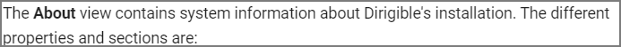
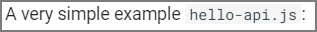
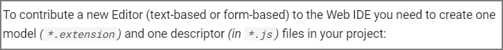
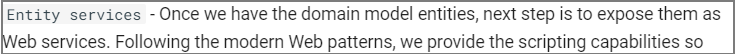
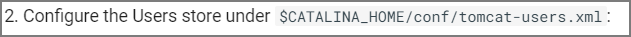
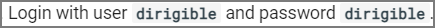
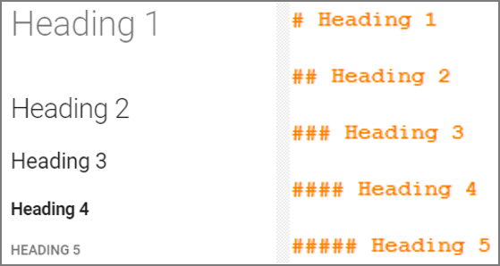
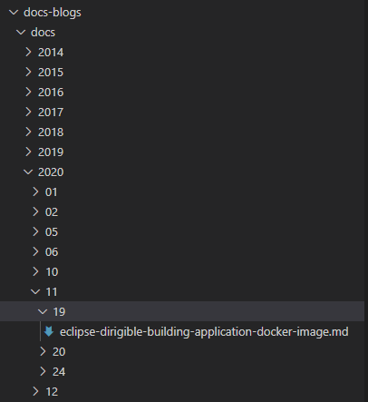
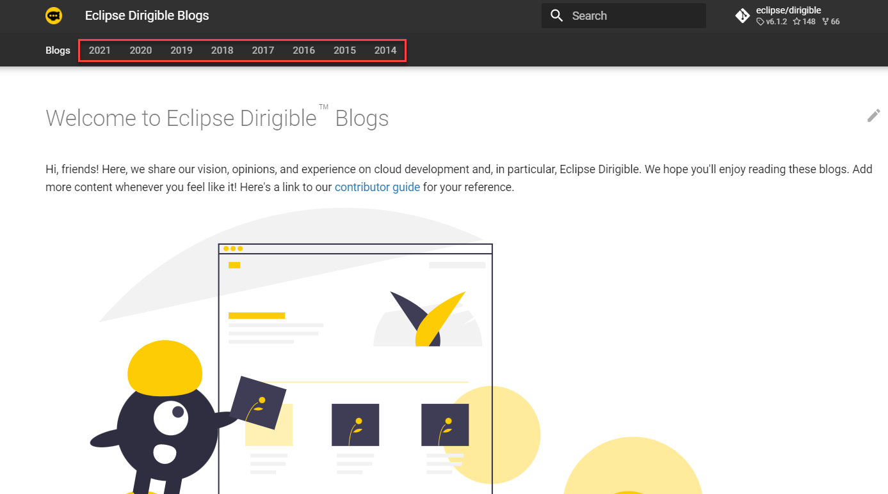
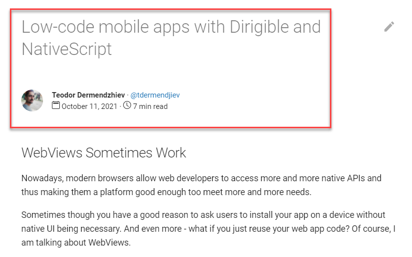

Community
===

Welcome to the community page for contributors! Here you will find resources to help you create even better documentation for Dirigible. 

## Contributor Guide

Eclipse Dirigible is an open source project, which means that you can propose contributions by sending pull requests through [GitHub](https://github.com/eclipse/dirigible).

Before you get started, here are some prerequisites that you need to complete:

### Legal considerations

Please read the [Eclipse Foundation policy on accepting contributions via Git](https://wiki.eclipse.org/Development_Resources/Contributing_via_Git).

Please read the [Code of Conduct](https://github.com/eclipse/dirigible/blob/master/CODE_OF_CONDUCT.md).

Your contribution cannot be accepted unless you have an [Eclipse Contributor Agreement](https://www.eclipse.org/legal/ECA.php) in place.

Here is the checklist for contributions to be acceptable:

1. [Create an account at Eclipse](https://accounts.eclipse.org/)
2. Add your GitHub user name in your account settings
3. [Log into the projects portal](https://projects.eclipse.org/), look for ["Eclipse Contributor Agreement"](https://www.eclipse.org/legal/ECA.php), and agree to the terms.
4. Ensure that you sign-off your Git commits with the same email address as your Eclipse Foundation profile. 

For  more information see the [Contributor Guide](https://github.com/eclipse/dirigible/blob/master/CONTRIBUTING.md).

### Style Guide

In this section we have outlined text stylizing options and for what elements they should be used. If everyone follows it, we will have visually consistent [documentation](https://github.com/dirigible-io/dirigible-io.github.io/).

??? Info "Bold"
	How it looks as text: **Bold Text**
	
	How it looks in markdown: \*\*Bold Text\*\*
	
	Use it for: 
	
	* UI elements
	
	
	
	* Navigation paths
	
	
	
??? Info "Monospace"
	How it looks as text: `Monospace Text`
	
	How it looks in markdown: \`Monospace Text\`
	
	Use it for: 
	
	* File names and extensions

	
	
	
	* Terms
	
	
	
	* File paths
	
	
	
??? Info "Monospace/Bold"
	How it looks as text: **`Monospace/Bold Text`**
	
	How it looks in markdown: \*\*\`Monospace/Bold Text\`\*\*
	
	Use it for: 
	
	* User input
	
	
	

??? Info "Headings"
	How it looks: 
	
	
	
	* Use Heading 1 for the titles
	* Heading 2 is for main topics
	* Continue with Heading 3 and 4 where needed
	* Structure your topic with no more than 3 heading levels(heading 2, 3 and 4)

### Blogs

We'd welcome any contribution to our [**Blogs**](../../blogs) site as long as it conforms with out [Legal considerations](#legal-considerations) outlined above. Below we've provided more details about the organization of the **Blogs** site and the frontmatter that needs to be added so new blogs have the same look and feel as all the others.

#### Add Your Blog to the Right Folder

All blogs are organized in folders by year, month, and day of publishing. Hence, a blog written on November 19, 2020 is placed in the directory `docs/2020/11/19/`:



This also helps arranging the blogs by year of publishing.



When publishing, add your blog to the right folder depending on the date. You can also create folders if needed.

#### Markdown Frontmatter

A big part of any blog's layout is controlled by its `.md` file frontmatter. This is metadata about the `.md` file and is denoted by the triple dashes at the start and end of the block. 

Here's an example with the title of this **Community** page:

``` yaml hl_lines="1-3"
	---
	title: Community
	---
	
	Welcome to the community page for contributors! Here you will find resources to help you create even better documentation for Dirigible. 

	## Contributor Guide

```	

1. Set the title of the blog in the frontmatter:

	``` yaml hl_lines="2"
	---
	title: <Your Blog Title>
	---
	```
	!!! caution "When the title is set in the frontmatter, use ``Heading 2`` level (`## This is a heading 2`) as the higher heading level in your blog. Otherwise, the first `Heading 1` you use will overwrite the title from the frontmatter and cause formatting issues."

2. Set the author:

	```yaml hl_lines="3"
	---
	title: <Your Blog Title>
	author: <Your Name>
	---
	```

3. Set your GitHub user:

	```yaml hl_lines="4"
	---
	title: <Your Blog Title>
	author: <Your Name>
	author_gh_user: <Your GitHub User>
	---
	```
4. Set reading time and publishing date:

	```yaml hl_lines="5-6"
	---
	title: <Your Blog Title>
	author: <Your Name>
	author_gh_user: <Your GitHub User>
	read_time: <Word Count/1000>
	publish_date: <Date of Publishing>
	---
	```

Providing all the metadata in the frontmatter as described will include:

- the title in the beginning of the page
- your GitHub avatar, your name, and a link to your GitHub profile in the author section
- reading time and publishing date in the details section

Here's an example from one of our recent blogs:



Happy Blogging!


## Join the Discussion

Reach out to other contributors and join in the discussion around Dirigible [here](https://dev.eclipse.org/mailman/listinfo/dirigible-dev).
