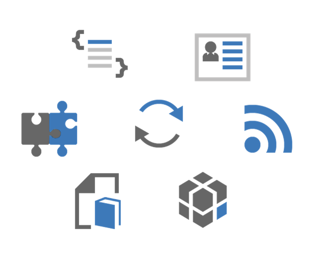

Dynamic Applications
===

We introduced the term "dynamic applications" as one that narrows the scope of the target applications that can be created using 
Eclipse Dirigible.
The overall process of building dynamic applications lies on well-known and proved principles:

*	[In-system development](http://en.wikipedia.org/wiki/In-system_programming) - known from microcontrollers to business software systems. A major benefit is working on a live system where all changes you make take effect immediately, hence the impact and side effects can be realized in the early stages of the development process.
*	`Content-centric` - known from [networking](http://en.wikipedia.org/wiki/Named_data_networking) to [development processes](http://en.wikipedia.org/wiki/Domain-driven_design) in the context of dynamic applications it comprises. All the artifacts are text-based models or executable scripts stored in a generic repository (along with the related binaries, such as images). This makes the life-cycle management of the application itself and the transport between the landscapes (Dev/Test/Prod) straight forward. 
In result, you can set up the whole system only by pulling the content from a remote source code repository such as *git*.
*	[Scripting languages](http://en.wikipedia.org/wiki/Scripting_language) - programming languages written for a special runtime environment that can interpret (rather than compile) the execution of tasks. Dynamic languages existing nowadays, as well as the existing smooth integration in the Web servers, make the rise of the in-system development in the cloud possible.
*	`Shortest turn-around time` - the driving principle for our tooling because instant access and instant value are some of the most important requirements for the developers.

In general, components of a dynamic application can be separated into the following categories:

*	`Data structures` - The artifacts representing the domain model of the application. In our case, we have chosen the well-accepted JSON format for describing a normalized entity model. There is no intermediate adaptation layer, hence all entities represent directly the database artifacts - tables and views.
*	`Entity services` - Once we have the domain model entities, next step is to expose them as Web services. Following the modern Web patterns, we provide the scripting capabilities so you can create your RESTful services in JavaScript, Ruby, and Groovy.
*	`Scripting services` - During the development, you can use a rich set of [APIs](../../../../api/) that give you access to the database and HTTP layer, utilities, and to the direct Java APIs underneath. Support for creating unit tests is important and is, therefore, integrated as an atomic part of the scripting support itself - you can use the same language for the tests as the one for the services themselves.
*	`User interface` - Web 2.0 paradigm, as well as HTML5 specification, bring the Web UI to another level. There are already many cool client-side AJAX frameworks that you can use depending on the nature of your application.
*	`Integration services` - Following the principle of atomicity, one dynamic application should be as self contained as possible. Unfortunately, in the real world there are always some external services that have to be integrated in your application - for data transfer, triggering external processes, lookup in external sources, etc. For this purpose, we provide capabilities for creating simple routing services and dynamic EIPs.
*	`Documentation` - The documentation is integral part of your application. The target format for describing services and for overall development documentation is already well accepted - *wiki*.

