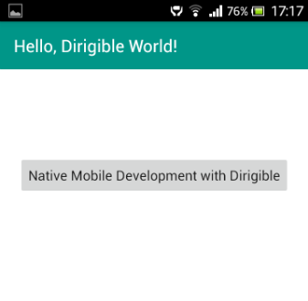

Mobile Applications
===

Overview
---

Mobile application support in Eclipse Dirigible is achieved via [Tabris.js](http://tabrisjs.com). It is a mobile framework that allows you to develop native iOS and Android mobile applications, written entirely in JavaScript. This framework provides native performance, native look and feel, and single code-base _(JavaScript)_. You can use existing JavaScript libraries and native extensions to extend the core functionality.

Unlike other frameworks, which use webviews or cross-platform intermediate runtimes, Tabris.js executes the JavaScript directly on the device and renders everything using native widgets. Thanks to the framework capabilities, the developers can focus more on the mobile application development and less on the platform specifics (iOS and Android).

