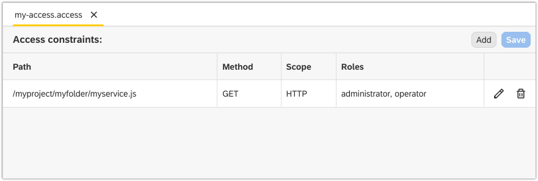

Access Editor
===

The **Access** editor lets you manage access to your project through security constraints files (`*.access`). You can create multiple access constraints within your project as part of one security constraints file.  

## Create a Security Constraints File 

1. Right-click on your project in the **Projects** view and choose **New** **&rarr;** **Access Constraints**.

    

2. Enter a name for the security constraints file.

    

## Create an Access Constraint

1. Double-click on your security constraints file to open it in the **Access** editor.

    

2. Click on the **Add** button.

3. In the **Create Constraint** dialog, fill in the path to the file for which you're creating the access constraint in the **Path** field.

4. Choose an HTTP or CMIS method for which the access constraint will be valid in the **Method** field.

5. Select HTTP or CMIS scope from the drop-down list in the **Scope** field.

6. Fill in a role(s) for which the access constraint is valid in the **Roles** field.

7. Click **Add**.

    

### Create a Public Endpoint

You can also use the **Access** editor to make a resource publicly accessible. To do this, fill in the role `public` in step 6 above. This way, you're effectively creating a new public endpoint for the resource. You can access the public endpoint by replacing `web` with `public` in the endpoint's URL.

1. Fill in the `public` role in the **Roles** field of the **Add Constraint** dialog, click **Add** and then **Save**.

    

2. Copy the endpoint's URL from the **Preview** view.

    

3. Open a browser, paste the URL, replace `web` with `public` and check if you can access the public endpoint.

    