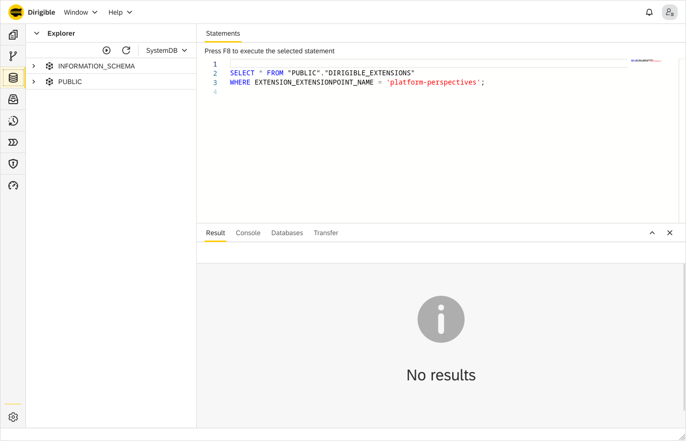

Database Perspective
===

The **Database** perspective contains tools for inspection and manipulation of the artifacts within the underlying relational database.
It is comprised of Database, SQL, Console and Result views. The Database perspective features a database explorer, a console to execute SQL statements and to preview results in table format.

