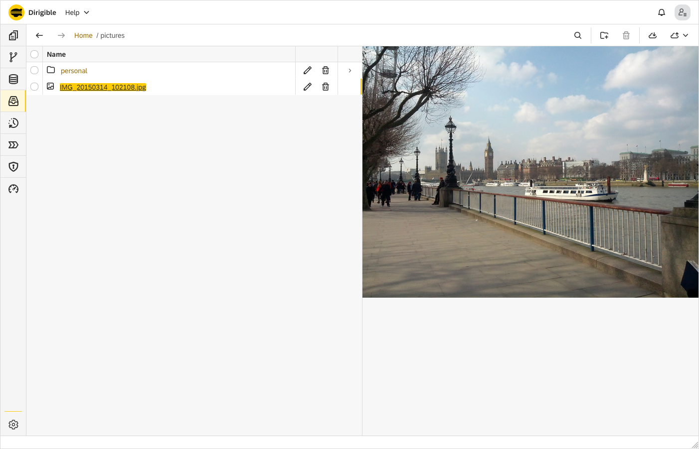

Documents Perspective
===

The **Documents** perspective is the place where the user manages the binary artifacts such as pictures, spreadsheets, PDF files, etc. It enables him/her to upload, overwrite, download, delete and search for artifacts.  
At the moment the **Documents** perspective consists of only one view, which is also called Documents.

