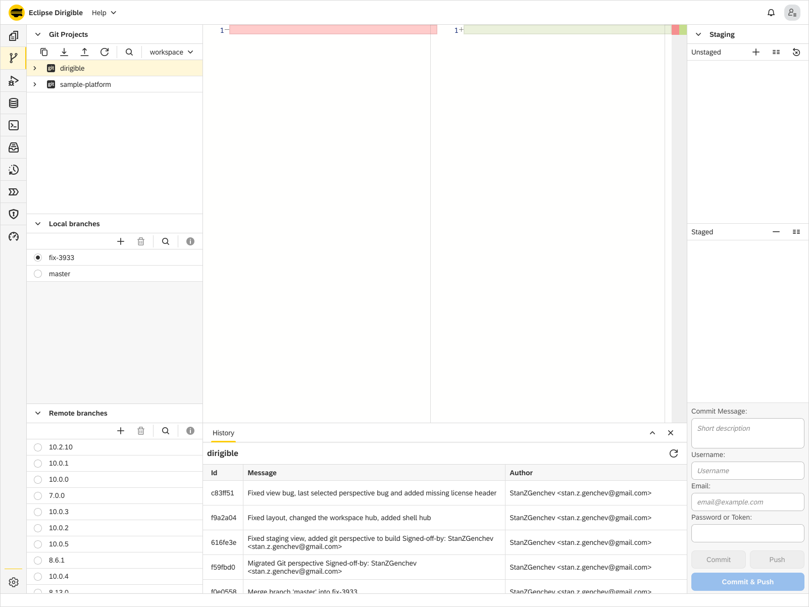

Git Perspective
===

The **Git** perspective aims at presenting a simplified interface for the most common Git operations. It is built from tools that support Git client operations.

The **Git** perspective is comprised of **Git** and **Console** views, and workspace menu. It enables the users to perform simple Git operations such as cloning a repository to a workspace, pulling changes, and pushing commits. The user can create, manage, and switch between multiple workspaces through the workspace menu.

!!! note
	In case of merge conflict on `Push` operation, a new branch with your local changes will be created in the remote repository. From this point, you can use your preferred tooling to apply the actual merge between the two branches.

## Video

<iframe width="560" height="315" src="https://www.youtube.com/embed/8CN3fSwV5YE" frameborder="0" allow="accelerometer; autoplay; clipboard-write; encrypted-media; gyroscope; picture-in-picture" allowfullscreen></iframe>