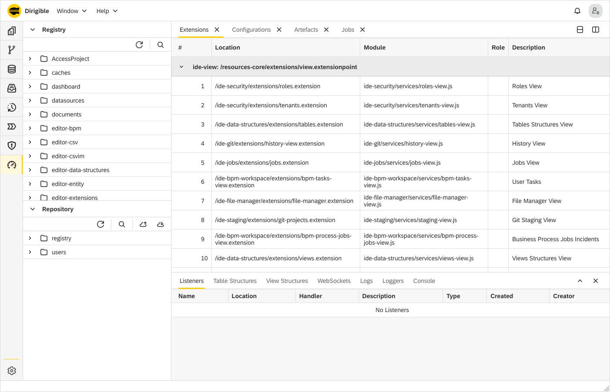

Operations Perspective
===

The Web IDE includes an **Operations perspective**, which is comprised of the following views:

* Registry
* Repository
* Extensions
* Configurations
* Artefacts
* Jobs
* Listeners
* Table Structures
* View Structures
* WebSockets
* Logs
* Loggers
* Console

The **Operations** perspective enables you to monitor the ongoing processes and operation activities.

