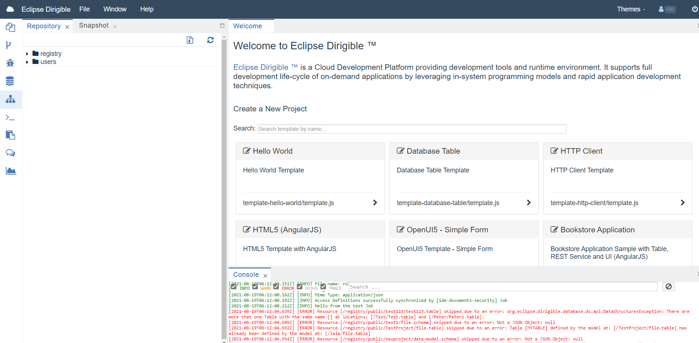

Repository Perspective
===

The **Repository** perspective gives access to the raw structure of the Dirigible instance. It is comprised of Repository, `Snapshot`, `Preview` and `Console` views.
There the user can inspect at low level the project and folder structure, as well as the artifacts content.
The user is able to import/export snapshots via the Snapshot view. 

!!! caution 
	Editing of the file contents via the Repository perspective is not recommended as it can lead to inconsistencies!
