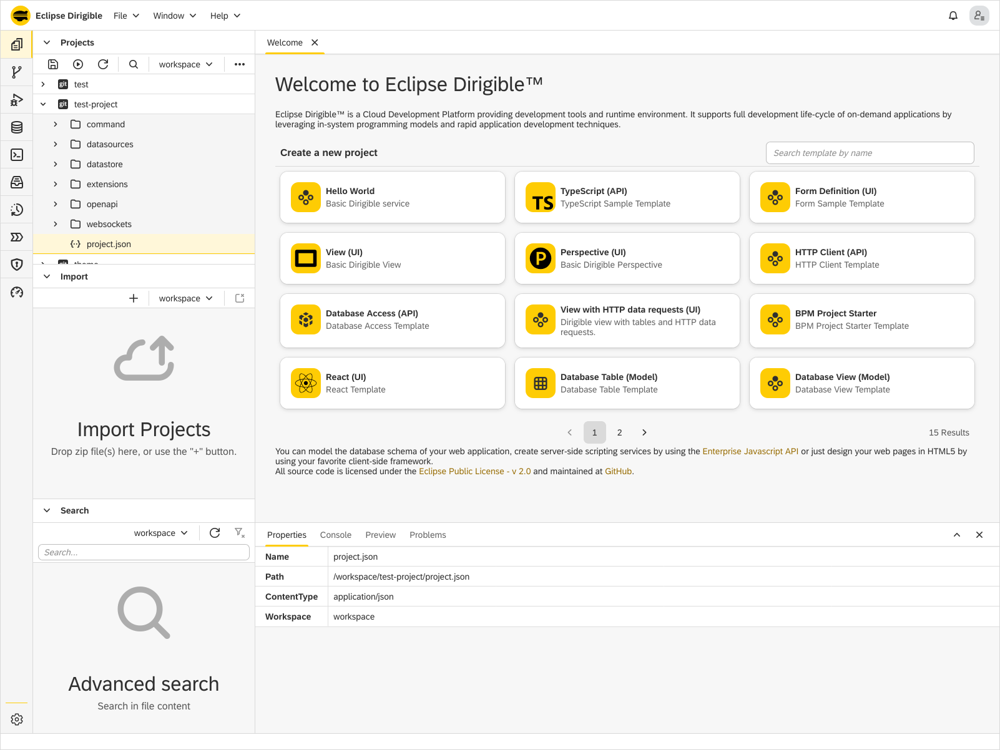

Workbench Perspective
===

This is the place where the user develops the dynamic applications. This perspective contains all views and editors that may help in the overall implementation, from domain models via services to the user interface.

The **Workbench** perspective is comprised of **Workspace**, **Import**, **Properties**, **Console**, and **Preview** views, plus the editors registered for each file type. In other words, the minimal toolset for file management, preview, and editing operations. 

The main view opened by default in this perspective is the `Workspace` view, a standard view with the projects in your [workspace](../../../concepts/workspace/).

