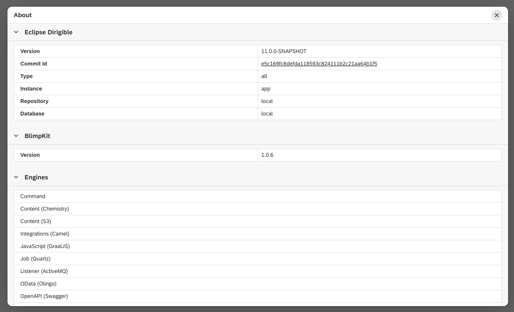

About
===

The `About` view contains system information about Dirigible's installation. The different properties and sections are:

* Version - the version of Dirigible.
* Commit Id - the commit that Dirigible is from. The commit id link also leads to the GitHub page of the release.
* Type - the type of the account.
* Instance - the type of the instance running.
* Repository - the place where the project repository is housed.
* Database - the database used. It can be local, custom or managed.
* Modules - the list of modules in the Dirigible.
* Engines - the list of engines in the Dirigible.
* Synchronizers - list of synchronizers in the Dirigible. Their status is also shown.

