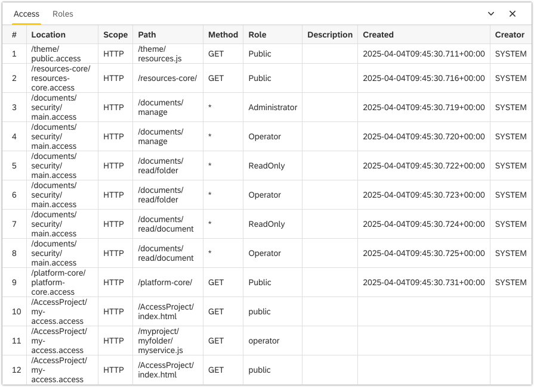

Access View
===

The `Access` view displays the defined security constraints on HTTP servers access or paths to the document repository. These constraints are defined in `*.access` files.

More info about the type of the artifacts you can find in [Artifacts](../../../artifacts).

