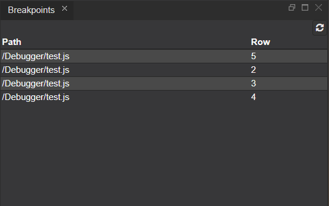

Breakpoint View
===

The Breakpoints view enables you to follow the breakpoints you have created in the course of the debugging process. 
The first column of the view displays the path to the file in the document repository and the second one - the row where the breakpoint is situated.

