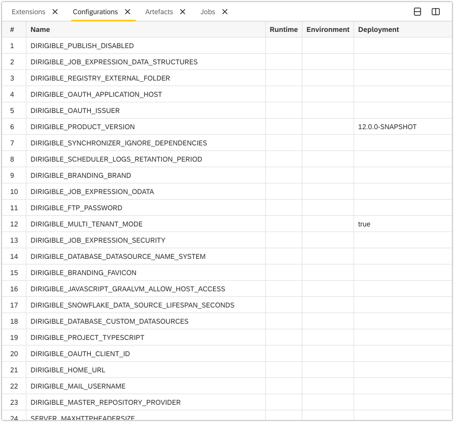
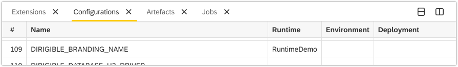

Configurations View
===

The **Configurations** view contains a list of configuration parameters and environment variables. Each of them begins with "DIRIGIBLE_" and continues with a unique name.



In addition to Name, each of the other four columns in the table holds a distinct parameter. They are Environment, Runtime, Deployment and Module (priority left to right).

## Changing a variable

The values of the configuration parameters are set by the module, but they can be overwritten. This can be done either during the deployment of Dirigible, by creating a dirigible.properties file with different values or by changing the values during runtime.

### Changing a variable during runtime
1. Follow steps 1-5 outlined in the [Create a hello-world.js service](../../../#create-a-hello-worldjs-service){:target="_blank"} tutorial.
2. Insert the following code at line 2:
``` javascript hl_lines="2 3 4"
var response = require("http/v4/response");
var config = require("core/v4/configurations");

config.set("DIRIGIBLE_BRANDING_NAME", "RuntimeDemo")

response.println("Hello World!");
response.flush();
response.close();
``` 
3. Save the file.
4. Refresh the page. 
5. Navigate to **Window** **&rarr;** **Select View** **&rarr;** **Configurations**


