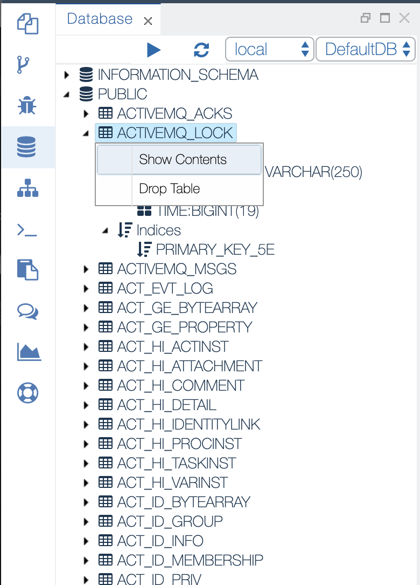

Database View
===

The `Database` view gives you direct access to the default target schema assigned to your account in the Web IDE.
It enables you to expand the schema item and see the list of all tables and views created either via the data structures models or directly via SQL script.

