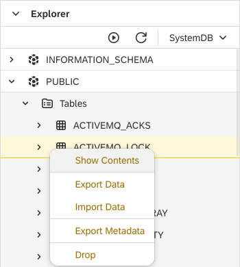

Database View
===

The **Database** view gives you direct access to the default target schema assigned to your account in the Web IDE.
It enables you to expand the schema item and see the list of all tables and views created either via the data structures models or directly via SQL script in [SQL View](https://www.dirigible.io/help/development/ide/views/sql/).

!!! note

    All created tables can be discovered under the `PUBLIC` schema _(for local deployment with **H2** database)_. The `PUBLIC` schema will appear, after the `local` data source type and the `DefaultDB` data source are selected in the upper right corner.

