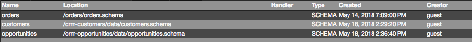

Data Structures View
===

The `Data Structures` view lists all data structures defined in the following files:

* `*.table` - the table layout definition in JSON
* `*.view` - the view layout definition in JSON
* `*.schema` - the schema layout definition in JSON
* `*.append` - append mode data file in DSV
* `*.delete` - delete mode data file in DSV
* `*.update` - update mode data file in DSV
* `*.replace` - replace mode data file in DSV

More info about the type of the artifacts you can find in [Artifacts](../../../artifacts).
