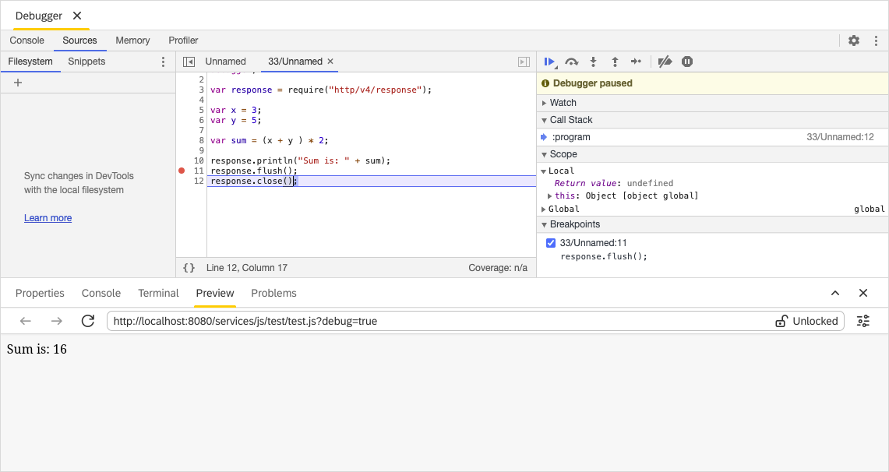

Debugger View
===

The `Debugger` view enables you to navigate the debugging of your code. You can: 

* Start
* Pause
* Restart
* Proceed step by step 

 

This view includes a few panes that are helpful during the debugging process. See below for more details.

??? tip "`Scope`"

	When you're paused on a line of code, the `Scope` pane shows you what local and global variables are currently defined, along with the value of each variable. It also shows closure variables, when applicable. Double-click a variable value to edit it. When you're not paused on a line of code, the `Scope` pane is empty.
    
    

??? tip "`Breakpoints`"

	The `Breakpoints` pane shows any line-of-code breakpoints you've added to your code. As the name suggests, you can use a line-of-code breakpoint when you've got a specific line of code that you want to pause on. As you can see in the `Breakpoints` pane, currently there are two breakpoints added: *Unnamed* at row 5 and *Unnamed* at row 8.
    
    

??? tip "`Debug Preview`"

	This pane displays the result of executing the debugged file. The `Debug Preview` is similar in functionality to the [`Preview`](../preview) view.
    
    

!!! info "Related content"

	* [Console](../console) view
    * [Debugger](../../perspectives/debugger) perspective