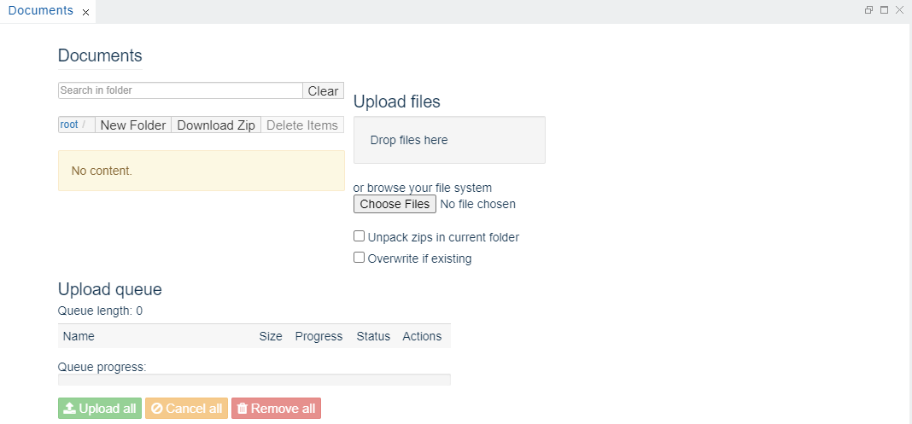

Documents View
===

The `Documents` view enables you to manage the binary artifacts such as pictures, spreadsheets, PDF, etc. You can upload, overwrite, download, delete, and search for artifacts.

