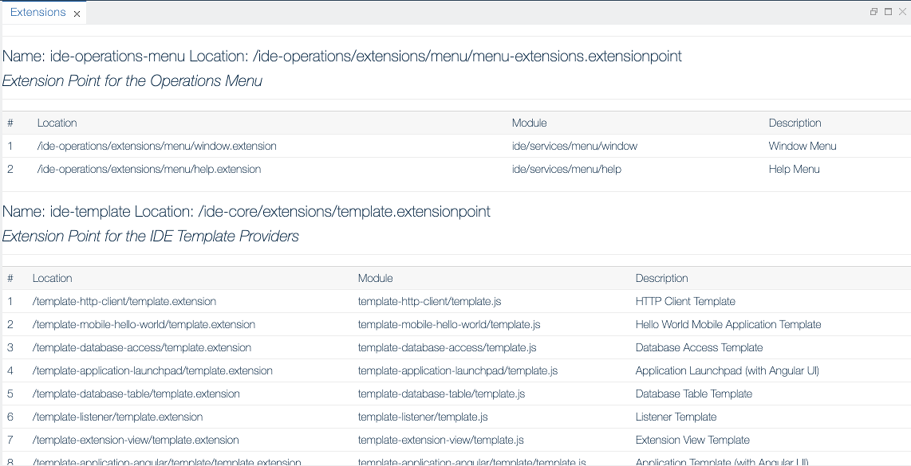

Extensions View
===

The **Extensions** view lists all defined extensions and extension points through `*.extension` and `*.extensionpoint` descriptor.

More info about the type of the artifacts you can find [here](../../../artifacts/)

