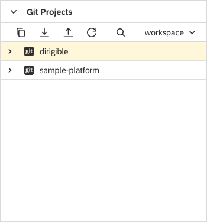

Git View
===

The `Git` view enables you to perform simple Git operations such as cloning a repository to a workspace, pulling changes, and pushing commits. The user can create, manage, and switch between multiple workspaces through the Workspace menu.

!!! info "Related content"

	* [Console](../console) view
    * [Staging](../staging) view
    * [History](../history) view
    
