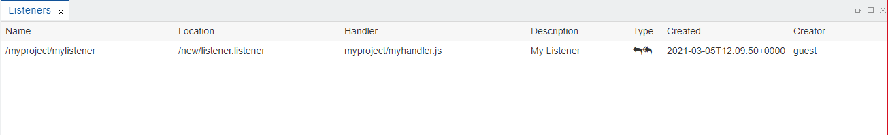

Listeners View
===

The `Listeners` view shows all message listeners registered by the `*.listener` files. Their type depends on the type of the message hub - **topic** or **queue**.

More info about the type of the artifacts you can find in [Artifacts](../../../artifacts/).
