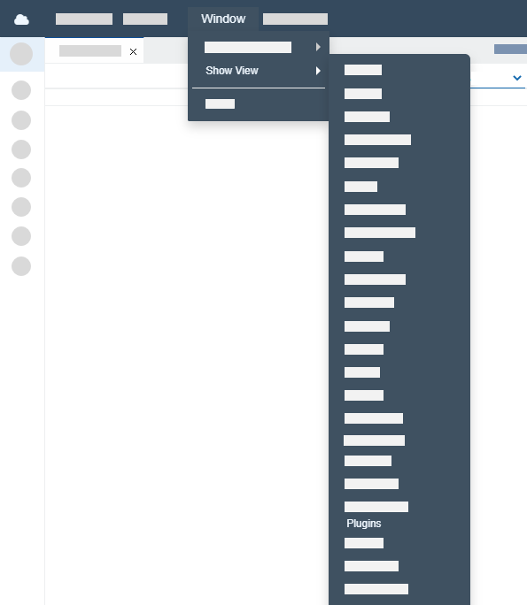

Plugins
===

!!! info
	The **Plugins** view is currently in an initial stage of development and does not have all features. 
	
### Overview

The **Plugins** view contains a list of plugins that you can install in Dirigible. 

Each plugin name is a link that leads to a page containing more information about it.

### Installing a plugin
Once you have a running Eclipse Dirigible instance, you can navigate to the **Plugins** view:

1. Choose **Window** **&rarr;** **Show View** **&rarr;** **Plugins**.

	
	
2. Install the plugin.

	