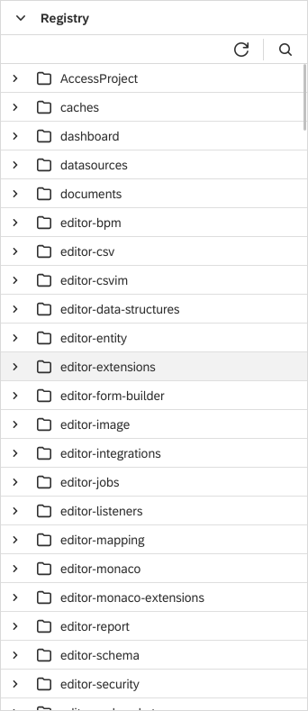

Registry View
===

Technically, the `Registry` is a space within the `Repository` where all the [published](../../../concepts/publishing/) artifacts are placed.

!!! caution 
	Editing of the file contents via the Registry perspective is not recommended as it can lead to inconsistencies!
