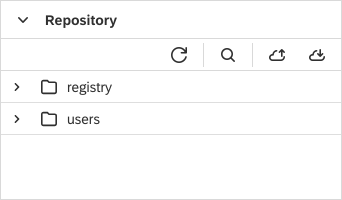

Repository View
===

The Repository view gives access to the raw structure of the underlying `Repository` content.
There you can inspect at low level the project and folder structure, as well as the artifacts content.
The view enables the user to create new collections and resources, to delete existing ones, or to export them.

!!! caution
	Editing of the file contents via the Repository perspective is not recommended as it can lead to inconsistencies!
