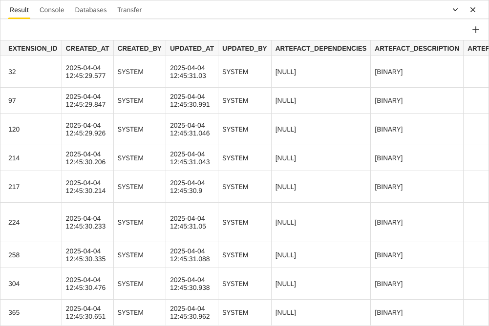

Result View
===

The **Result** view graphically shows you result of executed script
via [SQL View](https://www.dirigible.io/help/development/ide/views/sql/)
or if you press **show content** on some table
in [Database view](https://www.dirigible.io/help/development/ide/views/database/).

