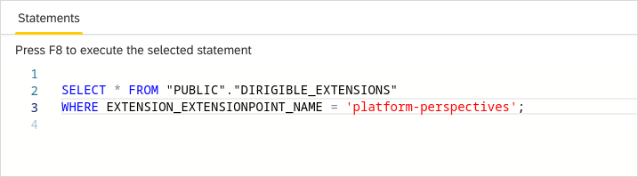

SQL View
===

The **SQL** view is one of the most powerful and dangerous tool for database management.
In the SQL console you can enter the SQL script compliant to the underlying database system.
You get the result of the execution in the Results view below.

