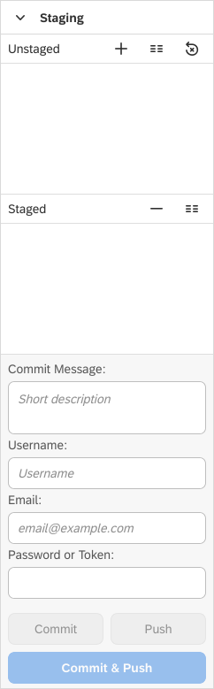

Staging View
===

The ```Staging``` view provides a visual alternative of executing Git commands from a terminal. You can manage your locally changed files and prepare them for pushing to your remote repository.



* ```Unstaged Files``` - all files that you've changed are listed here. However, these changes aren't ready yet to be binded to a commit. For this purpose, you have to stage them. Use the downward arrow to move files from unstaged to staged state.
* ```Staged Files``` - all files that you've changed and staged are listed here. These are ready to be binded to a commit. Use the upward arrow to move files from staged back to unstaged state.
* ```Commit Message``` - provide details about the changes included in your commit.
* ```Username```, ```Password```, ```Email``` - provide your authentication credentials.
* ```Commit & Push``` - commit your changes and directly push them to your remote repository.
* ```Commit``` - commit your changes without pushing them. This way, you can organize your changes in several commits and push them together.