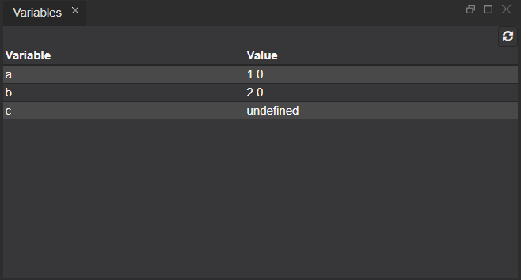

Variables View
===

The Variables view displays the defined values of the variables when the code is executed.
During the debugging process they may be displayed step by step or all at once, depending on the existing breakpoints.

