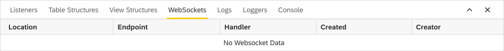

Web Sockets
===
The **Web Sockets** view lists all the connections that Dirigible has currently established with other ports. The different properties and sections are:

* `Location`
* `Endpoint`
* `Handler`
* `Created`
* `Creator`

