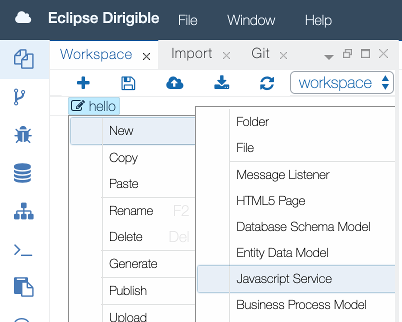
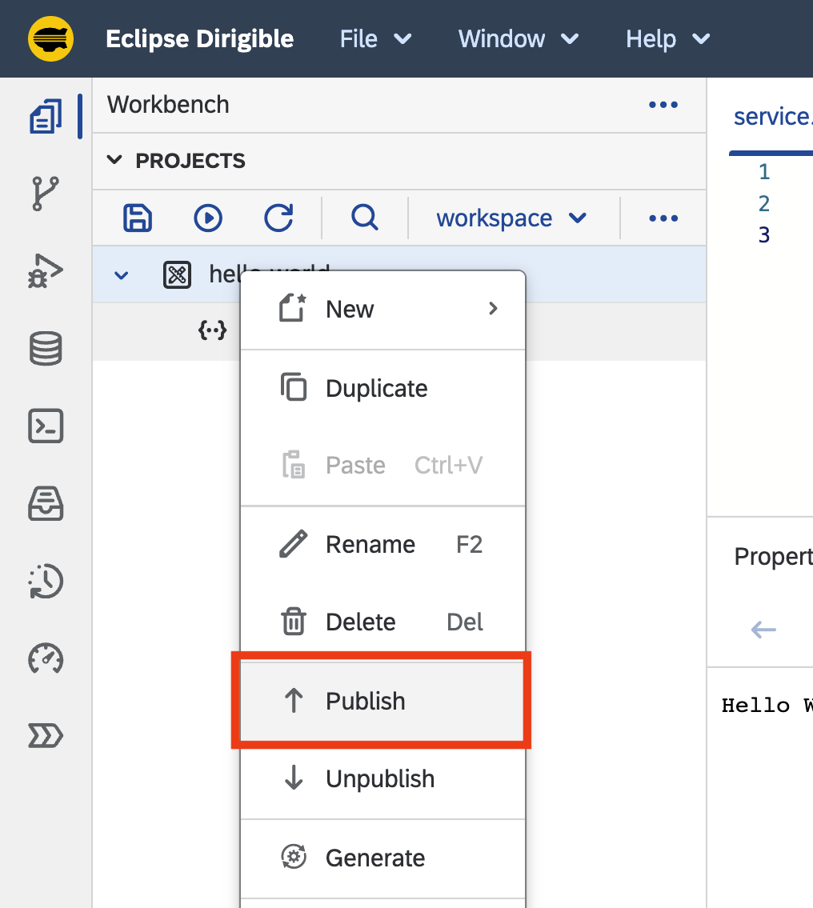
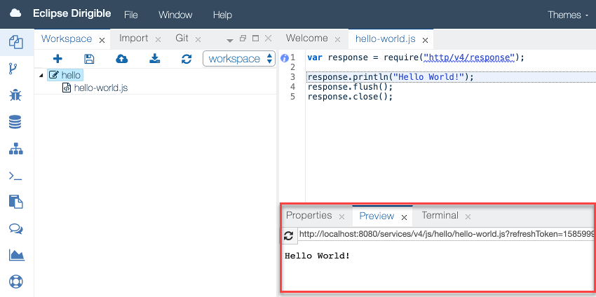

Getting Started
===

### Overview

This guide explains how to setup an Eclipse Dirigible instance and how to use it to build your very first `hello-world.js` service. The references section below points to the documentation with more technical details for the different aspects of the platform and its components and capabilities.

### Setup

In case you are using the shared [trial.dirigible.io](http://trial.dirigible.io) environment, you can skip this section.

#### Get the binary

* In case you want to use a prebuild package, you can get the one built for your environment from the [downloads](http://download.dirigible.io/) section.
* To build Eclipse Dirigible from sources by yourself, just follow the instructions in the [README](https://github.com/eclipse/dirigible/blob/master/README.md#build).

#### Choose the environment

* You can choose one of the [setup options](../setup/) available to get an Eclipse Dirigible instance depending on your target environment.
* A shared trial instance is also available and can be accessed from here:

 [trial.dirigible.io](http://trial.dirigible.io)

There are many [configuration options](../setup/setup-environment-variables/), so you can connect to different databases, use different platforms, choose a specific set of plugins, and many more.

#### Access the instance

In case of the standard setup on Apache Tomcat on your local machine, you can point your browser to the location:

 [http://localhost:8080](http://localhost:8080)

### Hello World Application

#### Create a `hello-world.js` service
Once you have a running Eclipse Dirigible instance, you can start with your project:

1. Choose **File** **&rarr;** **New** **&rarr;** **Project**.

    

2. Enter a name and create the project. 

    

3. Right-click on the project icon in the **Workspace** view and choose **New** **&rarr;** **Javascript Service**.

    

4. Enter a name for the service.
5. Double-click on the file icon to open the file in the editor on the right. The file already contains the `hello world.js` service implementation.

    

6. Right-click on the project icon and choose **Publish**.

    

7. With the file icon selected in the **Workspace** view, check the result of the execution of our fancy server-side Javascript service in the **Preview** view.

    

#### Update the `hello-world.js` service

1. Go to line 3 in the editor and change the `Hello World!` message to `Hello Dirigible!`.

    ```javascript hl_lines="3"
    var response = require("http/v4/response");
    
    response.println("Hello Dirigible!");
    response.flush();
    response.close();
    ```

1. Save the file: ++ctrl+s++ for Windows, ++cmd+s++ for macOS
1. The output in the **Preview** view changes immediately.

    !!! info "Note"  
        This is due to the default configuration of `auto-publish on save`. You can find more about this dynamic behavior in [Dynamic Applications](concepts/dynamic-applications).

### References

So far we saw how easy it is to create and modify a RESTful service, but Dirigible capabilities goes way beyond that:

* You can explore the [samples](../../samples/) section for more scenarios.
* If you would like to build complex services, you can go to the [API](../../api/) section. 
* If you are curious what you can do with Eclipse Dirigible apart from writing server-side JavaScript services, you can have a look at the [features](../overview/features/) section.
* In case you are interested in `modeling` and `generation` with the `Low-Code/No-Code` tooling of Eclipse Dirigible, you can read about [entity data models](concepts/entity-service) and [generation](concepts/generation).

