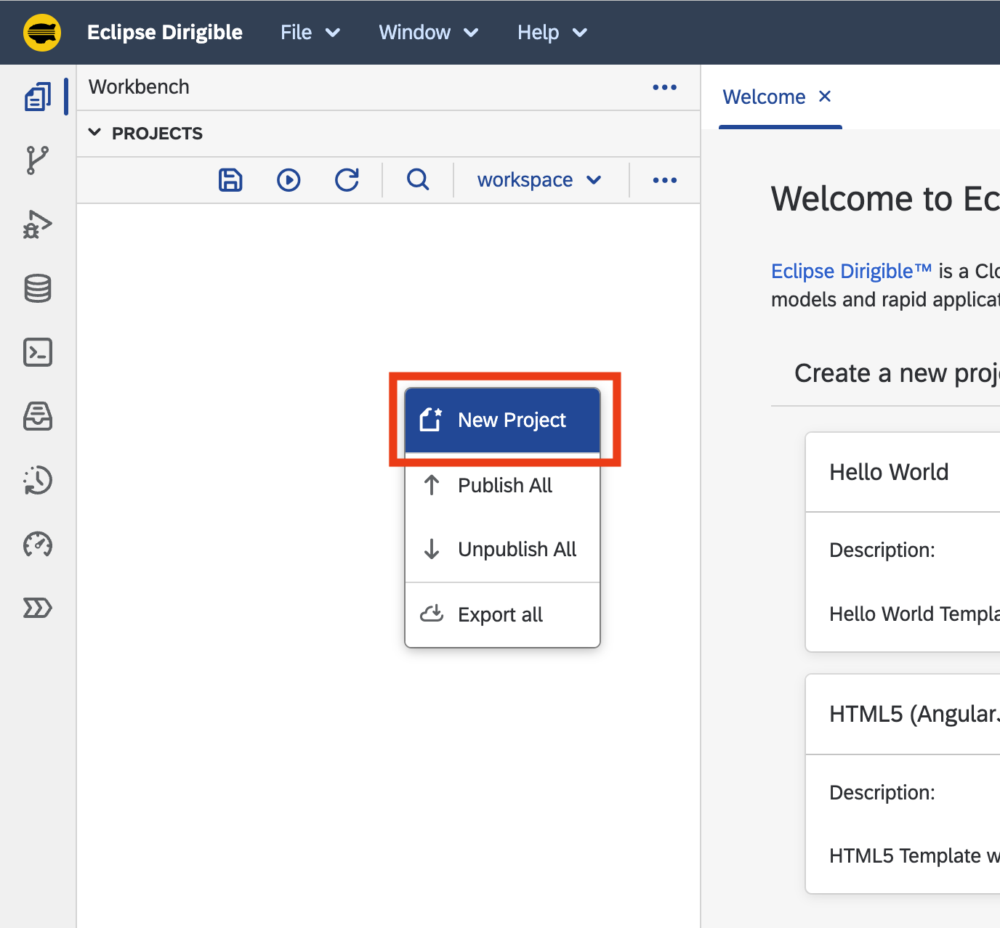
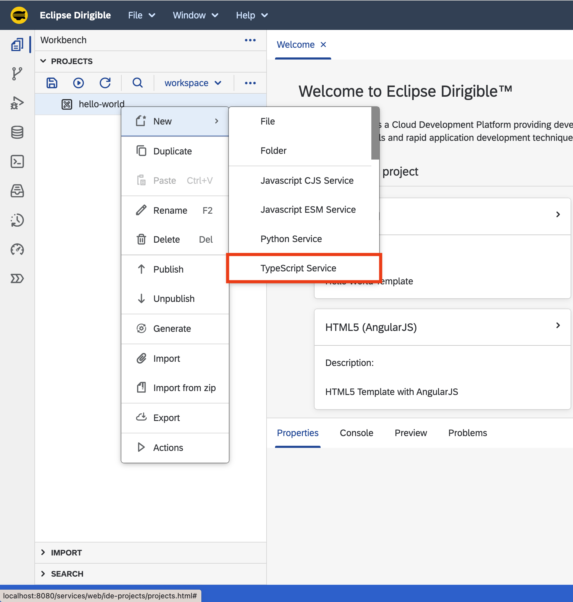

Getting Started
===

## Overview

This guide explains how to setup an Eclipse Dirigible instance and how to use it to build your very first `Hello World` service. The references section below points to the documentation with more technical details for the different aspects of the platform and its components and capabilities.

## Setup

!!! tip "Trial Environment"

    In case you are using the shared [https://trial.apps.dirigible.io](https://trial.apps.dirigible.io) environment, you can skip this section.

### Get the binary

* In case you want to use a prebuild package, you can get the one built for your environment from the [downloads](http://download.dirigible.io/) section.
* To build Eclipse Dirigible from sources by yourself, just follow the instructions in the [README](https://github.com/eclipse/dirigible/blob/master/README.md#build).

### Choose the environment

* You can choose one of the [setup options](../setup/) available to get an Eclipse Dirigible instance depending on your target environment.
* A shared trial instance is also available and can be accessed from here: [https://trial.apps.dirigible.io](https://trial.apps.dirigible.io)

!!! info "Environment Variables"

    There are many [configuration options](../setup/setup-environment-variables/), so you can connect to different databases, use different platforms, choose a specific set of plugins, and many more.

### Access the instance

In case of a local setup on your machine, you can access Eclipse Dirigible at the following location: [http://localhost:8080](http://localhost:8080)

!!! info "Default Credentials"

    The default username is `admin` and the default password is `admin`. The credentials can be updated, as described in the [configuration options](../setup/setup-environment-variables/).

## Hello World Application


### Create a `Hello World` service
Once you have a running Eclipse Dirigible instance, you can start with your project:

1. Right-click inside the `Projects` view.
1. From the menu select the **New Project** option.

    

1. Enter `hello-world` for the name of the project and click the **Create** button. 

    

1. Right-click on the `hello-world` project in the `Projects` view and choose **TypeScript** or **JavaScript ECMA6** service from the **New** dropdown:

    === "TypeScript"

        - Select the **New** **&rarr;** **TypeScript Service** option:

            
        
        - Enter `service.ts` for the name of the **TypeScript Service**:

            
        
        - Double-click on the `service.ts` to open the file in the editor on the right.
        
            

        !!! info
        
            The file already contains a `Hello World` service implementation. As it's not specified otherwise, the service can be executed by performing any of the following HTTP methods: `GET`, `POST`, `PUT`, `DELETE` and `PATCH`.

        - Right-click on the `hello-world` project and choose **Publish** option from the menu:

            
        
        - With the `service.ts` selected in the `Projects` view, check the result of the execution of the server-side **TypeScript Service** in the `Preview` view:

            

        !!! note

            The **TypeScript Service** is published and available at the http://localhost:8080/services/ts/hello-world/service.ts URL. It can be accessed in a separate browser tab, consumed by a third-party application or API tools like `Postman` or `cURL`.

    === "JavaScript ECMA6"

        - Select the **New** **&rarr;** **JavaScript ESM Service** option:

            
        
        - Enter `service.mjs` for the name of the **JavaScript ESM Service**:

            
        
        - Double-click on the `service.mjs` to open the file in the editor on the right.
        
            

        !!! info
        
            The file already contains a `Hello World` service implementation. As it's not specified otherwise, the service can be executed by performing any of the following HTTP methods: `GET`, `POST`, `PUT`, `DELETE` and `PATCH`.

        - Right-click on the `hello-world` project and choose **Publish** option from the menu:

            
        
        - With the `service.mjs` selected in the `Projects` view, check the result of the execution of the server-side **JavaScript ESM Service** in the `Preview` view:

            

        !!! note

            The **JavaScript ESM Service** is published and available at the http://localhost:8080/services/js/hello-world/service.mjs URL. It can be accessed in a separate browser tab, consumed by a third-party application or API tools like `Postman` or `cURL`.

### Update the `Hello World` service

1. Go to line 3 in the editor and change the `Hello World!` message to `Hello Eclipse Dirigible!`.

    === "TypeScript"

        ```ts hl_lines="3"
        import { response } from "sdk/http";

        response.println("Hello Eclipse Dirigible!");
        ```

    === "JavaScript ECMA6"

        ```js hl_lines="3"
        import { response } from "sdk/http";

        response.println("Hello Eclipse Dirigible!");
        ```

1. Save the file: ++ctrl+s++ for Windows, ++cmd+s++ for macOS
1. The output in the **Preview** view changes immediately.

    !!! info "Note"  
        This is due to the default configuration of `auto-publish on save`. You can find more about this dynamic behavior in [Dynamic Applications](/help/development/concepts/dynamic-applications/).

## References

So far we saw how easy it is to create and modify a `Hello World` RESTful service, but Eclipse Dirigible capabilities goes way beyond that.

!!! abstract "References"

    - You can explore the [Tutorials](/help/tutorials/application-development/bookstore/) section for more scenarios.
    - If you would like to build complex services, you can go to the [API](/api/) section to find more JavaScript APIs that Eclipse Dirigible provides out-of-the-box.
    - If you are curious what you can do with Eclipse Dirigible apart from writing server-side JavaScript services, you can have a look at the [features](/help/overview/features/) section.
    - In case you are interested in `Modeling` and `Generation` with the `Low-Code/No-Code` tooling of Eclipse Dirigible, you can read about [Entity Data Models](/help/development/concepts/entity-service/) and [Generation](/help/development/concepts/generation/).

