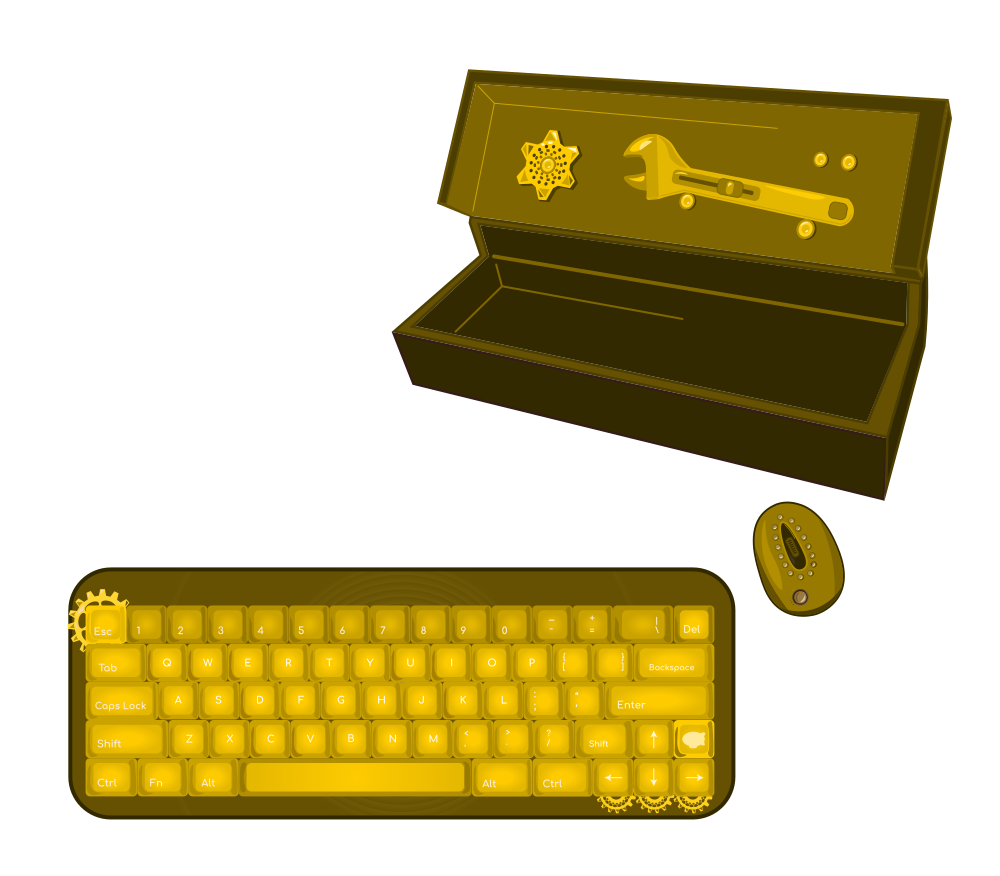
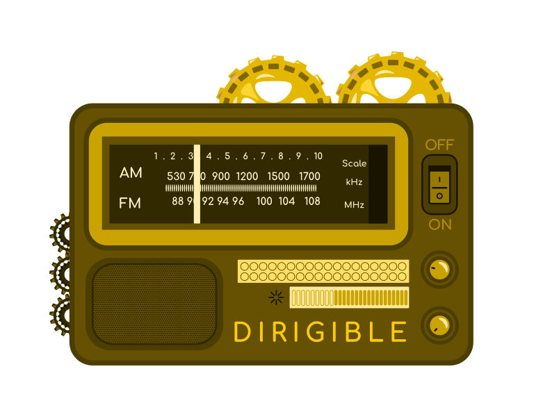

Welcome! How can we help? 
===

  

    <a href="development">
		

			

			
			
Build your first service with Eclipse Dirigible.

			

		
<button>Getting Started</button>

		

	</a>
  

  

    <a href="development/concepts">
		

			

			
			
Read essential definitions.

			

		
<button>Concepts</button>

		

	</a>
  

    <a href="overview/architecture">
		

			

			
			
Understand the nuts and bolts.

			

		
<button>Architecture</button>

		

	</a>
  
 
 

    <a href="overview/faq">
		

			

			
			
Find out what, why, and how.

			

		
<button>FAQ</button>

		

	</a>
  
 

  

    <a href="overview/features">
		

			

			
			
Review major features.

			

		
<button>Features</button>

		

	</a>
  
 
  

    <a href="setup">
		

			

			
			
Explore different setup options.

			

		
<button>Setup</button>

		

	</a>
  
 
  

    <a href="https://www.dirigible.io/api/">
		

			

			
			
Learn more about Enterprise JavaScript API availability, versions, and status.

			

		
<button>API</button>

		

	</a>
  

  

    <a href="https://www.dirigible.io/samples/">
		

			

			
			
Try out sample apps.

			

		
<button>Samples</button>

		

	</a>
  

