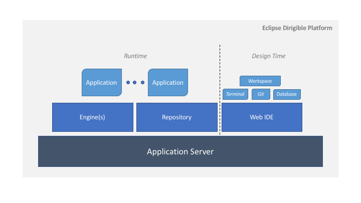
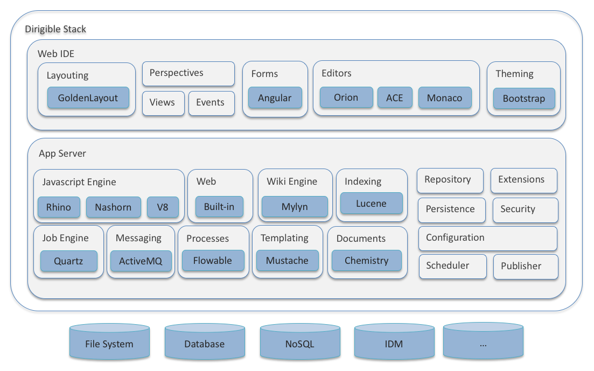
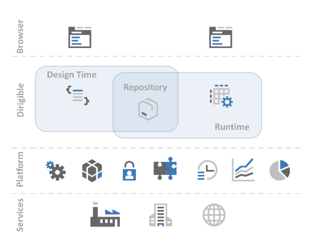

Architecture
===

The Eclipse Dirigible architecture follows the well-proved principles of simplicity and scalability in the classical service-oriented architecture.

The components are separated between the design time (definition work, modeling, scripting) and the runtime (execution of services, content provisioning, and monitoring). The transition between design time and runtime is achieved with a [repository](concepts_repository.html) component. The only linking part is the content itself.

At design time, the programmers and designers use the Web-based integrated development environment [Web IDE](ide.html). This tooling is based on the most popular client side JavaScript framework - AngularJS, as well as Bootstrap for theme-ing and GoldenLayout for windows management.

The runtime components provide the cloud application after you create it. The underlying technology platform is a Java-Web-Profile-compliant application server (such as Tomcat). On top are the Eclipse Dirigible containers for service execution. Depending on the scripting language and purpose, they can be: 
* GraalVM JS 
* Mylyn
* Lucene
* Quartz 
* ActiveMQ
* Flowable
* Mustache 
* Chemistry 

The runtime can be scaled independently from the design time and can be deployed without the design time at all (for productive landscapes).

Depending on the target cloud platform, you can integrate the services provided by the underlying technology platform in Eclipse Dirigible.

