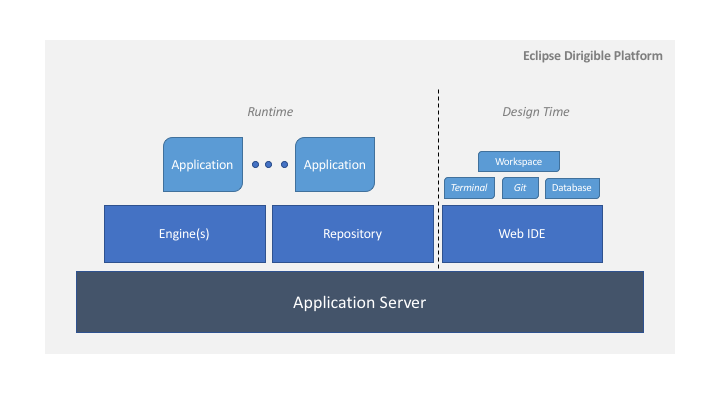
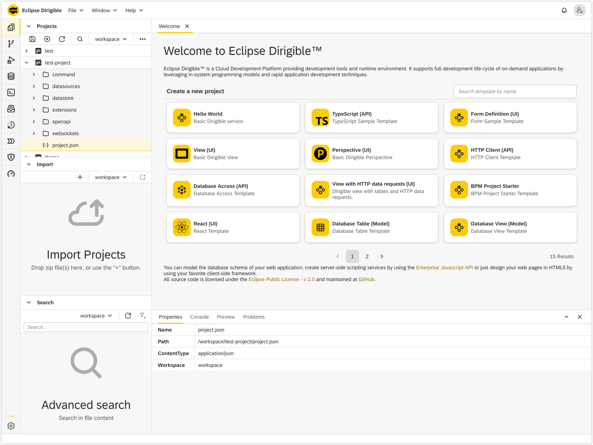
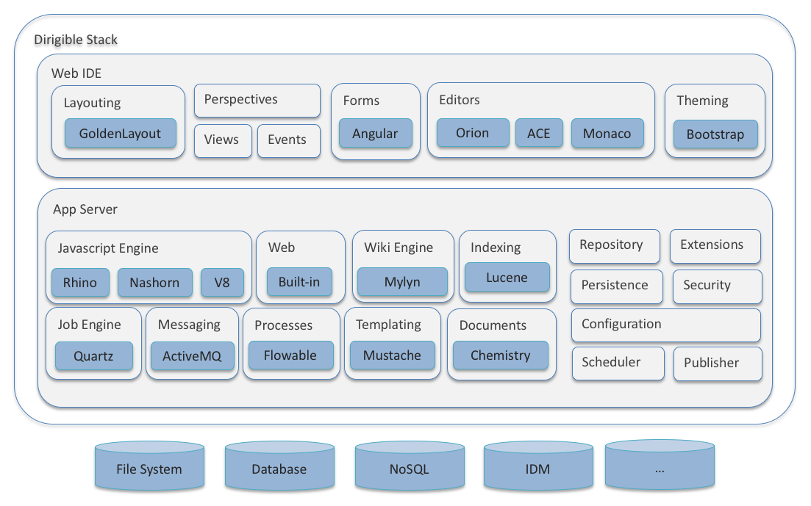
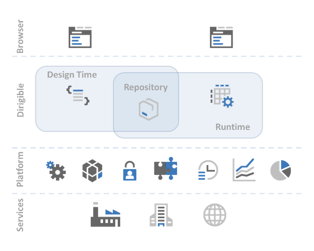

Architecture
===

The Eclipse Dirigible architecture follows the well-proved principles of simplicity and scalability in the classical service-oriented architecture.

The components are separated between the design time (definition work, modeling, scripting) and the runtime (execution of services, content provisioning, and monitoring). The transition between design time and runtime is achieved with a [repository](../../development/concepts/repository) component. The only linking part is the content itself.

At design time, the programmers and designers use the Web-based integrated development environment [Web IDE](../../development/ide). The IDE front-end is built with TypeScript and HTML, using the [BlimpKit](https://github.com/blimpkit/blimpkit.github.io) component framework for UI elements and the [Monaco](https://github.com/microsoft/monaco-editor) editor for code editing.

The runtime is delivered as a self-contained Spring Boot executable JAR (built with Java 21) that embeds all execution engines and the IDE web content. On top of the Spring Boot platform, Eclipse Dirigible ships dedicated engines for service execution. Depending on the scripting language and purpose, they include:

* GraalVM JavaScript / TypeScript (via [Graalium](https://github.com/eclipse-dirigible/graalium))
* Python
* [Flowable](https://www.flowable.org/) (BPMN)
* [Apache Camel](https://camel.apache.org/) (integration routes)
* Quartz (scheduled jobs)
* Mustache / Velocity (template engines)
* Lucene (indexing)
* Chemistry (CMIS / Content Management)
* Mylyn WikiText (Markdown / wiki rendering)

The runtime can be scaled independently from the design time and can be deployed without the design time at all (for productive landscapes).

Depending on the target cloud platform, you can integrate the services provided by the underlying technology platform in Eclipse Dirigible.

