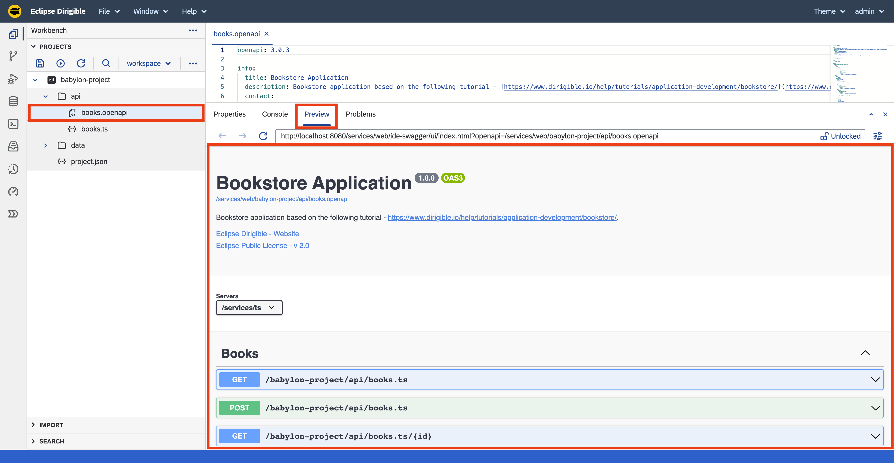

Bookstore Application - API
===

## Overview

This section shows how to create the API layer for the Bookstore application.
It contains a Books `REST API`. 

## Steps

### REST API

1. Right click on the `babylon-project` project and select **New &#8594; Folder**.
1. Enter `api` for the name of the folder.
1. Right click on the `api` folder and select **New &#8594; TypeScript Service**.
1. Enter `books.ts` for the name of the TypeScript Service.
1. Replace the content the following code:

    ```ts
    import { rs } from "@dirigible/http";
    import { BookRepository, Book } from '../data/BookRepository';

    const repository = new BookRepository();

    rs.service()
        .resource("")
        .get(function (ctx, request, response) {
            const entities: Book[] = repository.list();

            response.setContentType("application/json");
            response.setStatus(200);
            response.println(JSON.stringify(entities));
        }).produces(["application/json"])

        .resource("{id}")
        .get(function (ctx, request, response) {
            const id: number = ctx.pathParameters.id;
            const entity: Book = repository.findById(id);

            response.setContentType("application/json");
            if (entity) {
                response.setStatus(200);
                response.println(JSON.stringify(entity));
            } else {
                response.setStatus(404);
                response.println(JSON.stringify({
                    code: 404,
                    message: "Book not found"
                }));
            }
        }).produces(["application/json"])

        .resource("/count")
        .get(function (ctx, request, response) {
            const count: number = repository.count();

            response.setStatus(200);
            response.println(`${count}`);
        })

        .resource("")
        .post(function (ctx, request, response) {
            const entity = request.getJSON();

            entity.id = repository.create(entity);

            response.setContentType("application/json");
            response.setStatus(201);
            response.setHeader("Content-Location", `/services/ts/babylon-project/service/Books.ts/${entity.id}`);
            response.println(JSON.stringify(entity));
        }).produces(["application/json"])

        .resource("{id}")
        .put(function (ctx, request, response) {
            const entity = request.getJSON();
            entity.id = ctx.pathParameters.id;

            repository.update(entity);

            response.setContentType("application/json");
            response.setStatus(200);
            response.println(JSON.stringify(entity));
        }).produces(["application/json"])

        .resource("{id}")
        .delete(function (ctx, request, response) {
            const id: number = ctx.pathParameters.id;

            const entity: Book = repository.findById(id);

            if (entity) {
                repository.deleteById(id);
                response.setStatus(204);
            } else {
                response.setContentType("application/json");
                response.setStatus(404);
                response.println(JSON.stringify({
                    code: 404,
                    message: "Book not found"
                }));
            }
        }).produces(["*/*"])
        .execute();
    ```

!!! info "Save & Publish"
    
	Saving the file will trigger a _`Publish`_ action, which will build and deploy the **TypeScript Service**. A `GET` to the root path of the REST API request is triggered by selecting the `books.ts` file and open the `Preview` view. The **TypeScript Service** is available at the http://localhost:8080/services/ts/babylon-project/api/books.ts URL. It can be accessed in a separate browser tab, consumed by a third-party application or API tools like `Postman` or `cURL`.

!!! tip "https/rs"

    Take a look at the [`http/rs`](https://www.dirigible.io/api/http/rs/) documentation for more details about the API.

### OpenAPI

1. Right click on the `babylon-project/api` folder and select **New &#8594; File**.
1. Enter `books.openapi` for the name of the file.
1. Replace the content with the following definition:

    ```yaml
    openapi: 3.0.3
    
    info:
      title: Bookstore Application
      description: Bookstore application based on the following tutorial - [https://www.dirigible.io/help/tutorials/application-development/bookstore/](https://www.dirigible.io/help/tutorials/application-development/bookstore/).
      contact:
        name: Eclipse Dirigible
        url: https://dirigible.io
      license:
        name: Eclipse Public License - v 2.0
        url: https://github.com/dirigiblelabs/tutorial-babylon-project/blob/master/LICENSE
      version: 1.0.0
    
    servers:
      - url: /services/ts
    
    tags:
      - name: Books
    
    paths:
      /babylon-project/api/books.ts:
        get:
          tags:
            - Books
          responses:
            200:
              content:
                application/json:
                  schema:
                    type: array
                    items:
                      $ref: '#/components/schemas/Book'
        post:
          tags:
            - Books
          requestBody:
            required: true
            content:
              application/json:
                schema:
                  $ref: '#/components/schemas/Book'
          responses:
            201:
              content:
                application/json:
                  schema:
                    $ref: '#/components/schemas/Book'
            400:
              content:
                application/json:
                  schema:
                    $ref: '#/components/schemas/Error'
    
      /babylon-project/api/books.ts/{id}:
        get:
          tags:
            - Books
          parameters:
            - name: id
              in: path
              required: true
              schema:
                type: integer
                example: 10001
          responses:
            200:
              content:
                application/json:
                  schema:
                    $ref: '#/components/schemas/Book'
            404:
              content:
                application/json:
                  schema:
                    $ref: '#/components/schemas/Error'
                  example:
                    code: 404
                    message: Not Found
        put:
          tags:
            - Books
          parameters:
            - name: id
              in: path
              required: true
              schema:
                type: integer
                example: 10001
          requestBody:
            required: true
            content:
              application/json:
                schema:
                  $ref: '#/components/schemas/Book'
          responses:
            200:
              content:
                application/json:
                  schema:
                    $ref: '#/components/schemas/Book'
            400:
              content:
                application/json:
                  schema:
                    $ref: '#/components/schemas/Error'
            404:
              content:
                application/json:
                  schema:
                    $ref: '#/components/schemas/Error'
                  example:
                    code: 404
                    message: Not Found
        delete:
          tags:
            - Books
          parameters:
            - name: id
              in: path
              required: true
              schema:
                type: integer
                example: 10000
          responses:
            204:
              description: The resource was deleted successfully.
            404:
              content:
                application/json:
                  schema:
                    $ref: '#/components/schemas/Error'
                  example:
                    code: 404
                    message: Not Found
    components:
      schemas:
        Error:
          type: object
          properties:
            code:
              type: integer
              example: 400
            message:
              type: string
              example: Bad Request
    
        Book:
          type: object
          properties:
            id:
              type: integer
            isbn:
              type: string
              maxLength: 17
              pattern: ^\d{3}-\d{1}-\d{3}-\d{5}-\d{1}$
              example: 978-1-599-86977-3
            title:
              type: string
              maxLength: 120
              example: The Art of War
            publisher:
              type: string
              maxLength: 120
              example: Filiquarian
            date:
              type: string
              format: date
              example: "2006-01-01"
            price:
              type: number
              format: float
              minimum: 0
              example: 18.99
    ```



!!! info "Save & Publish"
    
	Saving the file will trigger a _`Publish`_ action, which will build and deploy the **OpenAPI** definition. To display the embedded [`SwaggerUI`](https://swagger.io/) select the `books.openapi` file and open the `Preview` view. The SwaggerUI can be accessed at [http://localhost:8080/services/web/ide-swagger/ui/index.html?openapi=/services/web/babylon-project/api/books.openapi](http://localhost:8080/services/web/ide-swagger/ui/index.html?openapi=/services/web/babylon-project/api/books.openapi)

    _**Note:** All published OpenAPI definitions can be seen at [http://localhost:8080/services/web/ide-swagger/ui/](http://localhost:8080/services/web/ide-swagger/ui/)_

## Next Steps

!!! success "Section Completed"

    After completing the steps in this tutorial, you would have:

    - REST API and business logic to perform CRUD operations on the Book entity.

    Continue to the [User Interface](../ui/) section to build a UI for the Book entity.

    _**Note:** The complete content of the Bookstore tutorial is available at: [https://github.com/dirigiblelabs/tutorial-babylon-project](https://github.com/dirigiblelabs/tutorial-babylon-project)_