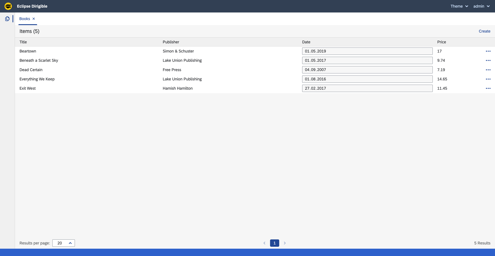

Bookstore Application - UI
===

## Overview

This section shows how to create the User Interface layer for the Bookstore application.
It contains a Books `Perspective`, `View` for displaying the data and `Dialog` for modifing the Books data.

## Steps

### Perspective

1. Right click on the `babylon-project` project and select **New &#8594; Folder**.
1. Enter `ui` for the name of the folder.
1. Create `index.html`, `perspective.js` and `perspective.extension` as shown below:

=== "index.html"

    1. Right click on the `ui` folder and select **New &#8594; File**.
    1. Enter `index.html` for the name of the file.
    1. Replace the content with the following code:

    ```html
    <!DOCTYPE html>
    <html lang="en" ng-app="app" ng-controller="ApplicationController" xmlns="http://www.w3.org/1999/xhtml">

        <head>
            <meta charset="utf-8">
            <meta http-equiv="X-UA-Compatible" content="IE=edge">
            <meta name="viewport" content="width=device-width, initial-scale=1">
            <link rel="icon" href="data:;base64,iVBORw0KGgo=" dg-brand-icon />
            <title dg-brand-title></title>
            <script type="text/javascript" src="perspective.js"></script>
            <theme></theme>
            <script type="text/javascript"
                src="/services/js/resources-core/services/loader.js?id=application-perspective-js">
            </script>
            <link type="text/css" rel="stylesheet"
                href="/services/js/resources-core/services/loader.js?id=application-perspective-css" />
        </head>

        <body>
            <ide-header menu-ext-id="books-menu"></ide-header>
            <ide-container>
                <ide-layout views-layout-model="layoutModel"></ide-layout>
            </ide-container>
            <ide-dialogs></ide-dialogs>
            <ide-status-bar></ide-status-bar>
            <script type="text/javascript">
                angular.module('app', ['ngResource', 'ideLayout', 'ideUI'])
                    .constant('branding', {
                        name: 'Babylon',
                        brand: 'Eclipse Dirigible',
                        brandUrl: 'https://dirigible.io',
                        icons: {
                            faviconIco: '/services/web/resources/images/favicon.ico',
                            favicon32: '/services/web/resources/images/favicon-32x32.png',
                            favicon16: '/services/web/resources/images/favicon-16x16.png',
                        },
                        logo: '/services/web/resources/images/dirigible.svg',
                    })
                    .constant('extensionPoint', {
                        perspectives: "books",
                        views: "books-view",
                        dialogWindows: "books-dialog-window"
                    })
                    .controller('ApplicationController', ["$scope", "messageHub", function ($scope, messageHub) {
                        const httpRequest = new XMLHttpRequest();
                        httpRequest.open("GET", "/services/js/resources-core/services/views.js?extensionPoint=books-view", false);
                        httpRequest.send();

                        $scope.layoutModel = {
                            views: JSON.parse(httpRequest.responseText).filter(e => !e.isLaunchpad && e.perspectiveName === "books").map(e => e.id)
                        };

                    }]);
            </script>
        </body>

    </html>
    ```

=== "perspective.js"

    1. Right click on the `ui` folder and select **New &#8594; File**.
    1. Enter `perspective.js` for the name of the file.
    1. Replace the content with the following code:

    ```js
    const perspectiveData = {
        id: "books",
        name: "books",
        link: "/services/web/babylon-project/ui/index.html",
        order: "100",
        icon: "/services/web/resources/unicons/copy.svg",
    };

    if (typeof exports !== 'undefined') {
        exports.getPerspective = function () {
            return perspectiveData;
        }
    }
    ```

=== "perspective.extension"

    1. Right click on the `ui` folder and select **New &#8594; Extension**.
    1. Enter `perspective.extension` for the name of the Extension.
    1. Right click on `perspective.extension` and select **Open With &#8594; Code Editor**.
    1. Replace the content with the following code:

    ```json
    {
        "module": "babylon-project/ui/perspective.js",
        "extensionPoint": "books",
        "description": "Books - Perspective"
    }
    ```


!!! note

    The `index.html`, `perspective.js` and `perspective.extension` files should be located at the `babylon-project/ui` folder.

### View

1. Right click on the `babylon-project/ui` folder and select **New &#8594; Folder**.
1. Enter `Books` for the name of the folder.
1. Create `index.html`, `controller.js`, `view.js` and `view.extension` as shown below:

=== "index.html"

    1. Right click on the `Books` folder and select **New &#8594; File**.
    1. Enter `index.html` for the name of the file.
    1. Replace the content with the following code:

    ```html
    <!DOCTYPE HTML>
    <html lang="en" xmlns="http://www.w3.org/1999/xhtml" ng-app="page" ng-controller="PageController">

        <head>
            <meta charset="utf-8">
            <meta http-equiv="X-UA-Compatible" content="IE=edge">
            <meta name="viewport" content="width=device-width, initial-scale=1">
            <link rel="icon" href="data:;base64,iVBORw0KGgo=" dg-brand-icon />
            <title dg-brand-title></title>
            <theme></theme>
            <script type="text/javascript" src="/services/js/resources-core/services/loader.js?id=application-view-js">
            </script>
            <link type="text/css" rel="stylesheet"
                href="/services/js/resources-core/services/loader.js?id=application-view-css" />
            <script type="text/javascript" src="controller.js"></script>
        </head>

        <body class="dg-vbox">
            <fd-toolbar has-title="true">
                <fd-toolbar-title>Items ({{dataCount}})</fd-toolbar-title>
                <fd-toolbar-spacer></fd-toolbar-spacer>
                <fd-button compact="true" dg-type="transparent" dg-label="Create" ng-click="createEntity()"></fd-button>
            </fd-toolbar>

            <fd-scrollbar class="dg-full-height" ng-hide="data == null">
                <table fd-table display-mode="compact" inner-borders="top" outer-borders="none">
                    <thead fd-table-header sticky="true">
                        <tr fd-table-row>
                            <th fd-table-header-cell>Title</th>
                            <th fd-table-header-cell>Publisher</th>
                            <th fd-table-header-cell>Date</th>
                            <th fd-table-header-cell>Price</th>
                            <th fd-table-header-cell></th>
                        </tr>
                    </thead>
                    <tbody fd-table-body>
                        <tr fd-table-row hoverable="true" ng-show="data.length == 0">
                            <td fd-table-cell no-data="true">No data available.</td>
                        </tr>
                        <tr fd-table-row hoverable="true" ng-repeat="next in data"
                            dg-selected="next.id === selectedEntity.id" ng-click="selectEntity(next)">
                            <td fd-table-cell ng-click="openDetails(next)" hoverable="true" activable="true">{{next.title}}
                            </td>
                            <td fd-table-cell ng-click="openDetails(next)" hoverable="true" activable="true">
                                {{next.publisher}}
                            </td>
                            <td fd-table-cell ng-click="openDetails(next)" hoverable="true" activable="true">
                                <fd-input type="date" ng-model="next.date" ng-readonly="true"></fd-input>
                            </td>
                            <td fd-table-cell ng-click="openDetails(next)" hoverable="true" activable="true">{{next.price}}
                            </td>
                            <td fd-table-cell fit-content="true">
                                <fd-popover>
                                    <fd-popover-control>
                                        <fd-button compact="true" glyph="sap-icon--overflow" dg-type="transparent"
                                            aria-label="Table Row Menu Button" ng-click="setTristate()">
                                        </fd-button>
                                    </fd-popover-control>
                                    <fd-popover-body dg-align="bottom-right">
                                        <fd-menu aria-label="Table Row Menu" no-backdrop="true" no-shadow="true">
                                            <fd-menu-item title="View Details" ng-click="openDetails(next)"></fd-menu-item>
                                            <fd-menu-item title="Edit" ng-click="updateEntity(next)"></fd-menu-item>
                                            <fd-menu-item title="Delete" ng-click="deleteEntity(next)"></fd-menu-item>
                                        </fd-menu>
                                    </fd-popover-body>
                                </fd-popover>
                            </td>
                        </tr>
                    </tbody>
                </table>
            </fd-scrollbar>

            <fd-pagination total-items="dataCount" items-per-page="dataLimit" items-per-page-options="[10, 20, 50]"
                page-change="loadPage(pageNumber)" items-per-page-change="loadPage(pageNumber)"
                items-per-page-placement="top-start" compact="true" display-total-items="true" ng-hide="dataCount == 0">
            </fd-pagination>
        </body>

    </html>
    ```

=== "controller.js"

    1. Right click on the `Books` folder and select **New &#8594; File**.
    1. Enter `controller.js` for the name of the file.
    1. Replace the content with the following code:

    ```js
    angular.module('page', ["ideUI", "ideView", "entityApi"])
        .config(["messageHubProvider", function (messageHubProvider) {
            messageHubProvider.eventIdPrefix = 'babylon-project.books.Books';
        }])
        .config(["entityApiProvider", function (entityApiProvider) {
            entityApiProvider.baseUrl = "/services/ts/babylon-project/api/books.ts";
        }])
        .controller('PageController', ['$scope', 'messageHub', 'entityApi', function ($scope, messageHub, entityApi) {

            function resetPagination() {
                $scope.dataPage = 1;
                $scope.dataCount = 0;
                $scope.dataLimit = 20;
            }
            resetPagination();

            //-----------------Events-------------------//
            messageHub.onDidReceiveMessage("entityCreated", function (msg) {
                $scope.loadPage($scope.dataPage);
            });

            messageHub.onDidReceiveMessage("entityUpdated", function (msg) {
                $scope.loadPage($scope.dataPage);
            });
            //-----------------Events-------------------//

            $scope.loadPage = function (pageNumber) {
                $scope.dataPage = pageNumber;
                entityApi.count().then(function (response) {
                    if (response.status != 200) {
                        messageHub.showAlertError("Books", `Unable to count Books: '${response.message}'`);
                        return;
                    }
                    $scope.dataCount = parseInt(response.data);
                    let offset = (pageNumber - 1) * $scope.dataLimit;
                    let limit = $scope.dataLimit;
                    entityApi.list(offset, limit).then(function (response) {
                        if (response.status != 200) {
                            messageHub.showAlertError("Books", `Unable to list Books: '${response.message}'`);
                            return;
                        }

                        response.data.forEach(e => {
                            if (e.date) {
                                e.date = new Date(e.date);
                            }
                        });

                        $scope.data = response.data;
                    });
                });
            };
            $scope.loadPage($scope.dataPage);

            $scope.selectEntity = function (entity) {
                $scope.selectedEntity = entity;
            };

            $scope.openDetails = function (entity) {
                $scope.selectedEntity = entity;
                messageHub.showDialogWindow("Books-details", {
                    action: "select",
                    entity: entity,
                });
            };

            $scope.createEntity = function () {
                $scope.selectedEntity = null;
                messageHub.showDialogWindow("Books-details", {
                    action: "create",
                    entity: {},
                }, null, false);
            };

            $scope.updateEntity = function (entity) {
                messageHub.showDialogWindow("Books-details", {
                    action: "update",
                    entity: entity,
                }, null, false);
            };

            $scope.deleteEntity = function (entity) {
                let id = entity.id;
                messageHub.showDialogAsync(
                    'Delete Books?',
                    `Are you sure you want to delete Books? This action cannot be undone.`,
                    [{
                        id: "delete-btn-yes",
                        type: "emphasized",
                        label: "Yes",
                    },
                    {
                        id: "delete-btn-no",
                        type: "normal",
                        label: "No",
                    }],
                ).then(function (msg) {
                    if (msg.data === "delete-btn-yes") {
                        entityApi.delete(id).then(function (response) {
                            if (response.status != 204) {
                                messageHub.showAlertError("Books", `Unable to delete Books: '${response.message}'`);
                                return;
                            }
                            $scope.loadPage($scope.dataPage);
                            messageHub.postMessage("clearDetails");
                        });
                    }
                });
            };

        }]);
    ```

=== "view.js"

    1. Right click on the `Books` folder and select **New &#8594; File**.
    1. Enter `view.js` for the name of the file.
    1. Replace the content with the following code:

    ```js
    const viewData = {
        id: "Books",
        label: "Books",
        factory: "frame",
        region: "center",
        link: "/services/web/babylon-project/ui/Books/index.html",
        perspectiveName: "books"
    };

    if (typeof exports !== 'undefined') {
        exports.getView = function () {
            return viewData;
        }
    }
    ```

=== "view.extension"

    1. Right click on the `Books` folder and select **New &#8594; Extension**.
    1. Enter `view.extension` for the name of the Extension.
    1. Right click on `view.extension` and select **Open With &#8594; Code Editor**.
    1. Replace the content with the following code:

    ```json
    {
        "module": "babylon-project/ui/Books/view.js",
        "extensionPoint": "books-view",
        "description": "Books - Application View"
    }
    ```

!!! note

    The `index.html`, `controller.js`, `view.js` and `view.extension` files should be located at the `babylon-project/ui/Books` folder.

### Dialog

1. Right click on the `babylon-project/ui/Books` folder and select **New &#8594; Folder**.
1. Enter `dialog-window` for the name of the folder.
1. Create `index.html`, `controller.js`, `view.js` and `view.extension` as shown below:

=== "index.html"

    1. Right click on the `dialog-window` folder and select **New &#8594; File**.
    1. Enter `index.html` for the name of the file.
    1. Replace the content with the following code:

    ```html
    <!DOCTYPE HTML>
    <html lang="en" xmlns="http://www.w3.org/1999/xhtml" ng-app="page" ng-controller="PageController">

        <head>
            <meta charset="utf-8">
            <meta http-equiv="X-UA-Compatible" content="IE=edge">
            <meta name="viewport" content="width=device-width, initial-scale=1">
            <link rel="icon" href="data:;base64,iVBORw0KGgo=" dg-brand-icon />
            <title dg-brand-title></title>
            <theme></theme>
            <script type="text/javascript" src="/services/js/resources-core/services/loader.js?id=application-view-js">
            </script>
            <link type="text/css" rel="stylesheet"
                href="/services/js/resources-core/services/loader.js?id=application-view-css" />

            <script type="text/javascript" src="controller.js"></script>
        </head>

        <body class="dg-vbox" dg-contextmenu="contextMenuContent">
            <fd-scrollbar class="dg-full-height">
                <div class="fd-margin--md fd-message-strip fd-message-strip--error fd-message-strip--dismissible"
                    role="alert" ng-show="errorMessage">
                    <p class="fd-message-strip__text">{{ errorMessage }}</p>
                    <fd-button glyph="sap-icon--decline" compact="true" dg-type="transparent" aria-label="Close"
                        in-msg-strip="true" ng-click="clearErrorMessage()">
                    </fd-button>
                </div>

                <fd-fieldset class="fd-margin--md" ng-form="formFieldset">
                    <fd-form-group dg-header="{{formHeaders[action]}}" name="entityForm">
                        <fd-form-item horizontal="false">
                            <fd-form-label for="idisbn" dg-required="false" dg-colon="true">ISBN</fd-form-label>
                            <fd-form-input-message-group dg-inactive="{{ formErrors.isbn ? false : true }}">
                                <fd-input id="idisbn" name="isbn" state="{{ formErrors.isbn ? 'error' : '' }}"
                                    ng-required="false" ng-change="isValid(formFieldset['isbn'].$valid, 'isbn')"
                                    ng-model="entity.isbn" ng-readonly="action === 'select'" ng-minlength="0.0 || 0"
                                    ng-maxlength="20.0 || -1" dg-input-rules="{ patterns: [''] }" type="text"
                                    placeholder="Enter isbn">
                                </fd-input>
                                <fd-form-message dg-type="error">Incorrect Input</fd-form-message>
                            </fd-form-input-message-group>
                        </fd-form-item>
                        <fd-form-item horizontal="false">
                            <fd-form-label for="idtitle" dg-required="false" dg-colon="true">Title</fd-form-label>
                            <fd-form-input-message-group dg-inactive="{{ formErrors.title ? false : true }}">
                                <fd-input id="idtitle" name="title" state="{{ formErrors.title ? 'error' : '' }}"
                                    ng-required="false" ng-change="isValid(formFieldset['title'].$valid, 'title')"
                                    ng-model="entity.title" ng-readonly="action === 'select'" ng-minlength="0.0 || 0"
                                    ng-maxlength="20.0 || -1" dg-input-rules="{ patterns: [''] }" type="text"
                                    placeholder="Enter title">
                                </fd-input>
                                <fd-form-message dg-type="error">Incorrect Input</fd-form-message>
                            </fd-form-input-message-group>
                        </fd-form-item>
                        <fd-form-item horizontal="false">
                            <fd-form-label for="idpublisher" dg-required="false" dg-colon="true">Publisher</fd-form-label>
                            <fd-form-input-message-group dg-inactive="{{ formErrors.publisher ? false : true }}">
                                <fd-input id="idpublisher" name="publisher"
                                    state="{{ formErrors.publisher ? 'error' : '' }}" ng-required="false"
                                    ng-change="isValid(formFieldset['publisher'].$valid, 'publisher')"
                                    ng-model="entity.publisher" ng-readonly="action === 'select'" ng-minlength="0.0 || 0"
                                    ng-maxlength="20.0 || -1" dg-input-rules="{ patterns: [''] }" type="text"
                                    placeholder="Enter publisher">
                                </fd-input>
                                <fd-form-message dg-type="error">Incorrect Input</fd-form-message>
                            </fd-form-input-message-group>
                        </fd-form-item>
                        <fd-form-item horizontal="false">
                            <fd-form-label for="iddate" dg-required="false" dg-colon="true">Date</fd-form-label>
                            <fd-form-input-message-group dg-inactive="{{ formErrors.date ? false : true }}">
                                <fd-input id="iddate" name="date" state="{{ formErrors.date ? 'error' : '' }}"
                                    ng-required="false" ng-change="isValid(formFieldset['date'].$valid, 'date')"
                                    ng-model="entity.date" ng-readonly="action === 'select'" type="date">
                                </fd-input>
                                <fd-form-message dg-type="error">Incorrect Input</fd-form-message>
                            </fd-form-input-message-group>
                        </fd-form-item>
                        <fd-form-item horizontal="false">
                            <fd-form-label for="idprice" dg-required="false" dg-colon="true">Price</fd-form-label>
                            <fd-form-input-message-group dg-inactive="{{ formErrors.price ? false : true }}">
                                <fd-input id="idprice" name="price" state="{{ formErrors.price ? 'error' : '' }}"
                                    ng-required="false" ng-change="isValid(formFieldset['price'].$valid, 'price')"
                                    ng-model="entity.price" ng-readonly="action === 'select'" type="number"
                                    placeholder="Enter price">
                                </fd-input>
                                <fd-form-message dg-type="error">Incorrect Input</fd-form-message>
                            </fd-form-input-message-group>
                        </fd-form-item>
                </fd-fieldset>
            </fd-scrollbar>

            <footer class="fd-dialog__footer fd-bar fd-bar--footer" ng-show="action !== 'select'">
                <div class="fd-bar__right">
                    <fd-button class="fd-margin-end--tiny fd-dialog__decisive-button" compact="true" dg-type="emphasized"
                        dg-label="{{action === 'create' ? 'Create' : 'Update'}}"
                        ng-click="action === 'create' ? create() : update()" state="{{ !isFormValid ? 'disabled' : '' }}">
                    </fd-button>
                    <fd-button class="fd-dialog__decisive-button" compact="true" dg-type="transparent" dg-label="Cancel"
                        ng-click="cancel()"></fd-button>
                </div>
            </footer>

        </body>

    </html>
    ```

=== "controller.js"

    1. Right click on the `dialog-window` folder and select **New &#8594; File**.
    1. Enter `controller.js` for the name of the file.
    1. Replace the content with the following code:

    ```js
    angular.module('page', ["ideUI", "ideView", "entityApi"])
        .config(["messageHubProvider", function (messageHubProvider) {
            messageHubProvider.eventIdPrefix = 'babylon-project.books.Books';
        }])
        .config(["entityApiProvider", function (entityApiProvider) {
            entityApiProvider.baseUrl = "/services/ts/babylon-project/api/books.ts";
        }])
        .controller('PageController', ['$scope', 'messageHub', 'entityApi', function ($scope, messageHub, entityApi) {

            $scope.entity = {};
            $scope.formHeaders = {
                select: "Books Details",
                create: "Create Books",
                update: "Update Books"
            };
            $scope.formErrors = {};
            $scope.action = 'select';

            if (window != null && window.frameElement != null && window.frameElement.hasAttribute("data-parameters")) {
                let dataParameters = window.frameElement.getAttribute("data-parameters");
                if (dataParameters) {
                    let params = JSON.parse(dataParameters);
                    $scope.action = params.action;
                    if ($scope.action == "create") {
                        $scope.formErrors = {
                        };
                    }
                    if (params.entity.date) {
                        params.entity.date = new Date(params.entity.date);
                    }
                    $scope.entity = params.entity;
                    $scope.selectedMainEntityKey = params.selectedMainEntityKey;
                    $scope.selectedMainEntityId = params.selectedMainEntityId;
                }
            }

            $scope.isValid = function (isValid, property) {
                $scope.formErrors[property] = !isValid ? true : undefined;
                for (let next in $scope.formErrors) {
                    if ($scope.formErrors[next] === true) {
                        $scope.isFormValid = false;
                        return;
                    }
                }
                $scope.isFormValid = true;
            };

            $scope.create = function () {
                let entity = $scope.entity;
                entity[$scope.selectedMainEntityKey] = $scope.selectedMainEntityId;
                entityApi.create(entity).then(function (response) {
                    if (response.status != 201) {
                        $scope.errorMessage = `Unable to create Books: '${response.message}'`;
                        return;
                    }
                    messageHub.postMessage("entityCreated", response.data);
                    $scope.cancel();
                    messageHub.showAlertSuccess("Books", "Books successfully created");
                });
            };

            $scope.update = function () {
                let id = $scope.entity.id;
                let entity = $scope.entity;
                entity[$scope.selectedMainEntityKey] = $scope.selectedMainEntityId;
                entityApi.update(id, entity).then(function (response) {
                    if (response.status != 200) {
                        $scope.errorMessage = `Unable to update Books: '${response.message}'`;
                        return;
                    }
                    messageHub.postMessage("entityUpdated", response.data);
                    $scope.cancel();
                    messageHub.showAlertSuccess("Books", "Books successfully updated");
                });
            };

            $scope.cancel = function () {
                $scope.entity = {};
                $scope.action = 'select';
                messageHub.closeDialogWindow("Books-details");
            };

            $scope.clearErrorMessage = function () {
                $scope.errorMessage = null;
            };

        }]);
    ```

=== "view.js"

    1. Right click on the `dialog-window` folder and select **New &#8594; File**.
    1. Enter `view.js` for the name of the file.
    1. Replace the content with the following code:

    ```js
    const viewData = {
        id: "Books-details",
        label: "Books",
        link: "/services/web/babylon-project/ui/Books/dialog-window/index.html",
        perspectiveName: "books"
    };

    if (typeof exports !== 'undefined') {
        exports.getDialogWindow = function () {
            return viewData;
        }
    }
    ```

=== "view.extension"

    1. Right click on the `dialog-window` folder and select **New &#8594; Extension**.
    1. Enter `view.extension` for the name of the Extension.
    1. Right click on `view.extension` and select **Open With &#8594; Code Editor**.
    1. Replace the content with the following code:

    ```json
    {
        "module": "babylon-project/ui/Books/dialog-window/view.js",
        "extensionPoint": "books-dialog-window",
        "description": "Books - Application Dialog Window"
    }
    ```

!!! note

    The `index.html`, `controller.js`, `view.js` and `view.extension` files should be located at the `babylon-project/ui/Books/dialog-window` folder.

## Publish and Preview

1. _(optional)_ Right click on the `babylon-project` project and select `Publish`.
1. Select the `babylon-project/ui/index.html` in the `Projects` view
1. In the `Preview` window you should see the web page for management of Books.
1. Try to enter a few books to test how it works.



!!! info "Application URL"

    The Bookstore Application is available at: [http://localhost:8080/services/web/babylon-project/ui/](http://localhost:8080/services/web/babylon-project/ui/)

## Summary

!!! success "Section Completed"

    After completing the steps in this tutorial, you would have:

    - Extendable UI `Perspective` for the book related views.
    - Books `View` to display the books data.
    - Books `Dialog` for modifing the books data.

    _**Note:** The complete content of the Bookstore tutorial is available at: [https://github.com/dirigiblelabs/tutorial-babylon-project](https://github.com/dirigiblelabs/tutorial-babylon-project)_