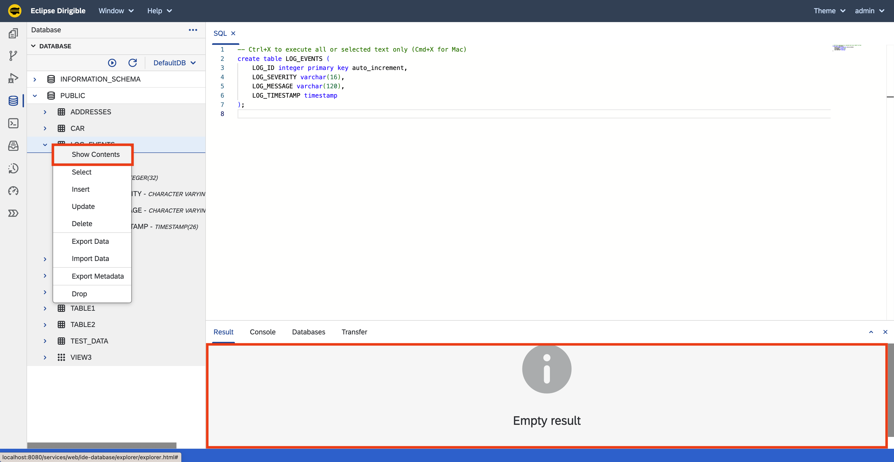

Scheduled Job - Database
===

## Overview

This section shows how to create the database table for the Scheduled Job application.

## Steps

### Database Table

1. Navigate to the [`Database Perspective`](/help/development/ide/perspectives/database/).
1. In the [`SQL View`](/help/development/ide/views/sql/) enter the following script:

    ```sql
    create table LOG_EVENTS (
        LOG_ID integer primary key auto_increment,
        LOG_SEVERITY varchar(16),
        LOG_MESSAGE varchar(120),
        LOG_TIMESTAMP timestamp
    );
    ```

1. Press the `Run` icon to execute the SQL script.

    !!! tip "Keyboard Shortcut"

        Press ++ctrl+x++ for Windows, ++cmd+x++ for macOS to execute the SQL script.

        _**Note:** You can execute all or part of the SQL scripts in the `SQL View` by making a selection and pressing the `Run` icon or the keyboard shortcut._

1. Press the `Refresh` button to see the `LOG_EVENTS` table.

    

### Table Content

1. Right click on the `LOG_EVENTS` table and select **Show Contents**.
1. The table data would be displayed in the [`Result View`](/help/development/ide/views/resultview/).
1. As the table is empty, there should be no data:

    

## Next Steps

!!! success "Section Completed"

    After completing the steps in this tutorial, you would:

    - Have database table named `LOG_EVENTS`.
    - Be familiar with the [`Database Perspective`](/help/development/ide/perspectives/database/), the [`SQL View`](/help/development/ide/views/sql/) and the [`Result View`](/help/development/ide/views/resultview/).

    Continue to the [Job Handler](../handler/) section to create a `Job Handler`, that would be executed by the `Scheduled Job`.

    _**Note:** The complete content of the Scheduled Job tutorial is available at: [https://github.com/dirigiblelabs/tutorial-scheduled-job-project](https://github.com/dirigiblelabs/tutorial-scheduled-job-project)_