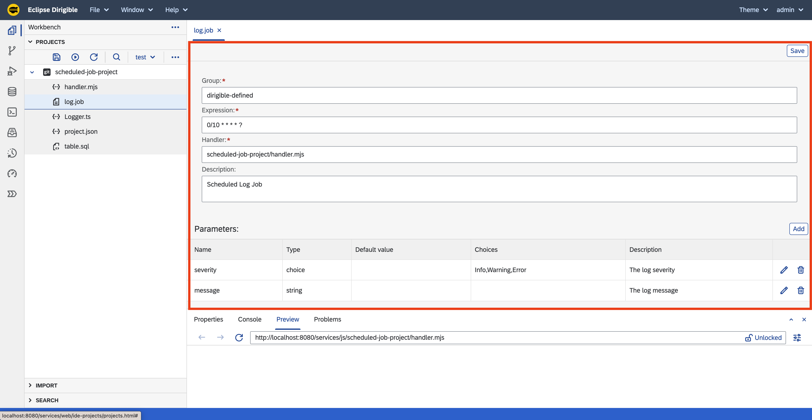
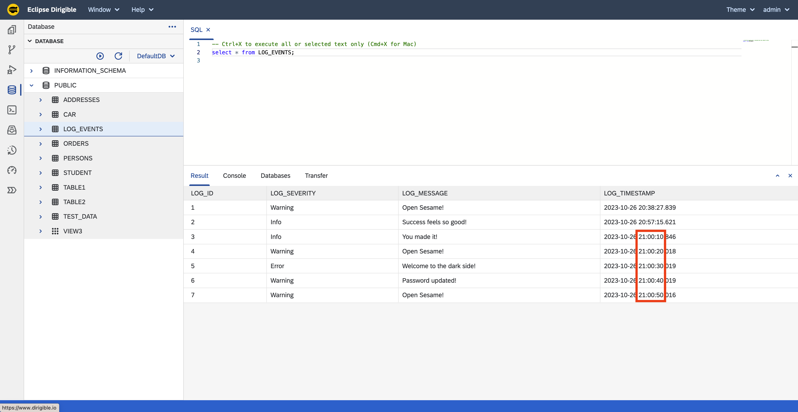

Scheduled Job - Job Definition
===

## Overview

This section shows how to create and manage `Job Definition` for the `Scheduled Job` application.

## Steps

### Job Definition

1. Right click on the `scheduled-job-project` project and select **New &#8594; Scheduled Job**.
1. Enter `log.job` for the name of the Scheduled Job.
1. Right click on `log.job` and select **Open With &#8594; Code Editor**.
1. Replace the content with the following definition:

    ```json
    {
        "expression": "0/10 * * * * ?",
        "group": "defined",
        "handler": "scheduled-job-project/handler.mjs",
        "description": "Scheduled Log Job",
        "parameters": [
            {
                "name": "severity",
                "type": "choice",
                "defaultValue": "",
                "choices": "Info,Warning,Error",
                "description": "The log severity"
            },
            {
                "name": "message",
                "type": "string",
                "defaultValue": "",
                "description": "The log message"
            }
        ]
    }
    ```

1. Double click on `log.job` to open it with the `Job Editor`.

    


!!! info "Save & Publish"
    
	Saving the file will trigger a _`Publish`_ action, that would schedule the job. As defined by the **expression** _(`0/10 * * * * ?`)_, the job handler would be executed each 10 seconds and data would be insterted into the `LOG_EVENTS` table.

### Log Events Data

1. Navigate to the [`Database Perspective`](/help/development/ide/perspectives/database/) to check that there are new records in the `LOG_EVENTS` table.
1. You can notice in the `LOG_TIMESTAMP` column that the last records are 10 seconds apart each.

    

### Manage Jobs

1. Navigate to the [`Jobs Perspective`](/help/development/ide/perspectives/jobs/) to see a list of the Scheduled Jobs on the instance.
1. Click on the `Enable/Disable` icon to stop the `log` Scheduled Job.

    

1. Navigate to the [`Database Perspective`](/help/development/ide/perspectives/database/) to check that there are no new records in the `LOG_EVENTS` table after the job was disabled.
1. Go back to the [`Jobs Perspective`](/help/development/ide/perspectives/jobs/).
1. Click on the `Trigger` icon and then on the `Trigger` button to start new `Job Execution`.

    

    !!! note "Force Trigger"

        This action would instantly trigger the `Job Handler` without respecting the `Job Schedule Expression` or whether the `Job Schedule` is enabled or disabled.

1. Navigate back to the [`Database Perspective`](/help/development/ide/perspectives/database/) to check that there was a new record added in the `LOG_EVENTS` table after the job was disabled.

## Summary

!!! success "Tutorial Completed"

    After completing all steps in this tutorial, you would:

    - Have `Scheduled Job`.
    - New records in the `LOG_EVENTS` table.
    - Experience with the [`Jobs Perspective`](/help/development/ide/perspectives/jobs/).

    _**Note:** The complete content of the Scheduled Job tutorial is available at: [https://github.com/dirigiblelabs/tutorial-scheduled-job-project](https://github.com/dirigiblelabs/tutorial-scheduled-job-project)_
