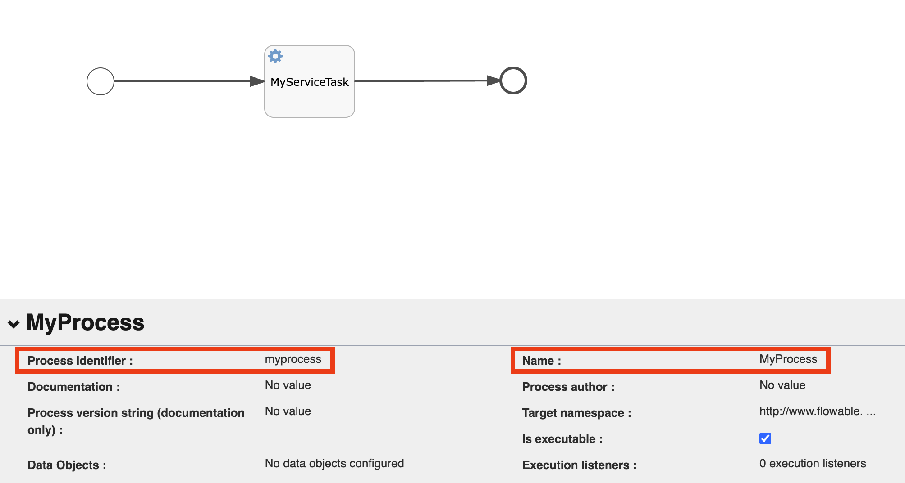
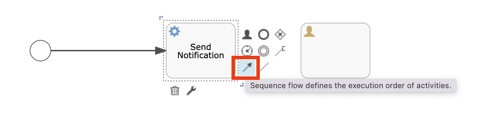
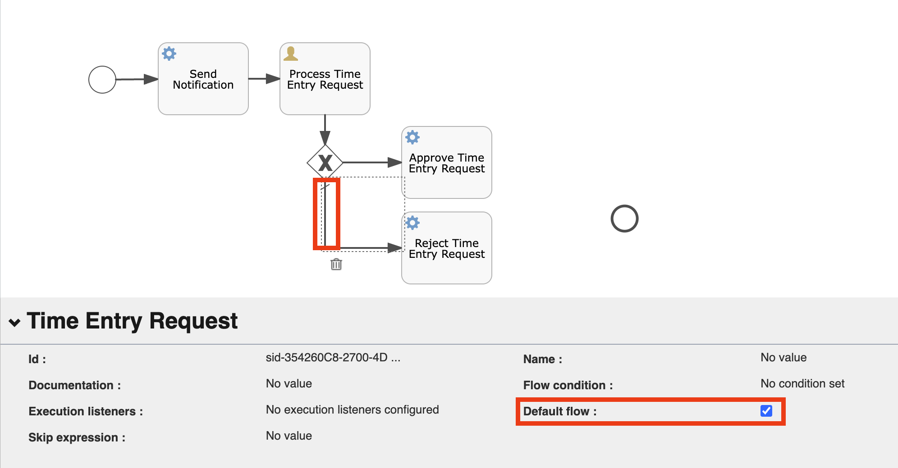

BPMN Process
===

This tutorial will guide you through the steps of creating a `Business Process` with `Service Task`, `User Task` and `Choice Gateway` elements.
The result of the business process modeling would be a **Time Entry Request** process, that once started would trigger an approval process _(with mail notifications, if configured)_ with the following steps:


### Steps

#### Start Eclipse Dirigible

!!! info 

	You can find more information on how to do that by following:

	- [Getting Started](https://www.dirigible.io/help/development/) section.
	- [Setup](https://www.dirigible.io/help/setup/) section.

#### Create Project

- Go to the `Projects` perspective and create `New Project`.
- Enter `sample-bpm` for the name of the project.
- The project will appear under the projects list.

#### Create JavaScript Process Task Handlers

JavaScript handlers should be provided for the `Service Task` steps in the `Business Process`. The following handlers will be executed during the `Approve Time Entry Request`, `Deny Time Entry Request` and `Send Notification` tasks.

- Right click on the `sample-bpm` project and select **New &#8594; Folder**.
- Enter `tasks` for the name of the folder.
- Create `approve-request.js`, `reject-request.js` and `send-notification.js` files.

=== "approve-request.js"

	1. Right click on the `tasks` folder and select **New &#8594; JavaScript CJS Service**.
	1. Enter `approve-request.js` for the name of the file.
	1. Double-click to open the file.
	1. Replace the content with the following:

		```javascript
		const process = require("bpm/v4/process");
		const mailClient = require("mail/v4/client");
		const config = require("core/v4/configurations");

		let execution = process.getExecutionContext();
		let executionId = execution.getId();

		let user = process.getVariable(executionId, "user");

		console.log(`Time Entry Request Approved for User [${user}]`);

		if (isMailConfigured()) {
			let from = config.get("APP_SAMPLE_BPM_FROM_EMAIL");
			let to = config.get("APP_SAMPLE_BPM_TO_EMAIL");
			let subject = "Time Entry Request - Approved";
			let content = `<h2>Status:</h2><h4>Time Entry Request for [${user}] - Approved</4>`;
			let subType = "html";
		
			mailClient.send(from, to, subject, content, subType);
		} else {
			console.error("Missing mail configuration");
		}

		function isMailConfigured() {
			return config.get("DIRIGIBLE_MAIL_USERNAME") != ""
				&& config.get("DIRIGIBLE_MAIL_PASSWORD") != ""
				&& config.get("DIRIGIBLE_MAIL_TRANSPORT_PROTOCOL") != ""
				&& config.get("DIRIGIBLE_MAIL_SMTPS_HOST") != ""
				&& config.get("DIRIGIBLE_MAIL_SMTPS_PORT") != ""
				&& config.get("APP_SAMPLE_BPM_FROM_EMAIL") != ""
				&& config.get("APP_SAMPLE_BPM_TO_EMAIL") != ""
		}
		```

	1. Save the changes.

=== "reject-request.js"

	1. Right click on the `tasks` folder and select **New &#8594; JavaScript CJS Service**.
	1. Enter `reject-request.js` for the name of the file.
	1. Double-click to open the file.
	1. Replace the content with the following:

		```javascript
		const process = require("bpm/v4/process");
		const mailClient = require("mail/v4/client");
		const config = require("core/v4/configurations");

		let execution = process.getExecutionContext();
		let executionId = execution.getId();

		let user = process.getVariable(executionId, "user");

		console.error(`Time Entry Request Rejected for User [${user}]`);

		if (isMailConfigured()) {
			let from = config.get("APP_SAMPLE_BPM_FROM_EMAIL");
			let to = config.get("APP_SAMPLE_BPM_TO_EMAIL");
			let subject = "Time Entry Request - Rejected";
			let content = `<h2>Status:</h2><h4>Time Entry Request for [${user}] - Rejected</h4>`;
			let subType = "html";

			mailClient.send(from, to, subject, content, subType);
		} else {
			console.error("Missing mail configuration");
		}

		function isMailConfigured() {
			return config.get("DIRIGIBLE_MAIL_USERNAME") != ""
				&& config.get("DIRIGIBLE_MAIL_PASSWORD") != ""
				&& config.get("DIRIGIBLE_MAIL_TRANSPORT_PROTOCOL") != ""
				&& config.get("DIRIGIBLE_MAIL_SMTPS_HOST") != ""
				&& config.get("DIRIGIBLE_MAIL_SMTPS_PORT") != ""
				&& config.get("APP_SAMPLE_BPM_FROM_EMAIL") != ""
				&& config.get("APP_SAMPLE_BPM_TO_EMAIL") != ""
		}
		```

	1. Save the changes.

=== "send-notification.js"

	1. Right click on the `tasks` folder and select **New &#8594; JavaScript CJS Service**.
	1. Enter `send-notification.js` for the name of the file.
	1. Double-click to open the file.
	1. Replace the content with the following:

		```javascript
		const process = require("bpm/v4/process");
		const base64 = require("utils/v4/base64");
		const mailClient = require("mail/v4/client");
		const config = require("core/v4/configurations");

		let execution = process.getExecutionContext();
		let executionId = execution.getId();

		let data = {
			executionId: executionId,
			User: process.getVariable(executionId, "User"),
			Project: process.getVariable(executionId, "Project"),
			Start: process.getVariable(executionId, "Start"),
			End: process.getVariable(executionId, "End"),
			Hours: process.getVariable(executionId, "Hours")
		};

		let urlEncodedData = base64.encode(JSON.stringify(data));
		
		let url = `http://localhost:8080/services/v4/web/sample-bpm/process/?data=${urlEncodedData}`;

		console.log(`Approve Request URL: ${url}`);

		if (isMailConfigured()) {
			let from = config.get("APP_SAMPLE_BPM_FROM_EMAIL");
			let to = config.get("APP_SAMPLE_BPM_TO_EMAIL");
			let subject = "Time Entry Request - Pending";
			let content = `<h2>Status:</h2><h4>Time Entry Request for [${data.User}] - Pending</h4>Click <a href="${url}" target="_blank">here</a> to process request.`;
			let subType = "html";

			mailClient.send(from, to, subject, content, subType);
		} else {
			console.error("Missing mail configuration");
		}

		function isMailConfigured() {
			return config.get("DIRIGIBLE_MAIL_USERNAME") != ""
				&& config.get("DIRIGIBLE_MAIL_PASSWORD") != ""
				&& config.get("DIRIGIBLE_MAIL_TRANSPORT_PROTOCOL") != ""
				&& config.get("DIRIGIBLE_MAIL_SMTPS_HOST") != ""
				&& config.get("DIRIGIBLE_MAIL_SMTPS_PORT") != ""
				&& config.get("APP_SAMPLE_BPM_FROM_EMAIL") != ""
				&& config.get("APP_SAMPLE_BPM_TO_EMAIL") != ""
		}
		```

	1. Save the changes.

#### Create Business Process Model

- Right click on the `sample-bpm` project and select **New &#8594; Business Process Model**.
- Enter `time-entry-request.bpmn` for the name of the business process.

=== "Manual Steps"

	1. Double-click the `time-entry-request.bpmn` file to open it with the `Flowable Editor`.
	1. Click on the **Process identifier** field and change the value to `time-entry-request`.
	1. Click on the **Name** field and change the value to `Time Entry Request`.

		

	1. Click on the **MyServiceTasks** to select the first step of the business process.

		

	1. Click on the **Name** field and change the value to `Send Notification`.
	1. Scroll down to the **Class fields** and click on it.
	1. Change the **handler** filed to `sample-bpm/tasks/send-notification.js`.

		

		!!! Info "JavaScript Task Handler"

		    The value of the handler field _(e.g. `sample-bpm/tasks/send-notification.js`)_ points to the location of the javascript task handler created in the previous step.

	1. Delete the arrow comming out of the **Send Notification** step.

		

	1. Expand the **Activities** group and drag and drop new **User task** to editor area.
	1. Connect the **Send Notification** task and the newly created user task.

		

		!!! Info "User Task"

		    Once the business process is triggered, it would stop at the **Process Time Entry Request** user task and it will wait for process continuation after the user task is completed.

	1. Select the user task.
	1. Click on the **Name** field and change the value to `Process Time Entry Request`.
	1. Create **Choice gateway** comming out of the **Process Time Entry Request** user task.

		

	1. Expand the **Activities** group and drag and drop new **Service task** to editor area.
	1. Select the service task.
	1. Click on the **Name** field and change the value to `Approve Time Entry Request`.
	1. Scroll down to the **Class fields** and click on it.
	1. Change the **handler** filed to `sample-bpm/tasks/approve-request.js`.
	1. Expand the **Activities** group and drag and drop new **Service task** to editor area.
	1. Select the service task.
	1. Click on the **Name** field and change the value to `Reject Time Entry Request`.
	1. Scroll down to the **Class fields** and click on it.
	1. Change the **handler** filed to `sample-bpm/tasks/reject-request.js`.
	1. Connect the **Choice gateway** with the **Approve Time Entry Request** and **Reject Time Entry Request** steps.
	1. Select the connection between the **Choice gateway** and the **Reject Time Entry Request** step.
	1. Click on the **Default flow** checkbox.

		

	1. Select the connection between the **Choice gateway** and the **Approve Time Entry Request** step.
	1. Click on the **Flow condition** field and change the value to `${isRequestApproved}`.

		

		!!! Info "Flow Condition"

		    In the flow condition `isRequestApproved` is a process context variable, that would be set as part of the process continuation after the completion of the **Process Time Entry Request** user task.

	1. Connect the **Approve Time Entry Request** and **Reject Time Entry Request** steps with the end event.
	1. Save the changes.

		

=== "XML Content"

	1. Right click on the `time-entry-request.bpmn` file and select **Open With &#8594; Code Editor**.
	1. Replace the content with the following:

		```xml
		<?xml version='1.0' encoding='UTF-8'?>
		<definitions xmlns="http://www.omg.org/spec/BPMN/20100524/MODEL" xmlns:xsi="http://www.w3.org/2001/XMLSchema-instance" xmlns:xsd="http://www.w3.org/2001/XMLSchema" xmlns:flowable="http://		flowable.org/bpmn" xmlns:bpmndi="http://www.omg.org/spec/BPMN/20100524/DI" xmlns:omgdc="http://www.omg.org/spec/DD/20100524/DC" xmlns:omgdi="http://www.omg.org/spec/DD/20100524/DI" 		typeLanguage="http://www.w3.org/2001/XMLSchema" expressionLanguage="http://www.w3.org/1999/XPath" targetNamespace="http://www.flowable.org/processdef" exporter="Flowable Open Source 		Modeler" exporterVersion="6.7.2">
		  <process id="time-entry-request" name="Time Entry Request" isExecutable="true">
		    <startEvent id="sid-3334E861-7999-4B89-B8B0-11724BA17A3E"/>
		    <serviceTask id="sid-ED1BBD7E-41C4-42D7-A933-2CD979372BE7" name="Send Notification" flowable:class="org.eclipse.dirigible.bpm.flowable.DirigibleCallDelegate">
		      <extensionElements>
		        <flowable:field name="handler">
		          <flowable:string><![CDATA[sample-bpm/tasks/send-notification.js]]></flowable:string>
		        </flowable:field>
		      </extensionElements>
		    </serviceTask>
		    <sequenceFlow id="sid-797626AE-B2F6-4C00-ABEE-FB30ADC177E4" sourceRef="sid-3334E861-7999-4B89-B8B0-11724BA17A3E" targetRef="sid-ED1BBD7E-41C4-42D7-A933-2CD979372BE7"/>
		    <endEvent id="sid-70B488C1-384A-4E19-8091-1B12D1AEC7FD"/>
		    <userTask id="sid-1949B473-2C74-4A44-BBB5-EA6235D62426" name="Process Time Entry Request"/>
		    <serviceTask id="sid-07258D72-C009-406E-82EE-512FC68F9339" name="Approve Time Entry Request" flowable:class="org.eclipse.dirigible.bpm.flowable.DirigibleCallDelegate">
		      <extensionElements>
		        <flowable:field name="handler">
		          <flowable:string><![CDATA[sample-bpm/tasks/approve-request.js]]></flowable:string>
		        </flowable:field>
		      </extensionElements>
		    </serviceTask>
		    <exclusiveGateway id="sid-9D358738-173A-49C8-8B5C-DE28F95CF812" default="sid-354260C8-2700-4D26-ACB3-03990B1B83B6"/>
		    <sequenceFlow id="sid-A3B49B75-2D22-4D46-A01D-89663F5D9398" sourceRef="sid-1949B473-2C74-4A44-BBB5-EA6235D62426" targetRef="sid-9D358738-173A-49C8-8B5C-DE28F95CF812"/>
		    <sequenceFlow id="sid-645847E8-C959-48BD-816B-2E9CC4A2F08A" sourceRef="sid-ED1BBD7E-41C4-42D7-A933-2CD979372BE7" targetRef="sid-1949B473-2C74-4A44-BBB5-EA6235D62426"/>
		    <serviceTask id="sid-EBA0B783-C844-4C0D-AFAD-18699F661DB4" name="Reject Time Entry Request" flowable:class="org.eclipse.dirigible.bpm.flowable.DirigibleCallDelegate">
		      <extensionElements>
		        <flowable:field name="handler">
		          <flowable:string><![CDATA[sample-bpm/tasks/reject-request.js]]></flowable:string>
		        </flowable:field>
		      </extensionElements>
		    </serviceTask>
		    <sequenceFlow id="sid-23401766-A5CA-4A91-8187-EDDCCD2BC5D5" sourceRef="sid-EBA0B783-C844-4C0D-AFAD-18699F661DB4" targetRef="sid-70B488C1-384A-4E19-8091-1B12D1AEC7FD"/>
		    <sequenceFlow id="sid-4CFA2E86-C3CD-4290-95B9-010BC9C0BEDC" sourceRef="sid-07258D72-C009-406E-82EE-512FC68F9339" targetRef="sid-70B488C1-384A-4E19-8091-1B12D1AEC7FD"/>
		    <sequenceFlow id="sid-354260C8-2700-4D26-ACB3-03990B1B83B6" sourceRef="sid-9D358738-173A-49C8-8B5C-DE28F95CF812" targetRef="sid-EBA0B783-C844-4C0D-AFAD-18699F661DB4"/>
		    <sequenceFlow id="sid-300248C3-876E-4B89-86F4-E978FA150CA5" sourceRef="sid-9D358738-173A-49C8-8B5C-DE28F95CF812" targetRef="sid-07258D72-C009-406E-82EE-512FC68F9339">
		      <conditionExpression xsi:type="tFormalExpression"><![CDATA[${isRequestApproved}]]></conditionExpression>
		    </sequenceFlow>
		  </process>
		  <bpmndi:BPMNDiagram id="BPMNDiagram_time-entry-request">
		    <bpmndi:BPMNPlane bpmnElement="time-entry-request" id="BPMNPlane_time-entry-request">
		      <bpmndi:BPMNShape bpmnElement="sid-3334E861-7999-4B89-B8B0-11724BA17A3E" id="BPMNShape_sid-3334E861-7999-4B89-B8B0-11724BA17A3E">
		        <omgdc:Bounds height="30.0" width="30.0" x="103.0" y="78.0"/>
		      </bpmndi:BPMNShape>
		      <bpmndi:BPMNShape bpmnElement="sid-ED1BBD7E-41C4-42D7-A933-2CD979372BE7" id="BPMNShape_sid-ED1BBD7E-41C4-42D7-A933-2CD979372BE7">
		        <omgdc:Bounds height="80.0" width="100.0" x="180.0" y="52.0"/>
		      </bpmndi:BPMNShape>
		      <bpmndi:BPMNShape bpmnElement="sid-70B488C1-384A-4E19-8091-1B12D1AEC7FD" id="BPMNShape_sid-70B488C1-384A-4E19-8091-1B12D1AEC7FD">
		        <omgdc:Bounds height="28.00000000000003" width="28.0" x="683.3333061801073" y="233.33332406150006"/>
		      </bpmndi:BPMNShape>
		      <bpmndi:BPMNShape bpmnElement="sid-1949B473-2C74-4A44-BBB5-EA6235D62426" id="BPMNShape_sid-1949B473-2C74-4A44-BBB5-EA6235D62426">
		        <omgdc:Bounds height="80.0" width="100.0" x="315.0" y="52.0"/>
		      </bpmndi:BPMNShape>
		      <bpmndi:BPMNShape bpmnElement="sid-07258D72-C009-406E-82EE-512FC68F9339" id="BPMNShape_sid-07258D72-C009-406E-82EE-512FC68F9339">
		        <omgdc:Bounds height="80.0" width="100.0" x="450.0" y="144.99999999999997"/>
		      </bpmndi:BPMNShape>
		      <bpmndi:BPMNShape bpmnElement="sid-9D358738-173A-49C8-8B5C-DE28F95CF812" id="BPMNShape_sid-9D358738-173A-49C8-8B5C-DE28F95CF812">
		        <omgdc:Bounds height="40.0" width="40.0" x="345.0" y="165.0"/>
		      </bpmndi:BPMNShape>
		      <bpmndi:BPMNShape bpmnElement="sid-EBA0B783-C844-4C0D-AFAD-18699F661DB4" id="BPMNShape_sid-EBA0B783-C844-4C0D-AFAD-18699F661DB4">
		        <omgdc:Bounds height="80.0" width="100.0" x="450.0" y="240.0"/>
		      </bpmndi:BPMNShape>
		      <bpmndi:BPMNEdge bpmnElement="sid-797626AE-B2F6-4C00-ABEE-FB30ADC177E4" id="BPMNEdge_sid-797626AE-B2F6-4C00-ABEE-FB30ADC177E4" flowable:sourceDockerX="15.0" 		flowable:sourceDockerY="15.0" flowable:targetDockerX="50.0" flowable:targetDockerY="40.0">
		        <omgdi:waypoint x="132.9494165151691" y="92.86607665568077"/>
		        <omgdi:waypoint x="179.99999999999878" y="92.44598214285713"/>
		      </bpmndi:BPMNEdge>
		      <bpmndi:BPMNEdge bpmnElement="sid-645847E8-C959-48BD-816B-2E9CC4A2F08A" id="BPMNEdge_sid-645847E8-C959-48BD-816B-2E9CC4A2F08A" flowable:sourceDockerX="50.0" 		flowable:sourceDockerY="40.0" flowable:targetDockerX="50.0" flowable:targetDockerY="40.0">
		        <omgdi:waypoint x="279.95000000000005" y="92.0"/>
		        <omgdi:waypoint x="314.9999999999962" y="92.0"/>
		      </bpmndi:BPMNEdge>
		      <bpmndi:BPMNEdge bpmnElement="sid-23401766-A5CA-4A91-8187-EDDCCD2BC5D5" id="BPMNEdge_sid-23401766-A5CA-4A91-8187-EDDCCD2BC5D5" flowable:sourceDockerX="50.0" 		flowable:sourceDockerY="40.0" flowable:targetDockerX="14.0" flowable:targetDockerY="14.000000000000014">
		        <omgdi:waypoint x="549.9499999999998" y="271.7229694847648"/>
		        <omgdi:waypoint x="683.5191504285505" y="249.61196067916165"/>
		      </bpmndi:BPMNEdge>
		      <bpmndi:BPMNEdge bpmnElement="sid-4CFA2E86-C3CD-4290-95B9-010BC9C0BEDC" id="BPMNEdge_sid-4CFA2E86-C3CD-4290-95B9-010BC9C0BEDC" flowable:sourceDockerX="50.0" 		flowable:sourceDockerY="40.0" flowable:targetDockerX="14.0" flowable:targetDockerY="14.000000000000014">
		        <omgdi:waypoint x="549.95" y="200.77812482414993"/>
		        <omgdi:waypoint x="683.9707941300649" y="243.1152758099949"/>
		      </bpmndi:BPMNEdge>
		      <bpmndi:BPMNEdge bpmnElement="sid-354260C8-2700-4D26-ACB3-03990B1B83B6" id="BPMNEdge_sid-354260C8-2700-4D26-ACB3-03990B1B83B6" flowable:sourceDockerX="20.0" 		flowable:sourceDockerY="20.0" flowable:targetDockerX="50.0" flowable:targetDockerY="40.0">
		        <omgdi:waypoint x="365.0" y="204.93951104100947"/>
		        <omgdi:waypoint x="365.0" y="280.0"/>
		        <omgdi:waypoint x="449.99999999997203" y="280.0"/>
		      </bpmndi:BPMNEdge>
		      <bpmndi:BPMNEdge bpmnElement="sid-A3B49B75-2D22-4D46-A01D-89663F5D9398" id="BPMNEdge_sid-A3B49B75-2D22-4D46-A01D-89663F5D9398" flowable:sourceDockerX="50.0" 		flowable:sourceDockerY="40.0" flowable:targetDockerX="20.0" flowable:targetDockerY="20.0">
		        <omgdi:waypoint x="365.0" y="131.95"/>
		        <omgdi:waypoint x="365.0" y="165.0"/>
		      </bpmndi:BPMNEdge>
		      <bpmndi:BPMNEdge bpmnElement="sid-300248C3-876E-4B89-86F4-E978FA150CA5" id="BPMNEdge_sid-300248C3-876E-4B89-86F4-E978FA150CA5" flowable:sourceDockerX="20.0" 		flowable:sourceDockerY="20.0" flowable:targetDockerX="50.0" flowable:targetDockerY="40.0">
		        <omgdi:waypoint x="384.94261658031087" y="185.0"/>
		        <omgdi:waypoint x="450.0" y="184.99999999999997"/>
		      </bpmndi:BPMNEdge>
		    </bpmndi:BPMNPlane>
		  </bpmndi:BPMNDiagram>
		</definitions>
		```

	1. Save the changes.

!!! Note "Business Process Synchronization"

	Usually when the `*.bpmn` process is saved it would take between one and two minutes to be deployed and active. After that period of time the business process can be executed. The synchronization period by default is set to **50 seconds** _(`0/50 * * * * ?`)_. Find out more about the [Job Expression](https://www.dirigible.io/help/setup/setup-environment-variables/#job-expression) environment variables.

	- Updating the `*.bpmn` file would result in new synchronization being triggered and the updated process flow would be available after minute or two.
	- Updating the **JavaScript Task Handler** won't require new synchronization and the new behaviour of the handlers will be available on the fly.

#### Create Process API

To trigger and continue the **BPMN Process** execution a server-side JavaScript API will be created.

- Right click on the `sample-bpm` project and select **New &#8594; Folder**.
- Enter `api` for the name of the folder.
- Create `process.js` file.

=== "process.js"

	1. Right click on the `api` folder and select **New &#8594; JavaScript CJS Service**.
	1. Enter `process.js` for the name of the file.
	1. Double-click to open the file.
	1. Replace the content with the following:

		```javascript
		const rs = require("http/v4/rs");
		const process = require("bpm/v4/process");
		const tasks = require("bpm/v4/tasks");
		const user = require("security/v4/user");
		
		rs.service()
		    .post("", (ctx, request, response) => {
		        let data = request.getJSON();
		        process.start('time-entry-request', {
		            "User": "" + user.getName(),
		            "Project": "" + data.Project,
		            "Start": "" + data.Start,
		            "End": "" + data.End,
		            "Hours": "" + data.Hours
		        });
		        response.setStatus(response.ACCEPTED);
		    })
		    .resource("continue/:executionId")
		    .post((ctx, request, response) => {
		        let executionId = request.params.executionId;
		        let tasksList = tasks.list();
		        let data = request.getJSON();
		        for (const task of tasksList) {
		            if (task.executionId.toString() === executionId.toString()) {
		                tasks.completeTask(task.id, {
		                    isRequestApproved: data.approved,
		                    user: data.user
		                });
		                break;
		            }
		        }
		        response.setStatus(response.ACCEPTED);
		    })
		    .execute()
		```

#### Create Submit Form

The submit form would call the server-side javascript api that was created in the previous step and will trigger the business process.

- Right click on the `sample-bpm` project and select **New &#8594; Folder**.
- Enter `submit` for the name of the folder.
- Create `index.html` and `controller.js` files.

=== "index.html"

	1. Right click on the `submit` folder and select **New &#8594; HTML5 Page**.
	1. Enter `index.html` for the name of the file.
	1. Double-click to open the file.
	1. Replace the content with the following:

		```html
		<!DOCTYPE HTML>
		<html lang="en" xmlns="http://www.w3.org/1999/xhtml" ng-app="page" ng-controller="PageController">
		
		    <head>
		        <meta charset="utf-8">
		        <meta http-equiv="X-UA-Compatible" content="IE=edge">
		        <meta name="viewport" content="width=device-width, initial-scale=1">
		        <link rel="icon" href="data:;base64,iVBORw0KGgo=" dg-brand-icon />
		        <title dg-brand-title></title>
		        <theme></theme>
		        <script type="text/javascript" src="/services/v4/js/resources-core/services/loader.js?id=application-view-js">
		        </script>
		        <link type="text/css" rel="stylesheet"
		            href="/services/v4/js/resources-core/services/loader.js?id=application-view-css" />
		
		        <script type="text/javascript" src="controller.js"></script>
		    </head>
		
		    <body class="dg-vbox" dg-contextmenu="contextMenuContent">
		
		        <div>
		            <fd-message-page glyph="sap-icon--time-entry-request">
		                <fd-message-page-title>Submit Time Entry Request</fd-message-page-title>
		                <fd-message-page-subtitle>
		                    <fd-scrollbar class="dg-full-height">
		                        <fd-fieldset class="fd-margin--md" ng-form="formFieldset">
		                            <fd-form-group name="entityForm">
		                                <fd-form-item horizontal="false">
		                                    <fd-form-label for="idProject" dg-required="true" dg-colon="true">Project
		                                    </fd-form-label>
		                                    <fd-combobox-input id="idProject" name="Project"
		                                        state="{{ formErrors.Project ? 'error' : '' }}" ng-required="true"
		                                        ng-change="isValid(formFieldset['Project'].$valid, 'Project')"
		                                        ng-model="entity.Project" dropdown-items="optionsProject"
		                                        dg-placeholder="Search Project ...">
		                                    </fd-combobox-input>
		                                </fd-form-item>
		                                <fd-form-item horizontal="false">
		                                    <fd-form-label for="idStart" dg-required="true" dg-colon="true">Start
		                                    </fd-form-label>
		                                    <fd-form-input-message-group dg-inactive="{{ formErrors.Start ? false : true }}">
		                                        <fd-input id="idStart" name="Start"
		                                            state="{{ formErrors.Start ? 'error' : '' }}" ng-required="true"
		                                            ng-change="isValid(formFieldset['Start'].$valid, 'Start')"
		                                            ng-model="entity.Start" type="date">
		                                        </fd-input>
		                                        <fd-form-message dg-type="error">Incorrect Input</fd-form-message>
		                                    </fd-form-input-message-group>
		                                </fd-form-item>
		                                <fd-form-item horizontal="false">
		                                    <fd-form-label for="idEnd" dg-required="true" dg-colon="true">End</fd-form-label>
		                                    <fd-form-input-message-group dg-inactive="{{ formErrors.End ? false : true }}">
		                                        <fd-input id="idEnd" name="End" state="{{ formErrors.End ? 'error' : '' }}"
		                                            ng-required="true" ng-change="isValid(formFieldset['End'].$valid, 'End')"
		                                            ng-model="entity.End" type="date">
		                                        </fd-input>
		                                        <fd-form-message dg-type="error">Incorrect Input</fd-form-message>
		                                    </fd-form-input-message-group>
		                                </fd-form-item>
		                                <fd-form-item horizontal="false">
		                                    <fd-form-label for="idHours" dg-required="true" dg-colon="true">Hours
		                                    </fd-form-label>
		                                    <fd-form-input-message-group dg-inactive="{{ formErrors.Hours ? false : true }}">
		                                        <fd-input id="idHours" name="Hours"
		                                            state="{{ formErrors.Hours ? 'error' : '' }}" ng-required="true"
		                                            ng-change="isValid(formFieldset['Hours'].$valid, 'Hours')"
		                                            ng-model="entity.Hours" min="0" max="40" dg-input-rules="{ patterns: [''] }"
		                                            type="number" placeholder="Enter Hours">
		                                        </fd-input>
		                                        <fd-form-message dg-type="error">Incorrect Input</fd-form-message>
		                                    </fd-form-input-message-group>
		                                </fd-form-item>
		                            </fd-form-group>
		                        </fd-fieldset>
		                    </fd-scrollbar>
		                </fd-message-page-subtitle>
		                <fd-message-page-actions>
		                    <fd-button class="fd-margin-end--tiny fd-dialog__decisive-button" compact="true"
		                        dg-type="emphasized" dg-label="Submit" ng-click="submit()"
		                        state="{{ !isFormValid ? 'disabled' : '' }}">
		                    </fd-button>
		                    <fd-button class="fd-dialog__decisive-button" compact="true" dg-type="transparent" dg-label="Cancel"
		                        ng-click="resetForm()"></fd-button>
		                </fd-message-page-actions>
		            </fd-message-page>
		        </div>
		
		    </body>
		
		</html>
		```

=== "controller.js"

	1. Right click on the `api` folder and select **New &#8594; File**.
	1. Enter `controller.js` for the name of the file.
	1. Double-click to open the file.
	1. Replace the content with the following:

		```javascript
		angular.module('page', ["ideUI", "ideView"])
			.controller('PageController', ['$scope', '$http', function ($scope, $http) {
		
				$scope.entity = {};
				$scope.optionsProject = [{
					text: "Project Alpha",
					value: "Project Alpha"
				}, {
					text: "Project Beta",
					value: "Project Beta"
				}, {
					text: "Project Evolution",
					value: "Project Evolution"
				}, {
					text: "Project Next",
					value: "Project Next"
				}];
		
				$scope.isValid = function (isValid, property) {
					$scope.formErrors[property] = !isValid ? true : undefined;
					for (let next in $scope.formErrors) {
						if ($scope.formErrors[next] === true) {
							$scope.isFormValid = false;
							return;
						}
					}
					$scope.isFormValid = true;
				};
		
				$scope.submit = function () {
					$http.post("/services/v4/js/sample-bpm/api/process.js", JSON.stringify($scope.entity)).then(function (response) {
						if (response.status != 202) {
							alert(`Unable to submit Time Entry Request: '${response.message}'`);
							$scope.resetForm();
							return;
						}
						alert("Time Entry Request successfully submitted");
						$scope.resetForm();
					});
				};
		
				$scope.resetForm = function () {
					$scope.entity = {};
					$scope.formErrors = {
						Project: true,
						Start: true,
						End: true,
						Hours: true,
					};
				};
		
				$scope.resetForm();
		
			}]);
		```

#### Create Process Form

The process form would call the server-side javascript api that was created before and will resume the business process execution.

- Right click on the `sample-bpm` project and select **New &#8594; Folder**.
- Enter `process` for the name of the folder.
- Create `index.html` and `controller.js` files.

=== "index.html"

	1. Right click on the `process` folder and select **New &#8594; HTML5 Page**.
	1. Enter `index.html` for the name of the file.
	1. Double-click to open the file.
	1. Replace the content with the following:

		```html
		<!DOCTYPE HTML>
		<html lang="en" xmlns="http://www.w3.org/1999/xhtml" ng-app="page" ng-controller="PageController">
		
		    <head>
		        <meta charset="utf-8">
		        <meta http-equiv="X-UA-Compatible" content="IE=edge">
		        <meta name="viewport" content="width=device-width, initial-scale=1">
		        <link rel="icon" href="data:;base64,iVBORw0KGgo=" dg-brand-icon />
		        <title dg-brand-title></title>
		        <theme></theme>
		        <script type="text/javascript" src="/services/v4/js/resources-core/services/loader.js?id=application-view-js">
		        </script>
		        <link type="text/css" rel="stylesheet"
		            href="/services/v4/js/resources-core/services/loader.js?id=application-view-css" />
		
		        <script type="text/javascript" src="controller.js"></script>
		    </head>
		
		    <body class="dg-vbox" dg-contextmenu="contextMenuContent">
		
		        <div>
		            <fd-message-page glyph="sap-icon--approvals">
		                <fd-message-page-title>Approve Time Entry Request</fd-message-page-title>
		                <fd-message-page-subtitle>
		                    <fd-scrollbar class="dg-full-height">
		                        <fd-fieldset class="fd-margin--md" ng-form="formFieldset">
		                            <fd-form-group name="entityForm">
		                                <fd-form-item horizontal="false">
		                                    <fd-form-label for="idHours" dg-colon="true">Hours
		                                    </fd-form-label>
		                                    <fd-form-input-message-group>
		                                        <fd-input id="idProject" name="Project" ng-model="entity.Project" type="input"
		                                            ng-readonly="true">
		                                        </fd-input>
		                                        <fd-form-message dg-type="error">Incorrect Input</fd-form-message>
		                                    </fd-form-input-message-group>
		                                </fd-form-item>
		                                <fd-form-item horizontal="false">
		                                    <fd-form-label for="idStart" dg-colon="true">Start
		                                    </fd-form-label>
		                                    <fd-form-input-message-group>
		                                        <fd-input id="idStart" name="Start" ng-model="entity.Start" type="date"
		                                            ng-readonly="true">
		                                        </fd-input>
		                                        <fd-form-message dg-type="error">Incorrect Input</fd-form-message>
		                                    </fd-form-input-message-group>
		                                </fd-form-item>
		                                <fd-form-item horizontal="false">
		                                    <fd-form-label for="idEnd" dg-colon="true">End</fd-form-label>
		                                    <fd-form-input-message-group>
		                                        <fd-input id="idEnd" name="End" ng-model="entity.End" type="date"
		                                            ng-readonly="true">
		                                        </fd-input>
		                                        <fd-form-message dg-type="error">Incorrect Input</fd-form-message>
		                                    </fd-form-input-message-group>
		                                </fd-form-item>
		                                <fd-form-item horizontal="false">
		                                    <fd-form-label for="idHours" dg-colon="true">Hours
		                                    </fd-form-label>
		                                    <fd-form-input-message-group>
		                                        <fd-input id="idHours" name="Hours" ng-model="entity.Hours" type="number"
		                                            ng-readonly="true">
		                                        </fd-input>
		                                        <fd-form-message dg-type="error">Incorrect Input</fd-form-message>
		                                    </fd-form-input-message-group>
		                                </fd-form-item>
		                            </fd-form-group>
		                        </fd-fieldset>
		                    </fd-scrollbar>
		                </fd-message-page-subtitle>
		                <fd-message-page-actions>
		                    <fd-button class="fd-margin-end--tiny fd-dialog__decisive-button" compact="true"
		                        dg-type="emphasized" dg-label="Approve" ng-click="approve()">
		                    </fd-button>
		                    <fd-button class="fd-dialog__decisive-button" compact="true" dg-type="negative" dg-label="Reject"
		                        ng-click="reject()"></fd-button>
		                </fd-message-page-actions>
		            </fd-message-page>
		        </div>
		
		    </body>
		
		</html>
		```

=== "controller.js"

	1. Right click on the `process` folder and select **New &#8594; File**.
	1. Enter `controller.js` for the name of the file.
	1. Double-click to open the file.
	1. Replace the content with the following:

		```javascript
		angular.module('page', ["ideUI", "ideView"])
			.controller('PageController', ['$scope', '$http', '$location', function ($scope, $http, $location) {
		
				let data = JSON.parse(atob(window.location.search.split("=")[1]));
		
				$scope.executionId = data.executionId;
				$scope.user = data.User;
		
				$scope.entity = {
					Project: data.Project,
					Start: new Date(data.Start),
					End: new Date(data.End),
					Hours: parseInt(data.Hours)
				};
		
				$scope.approve = function () {
					$http.post("/services/v4/js/sample-bpm/api/process.js/continue/" + $scope.executionId, JSON.stringify(
						{
							user: $scope.user,
							approved: true
						}
					)).then(function (response) {
						if (response.status != 202) {
							alert(`Unable to approve Time Entry Request: '${response.message}'`);
							return;
						}
						$scope.entity = {};
						alert("Time Entry Request Approved");
					});
				};
		
				$scope.reject = function () {
					$http.post("/services/v4/js/sample-bpm/api/process.js/continue/" + $scope.executionId, JSON.stringify(
						{
							user: $scope.user,
							approved: false
						}
					)).then(function (response) {
						if (response.status != 202) {
							alert(`Unable to reject Time Entry Request: '${response.message}'`);
							return;
						}
						$scope.entity = {};
						alert("Time Entry Request Rejected");
					});
				};
		
			}]);
		```

#### (Optional) Email Configuration

In order to recieve email notifications about the process steps a mail configuration should be provided.

The following environment variables are needed:

```
DIRIGIBLE_MAIL_USERNAME=<YOUR_MAIL_USERNAME>
DIRIGIBLE_MAIL_PASSWORD=<YOUR_MAIL_PASSWORD>
DIRIGIBLE_MAIL_TRANSPORT_PROTOCOL=smtps
DIRIGIBLE_MAIL_SMTPS_HOST=<YOUR_MAIL_HOST>
DIRIGIBLE_MAIL_SMTPS_PORT=465
APP_SAMPLE_BPM_FROM_EMAIL=<SENDER_EMAIL>
APP_SAMPLE_BPM_TO_EMAIL=<RECEIVER_EMAIL>
```

!!! Info "Connecting Eclipse Dirigible with SendGrid SMTP Relay"

    To use a gmail account for the mail configuration follow the steps in the [Connecting Eclipse Dirigible with SendGrid SMTP Relay](https://www.dirigible.io/blogs/2022/09/12/sendgrid-smtp-relay-setup/) blog.

	```
	DIRIGIBLE_MAIL_USERNAME=apikey
	DIRIGIBLE_MAIL_PASSWORD=<YOUR_API_KEY_HERE>
	DIRIGIBLE_MAIL_TRANSPORT_PROTOCOL=smtps
	DIRIGIBLE_MAIL_SMTPS_HOST=smtp.sendgrid.net
	DIRIGIBLE_MAIL_SMTPS_PORT=465
	APP_SAMPLE_BPM_FROM_EMAIL=<SENDER_EMAIL>
	APP_SAMPLE_BPM_TO_EMAIL=<RECEIVER_EMAIL>
	```

## Demo

1. Navigate to [http://localhost:8080/services/v4/web/sample-bpm/submit/](http://localhost:8080/services/v4/web/sample-bpm/submit/) to open the **Submit form**.
1. Enter the required data and press the **Submit** button.
1. If email configuration was provided an email notification will be send to the email address set by the `APP_SAMPLE_BPM_TO_EMAIL=<RECEIVER_EMAIL>` environment variable.
1. If email configuration wasn't provided then in the `Console` view the following message can be found:

	```
	Approve Request URL: http://localhost:8080/services/v4/web/sample-bpm/process/?data=eyJleGVjdXRpb25JZCI6IjE4Ni...
	```

1. Open the URL from the `Console` view or open it from the email notification.
1. The **Process form** would be prefilled with the data that was entered in the **Submit form**.
1. Press the **Approve** or **Reject** button to resume the process execution.
1. One more email notification would be send and message in the `Console` would be logged as part of the last step of the **Business Process**.

!!! Info "BPM Sample GitHub Repository"

    Go to [https://github.com/dirigiblelabs/sample-bpm](https://github.com/dirigiblelabs/sample-bpm) to find the complete sample. The repository can be cloned in the `Git` perspective and after few minutes the **BPM Sample** would be active.
