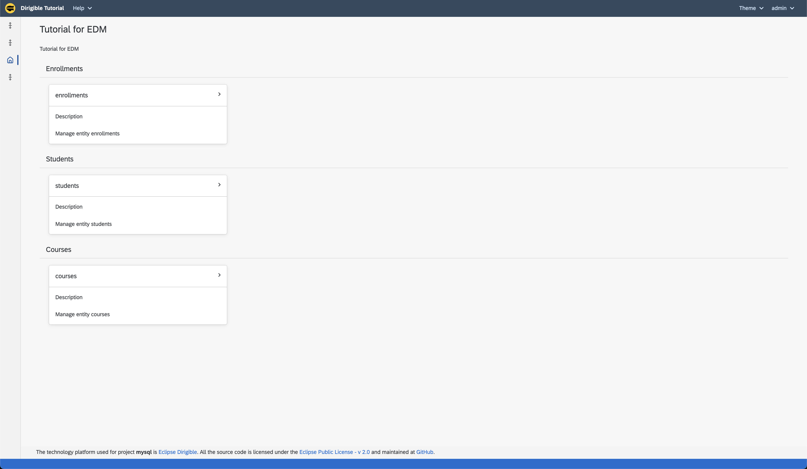
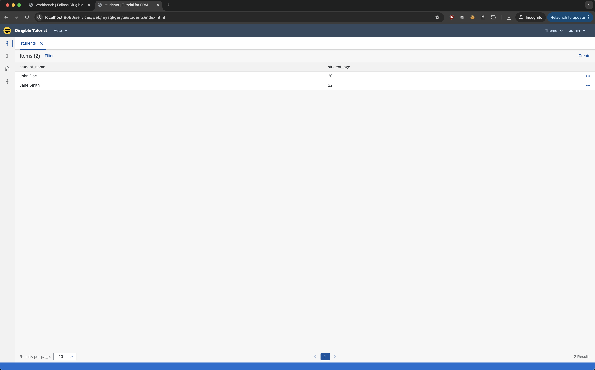

Generate Application from Datasource
===

This tutorial will guide you through the creation of an Entity Data Model (EDM) and the generation of a full-stack Dirigible application from datasource. We will be using MySQL for that purpose but Eclipse Dirigible supports other databases as well.

!!! info "Prerequisites"

    - Access to the latest version of Eclipse Dirigible (10.2.7+)
    - Docker Image setup (follow the steps below)

### Steps

#### Pull the Docker Image

- Pull the official Eclipse Dirigible Docker Image to your local environment.

    ```
    docker pull dirigiblelabs/dirigible:latest
    ```

#### Run the Docker Image

=== "Run"

    - Launch the Docker Image using the following command:

    ```
    docker run --name dirigible --rm -p 8080:8080 -p 8081:8081 dirigiblelabs/dirigible:latest
    ```

=== "with Environment Configurations"

    - *Optional* If you want to use environment variables to automatically import your datasource prepare the following file:

    **my_env.list**
    ```
    DIRIGIBLE_DATABASE_CUSTOM_DATASOURCES=TUTORIAL
    TUTORIAL_DRIVER=com.mysql.cj.jdbc.Driver
    TUTORIAL_URL=jdbc:mysql://host.docker.internal/my_db
    TUTORIAL_USERNAME=*my_username*
    TUTORIAL_PASSWORD=*my_pass*
    ```

    - Launch the Docker Image using the following command:

    ```
    docker run --env-file ./my_env.list --name dirigible --rm -p 8080:8080 -p 8081:8081 dirigiblelabs/dirigible:latest
    ```


#### Add the Data Source

There are several ways how to to add a datasource _(`via the Web IDE`, `via Environment Variables`, `via *.datsource file`)_:

=== "via the Web IDE"

    !!! note
    
        Note that this method may result in the loss of the datasource upon restart.

    - Navigate to the `Database` perspective

    

    - In the bottom right corner select the `+` sign and input the information for you datasource

    

    - Test your connection with a simple query

    

=== "via Environment Variables"

    Set the following environment variables:

    - `DIRIGIBLE_DATABASE_CUSTOM_DATASOURCES=<dataSourceName>`
    - `<dataSourceName>_DRIVER=com.mysql.cj.jdbc.Driver`
    - `<dataSourceName>_URL=jdbc:mysql://host.docker.internal/my_db`
    - `<dataSourceName>_USERNAME=*my_username*`
    - `<dataSourceName>_PASSWORD=*my_pass*`

    !!! note
    
        In the previous section the steps were explained in more details.


=== "via *.datsource file"

    - Create a `*.datasource` file in your application with the following content:
    ```json
    {
        "location": "/<projectName>/<path>/<dataSourceFileName>.datasource",
        "name": "<dataSourceName>",
        "driver": "com.mysql.cj.jdbc.Driver",
        "url": "jdbc:mysql://${MY_DB_HOST}:${MY_DB_PORT}/${MY_DB_NAME}",
        "username": "${MY_DB_USER}",
        "password": "${MY_DB_PASS}" 
    }
    ```

    !!! note

        Replace the following placeholders:
        
        - `/<projectName>/<path>/<dataSourceFileName>.datasource` with the location of the datasource file in the application.
        - `<dataSourceName>` with the name of the datasource.
        
        Set the following environment variables:
        - `MY_DB_HOST` - the database host.
        - `MY_DB_PORT` - the database port.
        - `MY_DB_NAME` - the database name.
        - `MY_DB_USER` - the database user.
        - `MY_DB_PASS` - the database password

#### Application Generation Steps

Once the datasource is added, proceed with the following steps to generate the application:

1. Right-click the database you want and select `Export Schema as Model`.

    

2. Navigate to the _**Workbench**_ perspective and you should see a project and a `*.model` file created from your database.

3. Right click the `*.model` file:

    - Click on the `Generate` option.
    - From the **Generate from template** pop-up select `Application - Full Stack`.

    

4. Input additional information for you application

    !!! note

        The `Data Source` field is where your records are going to be saved. For this tutorial we want to use our imported datasource `TUTORIAL` but if you want you can use the Eclipse Dirigible H2 datasource _(by default named `DefaultDB`)_.

    

5. In the `TUTORIAL` project a couple of files will be generated - this is our application. Right click the project and publish your application using the `Publish` button.

    

6. Navigate in the `gen` folder in the `TUTORIAL` project, select the `index.html` and in the **Preview** section below you can fetch
your link and start using your application:

    

    

### Conclusion

By following the steps outlined above, you can seamlessly generate an application in Eclipse Dirigible using a datasource. Ensure to set up the datasource correctly and choose the appropriate method based on your requirements.
