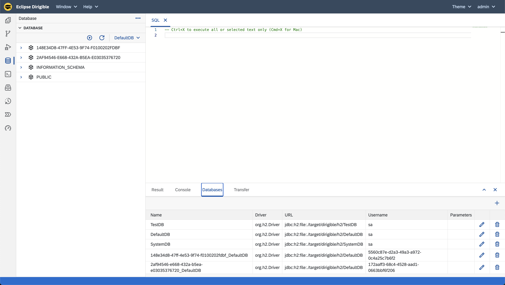
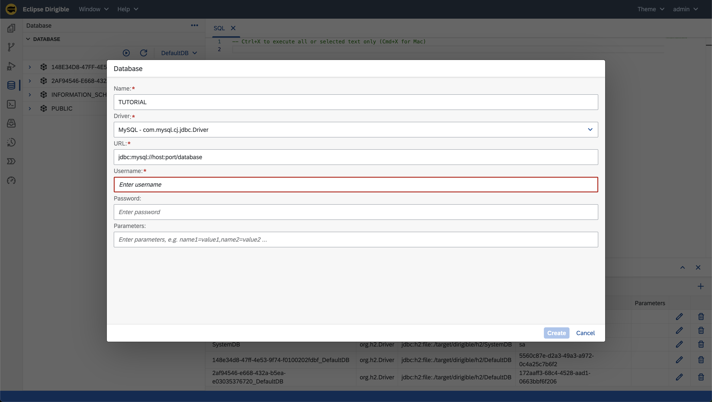
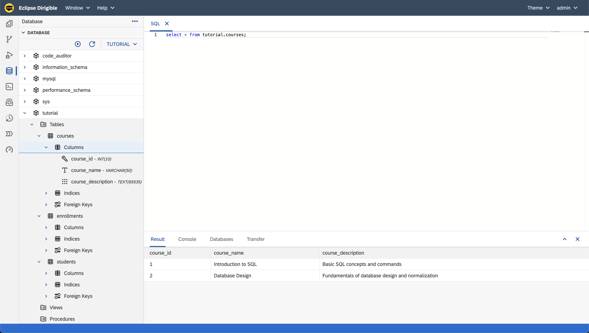
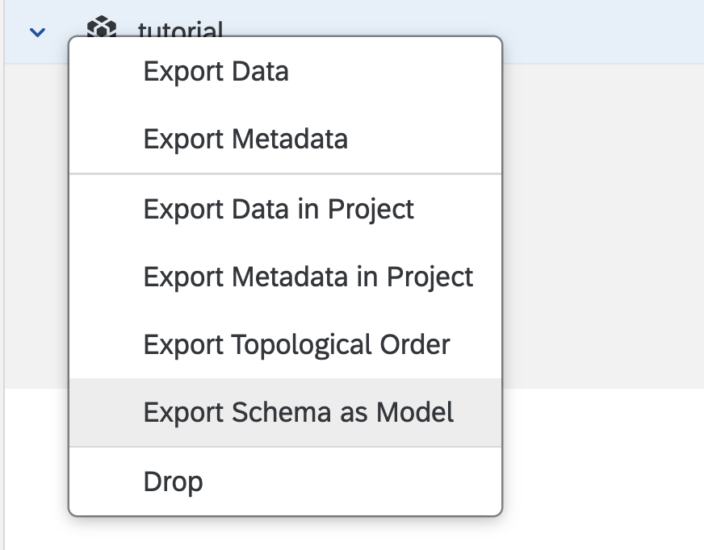
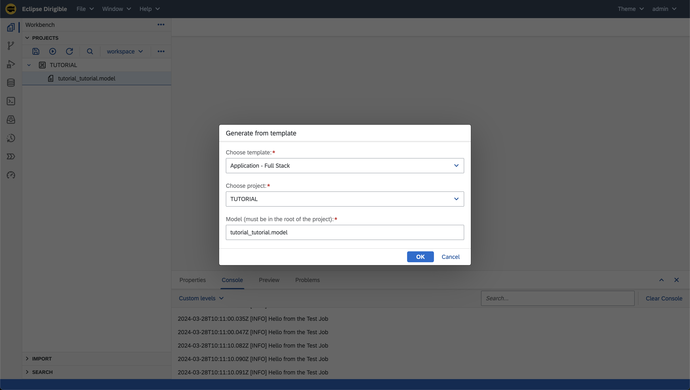
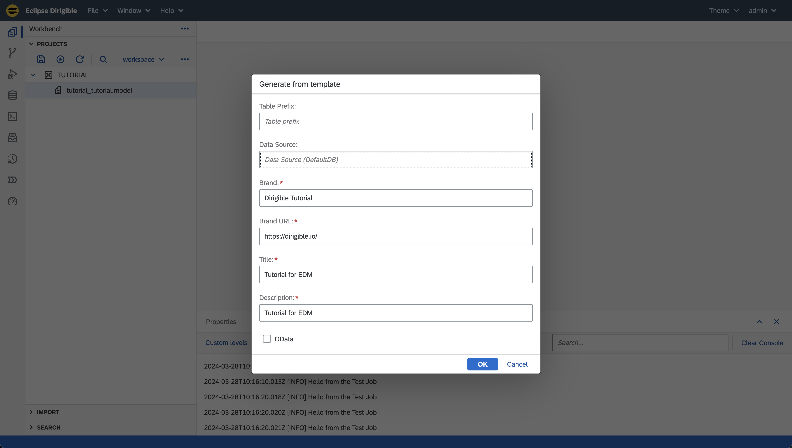
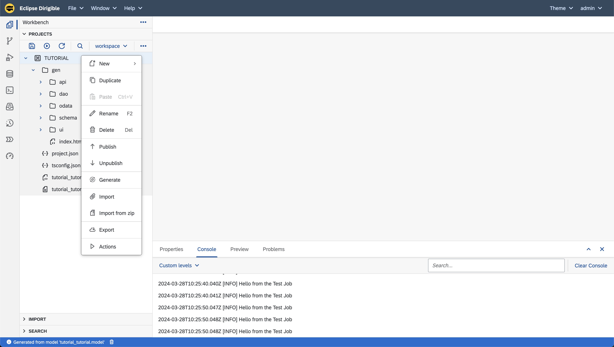

Generate Application from Datasource
===

This tutorial will guide you through the creation of an entity data model and generation of a full-stack Dirigible application from datasource. We will be using MySQL for that purpose but Eclipse Dirigible supports other database as well.

### Prerequisites
- Access to the latest version of Eclipse Dirigible (10.2.1+)
- Docker Image setup (follow steps below)

### Step 1: Pull the Docker Image
1. Pull the official Eclipse Dirigible Docker Image to your local environment.

    `docker pull dirigiblelabs/dirigible:latest`

### Step 2: Run the Docker Image
1. *Optional* If you want to use environment variables to automatically import your datasource prepare the following file:

    my_env.list
    ```
    DIRIGIBLE_DATABASE_CUSTOM_DATASOURCES=TUTORIAL
    TUTORIAL_DRIVER=com.mysql.cj.jdbc.Driver
    TUTORIAL_URL=jdbc:mysql://host.docker.internal/my_db
    TUTORIAL_USERNAME=*my_username*
    TUTORIAL_PASSWORD=*my_pass*
    ```
2. Launch the Docker Image using the following command:

    With environment variables
    ```
    docker run --env-file ./my_env.list --name dirigible --rm -p 8080:8080 -p 8081:8081 dirigiblelabs/dirigible:latest
    ```

    Without environment variables
    ```
    docker run --env-file ./my_env.list --name dirigible --rm -p 8080:8080 -p 8081:8081 dirigiblelabs/dirigible:latest
    ```


### Step 3: Add the Data Source
You have multiple options to add a datasource:

1. **Using Environment Variables**:
- Set up the datasource via environment variables - the previous section explained that

2. **Using the UI**:

    Note that this method may result in the loss of the datasource upon restart.

- Navigate to the `Database` perspective

    

- In the bottom right corner select the '+' sign and input the information for you datasource

    

- Test your connection with a simple query 

    

### Application Generation Steps
Once the datasource is added, proceed with the following steps to generate the application:

1. Right-click the database you want and select "Export Schema as Model".

    

2. Navigate to the _**Workbench**_ perspective and you should see a project and a _**.model**_ file created from your database

3. Right click the _**.model**_ file
    - Choose _**Generate**_
    - From the _**Generate from template**_ pop-up choose _**Application - Full Stack**_

    

4. Input additional information for you application

    Note: The _**Data Source**_ field is where your records are going to be saved. For this tutorial we want to use our imported datasource _**TUTORIAL**_ but if you want you can use Eclipse Dirigible in-memory H2 database - by default _**DefaultDB**_

    

5. In the _**TUTORIAL**_ project a couple of files will be generated - this is our application. Right click the project and publish your application using the _**Publish**_ button.

    

6. Navigate in the _**gen**_ folder in the _**TUTORIAL**_ project, select the _**index.html**_ and in the _**Preview**_ section below you can fetch
your link and start using your application

### Conclusion
By following the steps outlined above, you can seamlessly generate an application in Eclipse Dirigible using a datasource. Ensure to set up the datasource correctly and choose the appropriate method based on your requirements.

---

Feel free to reach out if you have any questions or need further assistance with the steps outlined above.