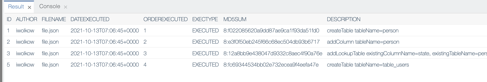

# Liquibase

###
Liquibase is a tool for tracking, managing and applying database schema changes. Liquibase supports JSON, YAML, XML, SQL and etc. formats. More information about Liquibase can be found [here](https://www.liquibase.org/)

## Dirigible
Dirigible are fully integrated with Liquibase. By changesets included in .changelog you can create, delete, update, insert tables and columns. You can even create rollback tags and rolback changes to desired point.
Below you can see example for working with liquibase in Dirigible.

Lets create a project and execute some .changelog file in our project.
Jump to Workbench perspective. Here you need to create file with **.changelog** extension.

```json

{
    "databaseChangeLog": [
        {
            "preConditions": [
                {
                    "runningAs": {
                        "username": "SA"
                    }
                }
            ]
        },
        {
            "changeSet": {
                "id": "1",
                "author": "iwolkow",
                "changes": [
                    {
                        "createTable": {
                            "tableName": "person",
                            "columns": [
                                {
                                    "column": {
                                        "name": "id",
                                        "type": "int",
                                        "autoIncrement": true,
                                        "constraints": {
                                            "primaryKey": true,
                                            "nullable": false
                                        }
                                    }
                                },
                                {
                                    "column": {
                                        "name": "firstname",
                                        "type": "varchar(50)"
                                    }
                                },
                                {
                                    "column": {
                                        "name": "lastname",
                                        "type": "varchar(50)",
                                        "constraints": {
                                            "nullable": false
                                        }
                                    }
                                },
                                {
                                    "column": {
                                        "name": "state",
                                        "type": "char(2)"
                                    }
                                }
                            ]
                        }
                    }
                ]
            }
        },
        {
            "changeSet": {
                "id": "2",
                "author": "iwolkow",
                "changes": [
                    {
                        "addColumn": {
                            "tableName": "person",
                            "columns": [
                                {
                                    "column": {
                                        "name": "username",
                                        "type": "varchar(8)"
                                    }
                                }
                            ]
                        }
                    }
                ]
            }
        },
        {
            "changeSet": {
                "id": "3",
                "author": "iwolkow",
                "changes": [
                    {
                        "addLookupTable": {
                            "existingTableName": "person",
                            "existingColumnName": "state",
                            "newTableName": "state",
                            "newColumnName": "id",
                            "newColumnDataType": "char(2)"
                        }
                    }
                ]
            }
        },
        {
            "changeSet": {
                "id": "5",
                "author": "iwolkow",
                "changes": [
                    {
                        "createTable": {
                            "tableName": "table_users",
                            "columns": [
                                {
                                    "column": {
                                        "name": "id",
                                        "type": "int",
                                        "autoIncrement": true,
                                        "constraints": {
                                            "primaryKey": true,
                                            "nullable": false
                                        }
                                    }
                                },
                                {
                                    "column": {
                                        "name": "first_name",
                                        "type": "varchar(10)"
                                    }
                                },
                                {
                                    "column": {
                                        "name": "last_name",
                                        "type": "varchar(50)",
                                        "constraints": {
                                            "nullable": false
                                        }
                                    }
                                },
                                {
                                    "column": {
                                        "name": "age",
                                        "type": "int"
                                    }
                                },
                                {
                                    "column": {
                                        "name": "last_updated",
                                        "type": "timestamp"
                                    }
                                }
                            ]
                        }
                    }
                ]
            }
        }
    ]
}
```

On saving the file Dirigible automatically detects and executes the .changelog file.
Switching to DB perspective we can see that in our PUBLIC schema, are created three tables,

as described in our changelog file:
- **Persons**,
- **State**
- **Table_Users**

and two more related to .changelog execution :
- **DATABASECHANGELOGLOCK**

- **DATABASECHANGELOG** , by choosing see content of this table in Result View are changesets
  represented as entries:




In SQL View we can execute several queries to check if everything works properly.

```sql
INSERT INTO STATE VALUES('RU');
INSERT INTO STATE VALUES('CH');
INSERT INTO STATE VALUES('FR');

INSERT INTO PERSON VALUES(1,'IVAN','PETROV','RU','ipetr88');
INSERT INTO PERSON VALUES(2,'MAURICE','LACROIX','CH','moris');
INSERT INTO PERSON VALUES(3,'JEAN','DE GAULLE','FR','jdg66');

```


Executing SQL scripts by pressing cmd+x(Mac OS), cntrl+x(Windows);
Table data can de seen by choosing "Show Content" on table. Results are shown in Result View.


