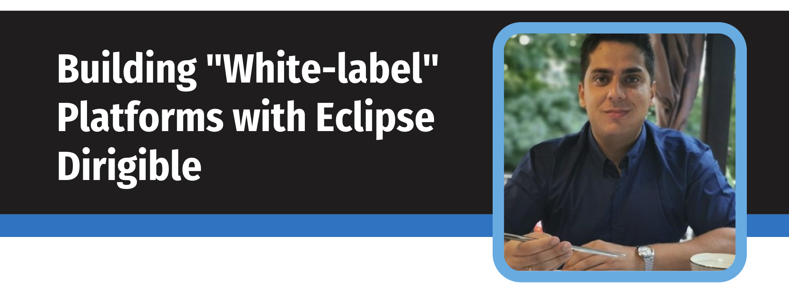

In this session Yordan Pavlov (CTO of [codbex](https://www.codbex.com)) shared his experience from building "white-label" platforms on top of Eclipse Dirigible.

### White-label Business Model

* Manufacturer: Creates generic (whilte-label) products.
* Retailer: Buys, rebrands and re-sells white-label products.
* End Customer: Buy directly from retailer branded products.

### Results

* Expand your offering
* Attract and close more customers
* Stand out from the competition
* Steady revenue
* Focus on what matters

[Slides](https://prezi.com/i/qetssbppqa7w/building-white-label-platforms-with-eclipse-dirigible/)

[Recording](https://www.youtube.com/watch?v=oinisS6HFi0)

### Congrats
